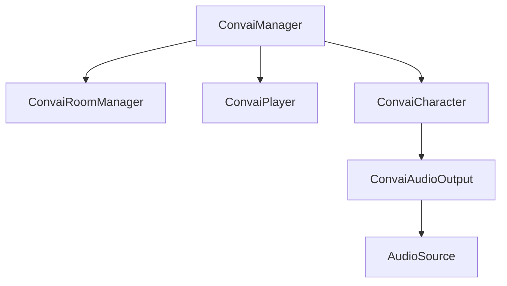

Every Convai-powered scene is built from four core components. Understanding what each one does and how they relate to each other makes building and debugging your setup straightforward.

## Component overview

The diagram below shows how the components depend on each other at runtime.



`ConvaiManager` is the root. It bootstraps the SDK, manages the room connection through `ConvaiRoomManager`, and owns references to all `ConvaiCharacter` and `ConvaiPlayer` instances in the scene.

## ConvaiManager

`ConvaiManager` is the SDK's entry point. It must be present in every scene that uses Convai. It initializes all internal services and injects dependencies into the other components automatically.

**Add it:** Use **GameObject > Convai > Setup Required Components** to add `ConvaiManager` and its companion components in one step. Do not add it manually via Add Component — the wizard ensures the correct setup.

**Key behavior:**

* Singleton. Only one `ConvaiManager` may exist per scene.
* Runs at execution order `-1100` — it initializes before all other components.
* Auto-discovers `ConvaiCharacter` and `ConvaiPlayer` instances in the scene on startup.
* Injects dependencies into discovered components automatically when `_autoInject` is enabled (default: on).

**Useful properties at runtime:**

| Property                      | Type                             | Description                            |
| ----------------------------- | -------------------------------- | -------------------------------------- |
| `IsBootstrapped`              | `bool`                           | SDK internal services are initialized  |
| `IsInitialized`               | `bool`                           | Bootstrap complete and event hub ready |
| `IsConnected`                 | `bool`                           | Room connection is active              |
| `Characters`                  | `IReadOnlyList<ConvaiCharacter>` | All characters owned by this manager   |
| `Player`                      | `ConvaiPlayer`                   | The player component in this scene     |
| `ActiveConversationCharacter` | `ConvaiCharacter`                | Authored startup character for the room |

## ConvaiRoomManager

`ConvaiRoomManager` manages the connection lifecycle between your scene and Convai. It handles connecting, disconnecting, and reconnecting the shared room session. It lives on the same GameObject as `ConvaiManager`.

**Key behavior:**

* Auto-connects on `Start()` when `ConnectOnStart` is `true` (default: `true`).
* Reconnects automatically on transient failures, up to `_maxReconnectAttempts` (default: `3`).
* Manages the microphone — starts capturing audio `_autoMicStartDelaySeconds` (default: `0.5s`) after the connection is established.

**Inspector fields:**

| Field                       | Default     | Description                                                      |
| --------------------------- | ----------- | ---------------------------------------------------------------- |
| `ConnectOnStart`            | `true`      | Connect to Convai automatically when the scene starts            |
| `_connectionType`           | `Audio`     | `Audio` for voice-only; `Video` to also send camera frames       |
| `_pushToTalkKey`            | `KeyCode.T` | Keyboard key used for push-to-talk input mode                    |
| `_maxReconnectAttempts`     | `3`         | Attempts before giving up on reconnection                        |
| `_autoMicStartDelaySeconds` | `0.5`       | Seconds to wait after connection before opening the microphone   |
| `_roomRejoinTtlSeconds`     | `60`        | Seconds after disconnect during which the session can be resumed |

Turn-taking settings are also configured here. See [Configure conversation input mode](configure-conversation-input-mode.md).

**Core Server URL:** In the current Unity SDK <code class="expression">space.vars.unity_sdk_version</code>, a non-empty serialized `CoreServerBaseURL` overrides the value under **Edit > Project Settings > Convai SDK**. In the staged <code class="expression">space.vars.unity_sdk_preview_version</code> preview, that scene field is deprecated and ignored; Project Settings (or per-connect runtime credentials) supply the URL.

## ConvaiCharacter

`ConvaiCharacter` represents one AI character in your scene. Each NPC or virtual instructor that talks to players needs its own `ConvaiCharacter` component.

**Unity SDK <code class="expression">space.vars.unity_sdk_preview_version</code> preview:** When more than one enabled, manager-owned character is present, the preview sends them as one ordered roster and connects them to one shared room. It does not infer whom the player is addressing. This behavior is not part of the current <code class="expression">space.vars.unity_sdk_version</code> Asset Store release.

Choose an explicit startup character before the room connects. `ConvaiManager.ActiveConversationCharacter` identifies that authored startup character; it is not a live mirror of the server's routing target. After connection, use `IConvaiRoomConnectionService.SetInteractionTargetAsync(...)` from your own raycast, proximity, button, or UI selection logic. Read the acknowledged runtime target from `CurrentMultiCharacterSession.ActiveMembershipId`.

**Startup roster:** All enabled characters owned by the manager are included. Inactive or disabled characters are excluded. If the room started in multi-character mode, activate an excluded character and call `AddCharacterAsync(...)` after connection when you want it to join. A one-character legacy room cannot be converted later with `AddCharacterAsync(...)`. A scene with multiple startup characters must resolve an explicit startup character before connecting.

**The Character ID field is required.** Get this value from your character's profile on the [Convai dashboard](https://convai.com).

**Inspector fields:**

| Field                           | Default   | Description                                                     |
| ------------------------------- | --------- | --------------------------------------------------------------- |
| `_characterId`                  | _(empty)_ | **Required.** Unique ID from your Convai dashboard              |
| `_characterName`                | _(empty)_ | Display name shown in transcripts and logs                      |
| `_nameTagColor`                 | White     | Color used to identify this character in the transcript UI      |
| `_autoConnect`                  | `false`   | Ask the room manager to connect after this character initializes |
| `_enableRemoteAudio`            | `true`    | Play back the character's voice audio                           |
| `_enableSessionResume`          | `false`   | Reuse this character's conversation session ID on reconnect      |
| `_characterReadyTimeoutSeconds` | `30`      | Seconds to wait for the character-ready signal (0 = no timeout) |

**Useful properties at runtime:**

| Property             | Type           | Description                                                   |
| -------------------- | -------------- | ------------------------------------------------------------- |
| `IsCharacterReady`   | `bool`         | Character has received the ready signal from Convai           |
| `IsSessionConnected` | `bool`         | Shared room is connected (this character may not be ready yet) |
| `IsInConversation`   | `bool`         | Shared room is connected and this character is ready           |
| `IsSpeaking`         | `bool`         | Character is currently outputting audio                       |
| `SessionState`       | `SessionState` | Shared room connection state mirrored on this character       |

**Component dependencies:** `ConvaiAudioOutput` (handles audio playback for this character) must be on the same GameObject. `ConvaiAudioOutput` requires an `AudioSource` on the same GameObject.

## ConvaiPlayer

`ConvaiPlayer` identifies the user in the conversation. It provides the player's display name and color to the transcript UI and lets Convai attribute player speech to the correct participant.

**One `ConvaiPlayer` per scene.** Multiple player components in the same scene are not supported.

**Inspector fields:**

| Field           | Default    | Description                                                     |
| --------------- | ---------- | --------------------------------------------------------------- |
| `_playerName`   | `"Player"` | Display name shown in the transcript UI                         |
| `_playerId`     | _(empty)_  | Local ID for transcript attribution (empty = use `_playerName`) |
| `_nameTagColor` | Green      | Color used to identify the player in the transcript UI          |


`PlayerId` is a local display identifier for the transcript UI only. It is not the server-generated speaker ID used for Long-Term Memory. The server-assigned speaker ID is resolved after connection and is not set manually.


**Useful methods:**

```csharp
// Override display name at runtime (for example, after a player logs in)
GetComponent<ConvaiPlayer>().SetRuntimeDisplayName("Dr. Reyes");

// Set both name and ID together
GetComponent<ConvaiPlayer>().Configure("Dr. Reyes", "user-123");
```

## Optional components

### ConvaiAudioOutput

Handles audio playback for a single character. Add it to the same GameObject as `ConvaiCharacter`. Requires an `AudioSource` on the same GameObject.

| Field          | Default | Description                        |
| -------------- | ------- | ---------------------------------- |
| `Volume`       | `1.0`   | Playback volume (0–1)              |
| `IsMuted`      | `false` | Mute this character's audio output |
| `_use3DAudio`  | `true`  | Enable spatial (3D) audio          |
| `_minDistance` | `1`     | Spatial audio minimum distance     |
| `_maxDistance` | `50`    | Spatial audio maximum distance     |

### ConvaiSceneConfig

An optional ScriptableObject (**Assets > Create > Convai > Scene Config**) that lets you define character IDs, prefabs, and auto-connect behavior in a reusable asset rather than inline in the Inspector. Useful for managing multiple characters across scenes. See Advanced Topics for full details.

## Embodiment infrastructure Convai adds automatically

Five additional components can appear on a character's GameObject without you adding them. Convai adds each one the first time an embodiment module — Gaze, Body Animation, Body Language, or Emotion — needs it on that character, typically the first time you enter Play Mode after adding one of those modules. Seeing them appear is expected; nothing is broken.

| Component | Added when | What it does |
| --- | --- | --- |
| `EmbodimentContext` | Any embodiment module resolves its character | Character-scoped composition root that embodiment modules use to find the character's rig and each other's shared data |
| `StandardRigBinding` | A module needs the character's bones or face meshes | Detects the rig convention (`ARKit`, `ReallusionCC3`, `ReallusionCC4Extended`, `MetaHuman`, or `Custom`) and resolves bones and blendshapes for modules to read |
| `AnimatorConductor` | A module needs to drive `Animator` parameters | Single writer for `Animator` parameters, so two modules can never overwrite the same parameter |
| `EmbodimentTickScheduler` | Any embodiment module registers a per-frame update | Runs embodiment modules in a fixed cognition → expression → finalize order every frame |
| `FacialBlendshapeCompositorHost` | A module needs to write facial blendshapes | Single writer for facial blendshape output, combining LipSync, Emotion, and other sources into one result each frame |


None of these components appear in the **Add Component** menu. `StandardRigBinding` is the only one you can add yourself — from **Add Component > Convai > Embodiment > Character Rig** — if you want to configure rig detection before Play Mode. The other four are internal to the SDK and are never added by hand.


## Next steps

Now that you understand the components, build your own scene from scratch.


[Build a custom scene](build-a-custom-scene.md)

