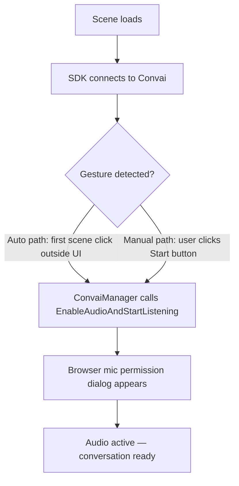

# webgl

WebGL builds work with the Convai Unity SDK, but the browser environment introduces constraints that do not exist on native platforms. Audio playback routes through browser HTML audio elements instead of Unity `AudioSource`. Microphone access requires HTTPS. And browsers block audio activation until the user performs a gesture. This page covers every WebGL-specific behavior and what you need to do before shipping.

***

## What Works on WebGL

| Feature                       | WebGL                | Notes                                                                                                       |
| ----------------------------- | -------------------- | ----------------------------------------------------------------------------------------------------------- |
| Voice conversation            | ✅ Full               | —                                                                                                           |
| Lip sync                      | ✅ Full               | Uses realtime clock instead of hardware DSP. See [Known Issue](webgl.md#known-issue-lip-sync-timing-drift). |
| Actions                       | ✅ Full               | —                                                                                                           |
| Dynamic Context               | ✅ Full               | —                                                                                                           |
| Emotion                       | ✅ Full               | —                                                                                                           |
| Vision                        | ✅ Full               | Captures from browser canvas. Not from Unity `RenderTexture`.                                               |
| Long-Term Memory              | ✅ Full               | —                                                                                                           |
| Narrative Design              | ✅ Full               | —                                                                                                           |
| Spatial audio                 | ❌ Not supported      | Browser audio elements have no 3D positioning.                                                              |
| Screen share                  | ❌ Not supported      | —                                                                                                           |
| Microphone device selection   | ❌ Browser-controlled | The Settings microphone dropdown is always empty on WebGL.                                                  |
| Unity `AudioSource` playback  | ❌ Not supported      | Character audio plays through a browser HTML audio element. Unity audio effects and mixers do not apply.    |
| Microphone test (Settings UI) | ❌ Disabled           | The test button shows "Microphone test not supported on WebGL."                                             |

***

## Requirements


**HTTPS required for microphone access.** Browsers block microphone access on HTTP pages. The only exception is `localhost`, which is always treated as secure.



**Serving inside an iframe?** The parent page must include `allow="microphone"` on the iframe element. Without it, the browser blocks microphone access regardless of HTTPS.

```html
<iframe src="https://your-build-url.com" allow="microphone"></iframe>
```


***

## Handle the Browser Audio Gesture

Browsers require a user interaction — a click or touch — before they allow audio playback or microphone access. Nothing plays and no mic access is granted until this gesture happens.



### How the SDK Handles It Automatically

`ConvaiManager` detects the first click or touch that lands outside a UI element and calls `EnableAudioAndStartListening()` automatically. This satisfies the browser gesture requirement without any code from you.


In scenes with full-screen UI overlays or canvas-based menus, background clicks may not reach `ConvaiManager`'s detector. Rely on the automatic path only in scenes where the background is directly clickable. Otherwise, add an explicit Start button.


### Add an Explicit Start Button (Recommended)

An explicit button is the safest approach. It works regardless of scene layout and gives users a clear moment to grant microphone permission.



1. Add a **Button** component to a UI GameObject.
2. In the Button's **On Click ()** list, click **+**.
3. Drag your `ConvaiManager` GameObject into the object field.
4. Select **ConvaiManager → EnableAudioAndStartListening ()**.

The button appears at scene start. When the user clicks it, audio activates and the microphone permission dialog appears.




```csharp
using Convai.Runtime.Components;
using UnityEngine;

public class StartConversationButton : MonoBehaviour
{
    [SerializeField] private ConvaiManager _convaiManager;

    public void OnStartClicked()
    {
        _convaiManager.EnableAudioAndStartListening();
    }
}
```


Wire `OnStartClicked` to the button's **On Click ()** event in the Inspector.




After clicking the button, the browser mic permission dialog appears. Once the user allows access, the character's first response plays through the browser and lip sync activates.


***

## Microphone on WebGL

The browser controls microphone device selection entirely. The SDK returns an empty device list on WebGL — the Microphone Device dropdown in the Settings UI is empty by design. When conversation starts, the browser displays its own permission prompt where the user can choose a device.

No additional code or configuration is needed. The SDK handles this automatically.

***

## Vision on WebGL

When Vision is enabled, the SDK captures the Unity game view as rendered in the browser canvas using `WebGLCanvasVideoSource`. No extra setup is required beyond enabling the Vision feature for your character.


WebGL Vision captures the browser canvas — not a webcam feed. If your scenario requires the learner's webcam, WebGL Vision is not the right approach. Consider mobile or desktop builds where `WebcamVisionFrameSource` is available.


***

## Known Issue: Lip-Sync Timing Drift


**Known defect — no workaround available.** On WebGL, the SDK uses `RealtimePlaybackClock` (based on `Time.realtimeSinceStartupAsDouble`) instead of the hardware DSP clock used on native platforms. Audio and lip-sync data both arrive correctly, but playback timing can drift in browser builds, causing visible desynchronization between speech and mouth animation. This is a tracked defect, not an unsupported feature.


***

## Build Validation Checklist

Before shipping a WebGL build:

* [ ] Build is served over HTTPS (or `localhost` for testing)
* [ ] An explicit Start button or clear gesture entry point is present in the scene
* [ ] Microphone permission dialog has been tested with an actual browser (not only in Editor Play mode)
* [ ] If embedded in an iframe: parent page has `allow="microphone"` on the iframe element
* [ ] Lip sync has been visually validated in a browser (not only in Editor)
* [ ] If Vision is enabled: character response to canvas content has been validated in browser

***

## Usage Examples

### Corporate Training Simulation on a Learning Management System

A compliance training application runs inside a corporate LMS browser portal. Learners complete a role-play conversation with a Convai character to practice responding to workplace safety scenarios.

**Setup:** Add a "Begin Training" button to the UI. Wire it to `ConvaiManager.EnableAudioAndStartListening()` via Inspector. The button is visible immediately at scene start. Conversation begins only when the learner clicks it.

**Outcome:** The button click satisfies the browser gesture requirement. The mic permission dialog appears. The character responds through the browser audio system. Lip sync plays. The LMS records completion when the conversation reaches its end state via an Action.

***

### Language Learning App Embedded in an E-Learning Platform

A language practice tool is built as a Unity WebGL build and embedded inside a third-party e-learning platform via iframe. Learners speak with a Convai character to practice conversational phrases.

**Setup:** Build is served over HTTPS. The host platform's iframe tag includes `allow="microphone"`. A "Start Practice" button calls `EnableAudioAndStartListening()`. Because the build is inside an iframe, the `allow` attribute is required — without it, the mic never activates even if the outer page is HTTPS.

**Outcome:** Learner clicks Start Practice, browser permission prompt appears, conversation runs through the iframe. Spatial audio is not used (browser limitation), which has no impact on this use case.

***

## Troubleshooting

| Symptom                                                     | Likely Cause                                        | Fix                                                                                  |
| ----------------------------------------------------------- | --------------------------------------------------- | ------------------------------------------------------------------------------------ |
| Microphone never activates; no browser dialog appears       | Page served over HTTP                               | Serve over HTTPS or use `localhost`                                                  |
| Mic silent inside iframe; no permission dialog              | `allow="microphone"` missing on iframe element      | Add `allow="microphone"` to the `<iframe>` tag on the parent page                    |
| No audio from character after connecting                    | First audio blocked — user gesture not yet consumed | Add an explicit Start button wired to `ConvaiManager.EnableAudioAndStartListening()` |
| Microphone dropdown in Settings is empty                    | Expected WebGL behavior                             | Browser controls device selection; no action needed                                  |
| "Microphone test not supported on WebGL" in Settings        | Expected                                            | WebGL cannot record and play back audio through the Unity microphone API             |
| Lip sync plays but timing drifts                            | Known WebGL realtime clock limitation               | No workaround currently available — this is a tracked defect                         |
| Unity audio effects or mixer not applied to character voice | Audio bypasses Unity audio system on WebGL          | Spatial effects and `AudioMixer` processing are not supported on WebGL               |
| Character audio plays but has no 3D positioning             | Spatial audio not supported on WebGL                | Browser HTML audio elements do not support 3D audio                                  |

***

## Next Steps


[Broken link](/broken/pages/665d1a02c31405b646ea5620c1cde76157d769ae)



[Broken link](/broken/pages/f796a49a82f4b79cf42397dc35d3add7a3f73bdd)

