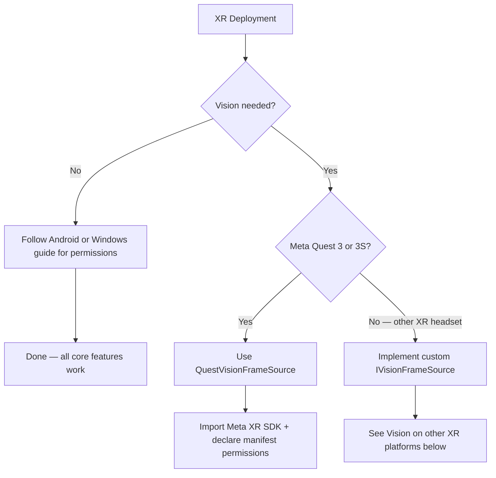

# XR headsets

The Convai Unity SDK runs on Android-based XR headsets (Meta Quest, Horizon OS, Android XR) and Windows XR headsets without extra configuration for core features. Voice conversation, lip sync, actions, emotion, and long-term memory work the same as on any other supported platform. Vision is the only feature that requires XR-specific integration work — and only when you want the AI character to see the real world through the headset's cameras.





### Core feature support

| Feature              | Android XR (Meta Quest, Horizon OS)            | Windows XR                              |
| -------------------- | ---------------------------------------------- | --------------------------------------- |
| Voice conversation   | ✅ Full                                         | ✅ Full                                  |
| Lip sync             | ✅ Full                                         | ✅ Full                                  |
| Actions              | ✅ Full                                         | ✅ Full                                  |
| Emotion              | ✅ Full                                         | ✅ Full                                  |
| Long-Term Memory     | ✅ Full                                         | ✅ Full                                  |
| Narrative Design     | ✅ Full                                         | ✅ Full                                  |
| Vision (passthrough) | ✅ `QuestVisionFrameSource` (Quest 3 / 3S only) | ⚠️ Custom `IVisionFrameSource` required |
| Spatial audio        | ✅ Full                                         | ✅ Full                                  |

For Android-based XR headsets, all core setup follows the Android platform guide — including the `RECORD_AUDIO` manifest declaration and runtime permission flow.


[ios-and-android.md](ios-and-android.md)


Vision is the only feature that varies between XR platforms. The decision tree below shows when extra setup is needed:



### Vision on Meta Quest

`QuestVisionFrameSource` streams the passthrough camera feed from a Meta Quest 3 or 3S headset to Convai, enabling the AI character to see and respond to the real world the learner is looking at. The component uses reflection to bind to the Meta XR SDK's `PassthroughCameraAccess` at runtime — the Convai SDK has no hard compile-time dependency on any Meta SDK package.

For the complete setup guide, Inspector reference, and troubleshooting steps, see the Meta Quest Vision setup page.

<table data-view="cards"><thead><tr><th></th><th data-hidden data-card-target data-type="content-ref"></th></tr></thead><tbody><tr><td><strong>Meta Quest Vision setup</strong><br>Configure QuestVisionFrameSource, declare required manifest permissions, and validate passthrough Vision on Quest 3 and 3S.</td><td><a href="meta-quest-vision.md">meta-quest-vision.md</a></td></tr></tbody></table>

### Vision on other XR platforms

No built-in frame source exists for non-Meta XR headsets — OpenXR-only devices, Windows Mixed Reality, HoloLens, or Android XR platforms that do not expose a passthrough camera through the Meta XR SDK.

To enable Vision on these devices, implement `IVisionFrameSource` and supply frames from your XR SDK's camera API:


```csharp
using System;
using Convai.Runtime.Vision.Sources;
using UnityEngine;

public class CustomXRVisionFrameSource : MonoBehaviour, IVisionFrameSource
{
    [SerializeField] private float _targetFrameRate = 15f;
    [SerializeField] private string _sourceId = "custom-xr";

    private RenderTexture _renderTexture;

    public bool IsCapturing { get; private set; }
    public long FrameCount { get; private set; }
    public (int Width, int Height) FrameDimensions => (_renderTexture ? _renderTexture.width : 0,
                                                       _renderTexture ? _renderTexture.height : 0);
    public float TargetFrameRate => _targetFrameRate;
    public string SourceId => _sourceId;
    public RenderTexture CurrentRenderTexture => _renderTexture;
    public bool IsFrameReady { get; private set; }

    public event Action FrameReady;

    public void StartCapture()
    {
        // Initialize your XR SDK camera and RenderTexture here.
        // Each time a new frame is available, blit it into _renderTexture (top-down / Y-flipped),
        // then increment FrameCount, set IsFrameReady = true, and raise FrameReady?.Invoke().
        IsCapturing = true;
    }

    public void StopCapture()
    {
        IsCapturing = false;
        IsFrameReady = false;
    }
}
```


Assign your custom source to `ConvaiVisionPublisher` via its Inspector field. See the Vision feature documentation for the full `IVisionFrameSource` contract, publishing policies, and debug preview setup.

### Next steps


[meta-quest-vision.md](meta-quest-vision.md)



[ios-and-android.md](ios-and-android.md)

