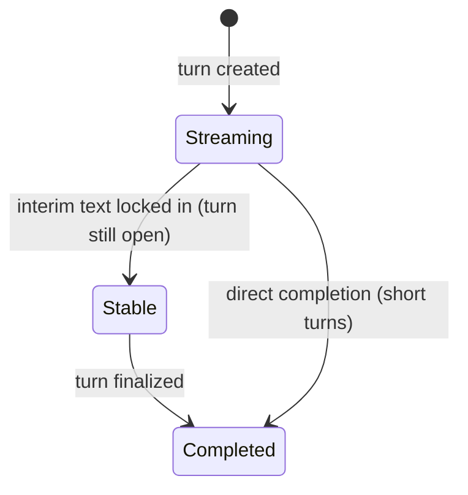

# transcript history

`ConvaiManager.Transcripts` exposes a read-only facade over the SDK's internal room transcript engine. It gives you structured access to every turn that has occurred in the session — who spoke, when, what they said, and whether they were interrupted. This is the API for post-session exports, live analytics dashboards, interrupted-turn detection, and any use case that needs the full transcript timeline rather than just streaming callbacks.

The `ConvaiTranscripts` facade is separate from the UI pipeline. It does not control what appears on screen — for that, see [Transcript UI](/broken/pages/054b5abbc1a1269634429f6e1bd44225bddd4cb7). It also does not support clearing or mutating the timeline; history is always append-only.

***

## Accessing the Facade

```csharp
using Convai.Runtime.Components;

// Access the facade — throws InvalidOperationException if ConvaiManager is not initialized
ConvaiTranscripts transcripts = ConvaiManager.ActiveManager.Transcripts;
```


Accessing `Transcripts` before `ConvaiManager` has completed initialization throws `InvalidOperationException`. Check `ConvaiManager.IsInitialized` or access from `Start()` or later in the frame lifecycle.


There are two ways to work with the facade:

| Approach                   | When to use                                                                       |
| -------------------------- | --------------------------------------------------------------------------------- |
| **Subscribe to `Changed`** | Live updates — react to every new word, turn, or completion as it happens         |
| **Poll `CurrentTimeline`** | Snapshot — read the full timeline at a specific moment (e.g., after session ends) |

```csharp
private void OnEnable()
{
    ConvaiManager.ActiveManager.Transcripts.Changed += OnTranscriptChanged;
}

private void OnDisable()
{
    if (ConvaiManager.ActiveManager != null)
        ConvaiManager.ActiveManager.Transcripts.Changed -= OnTranscriptChanged;
}

private void OnTranscriptChanged(TranscriptUpdateBatch batch)
{
    // Called every time any turn changes
    foreach (string completedId in batch.CompletedTurnIds)
    {
        TranscriptTurnSnapshot turn = ConvaiManager.ActiveManager.Transcripts.GetTurn(completedId);
        Debug.Log($"[Transcript] Completed: {turn.Participant.DisplayName}: {turn.DisplayText}");
    }
}
```

***

## `TranscriptTimelineSnapshot`

`CurrentTimeline` is an immutable snapshot of the full room transcript state at the moment you access it.

| Property                  | Type                                                  | Description                                                                                                    |
| ------------------------- | ----------------------------------------------------- | -------------------------------------------------------------------------------------------------------------- |
| `ActiveTurns`             | `IReadOnlyList<TranscriptTurnSnapshot>`               | Turns still in progress — speaker is still being recognized                                                    |
| `CommittedTurns`          | `IReadOnlyList<TranscriptTurnSnapshot>`               | Finalized turns — speaker has stopped and turn is complete                                                     |
| `TurnsById`               | `IReadOnlyDictionary<string, TranscriptTurnSnapshot>` | Fast lookup of any turn by `TurnId`                                                                            |
| `LatestTurnByParticipant` | `IReadOnlyDictionary<string, TranscriptTurnSnapshot>` | Most recent turn per participant                                                                               |
| `Cursor`                  | `long`                                                | Monotonic counter. Increments with every change — use to detect whether timeline has changed since last access |

```csharp
// Read the timeline at session end
TranscriptTimelineSnapshot timeline = ConvaiManager.ActiveManager.Transcripts.CurrentTimeline;

Debug.Log($"Committed turns: {timeline.CommittedTurns.Count}");
Debug.Log($"Still active: {timeline.ActiveTurns.Count}");

foreach (TranscriptTurnSnapshot turn in timeline.CommittedTurns)
{
    Debug.Log($"{turn.Participant.DisplayName}: {turn.DisplayText}");
}
```

***

## `TranscriptTurnSnapshot` — Full Field Reference

Each turn represents one continuous speech segment from one participant.

| Field                           | Type                                       | Description                                                     |
| ------------------------------- | ------------------------------------------ | --------------------------------------------------------------- |
| `TurnId`                        | `string`                                   | Unique turn identifier                                          |
| `MessageId`                     | `string`                                   | Alias for `TurnId` — same value                                 |
| `RoomSequence`                  | `long`                                     | Global ordering across all participants in the room             |
| `Participant`                   | `TranscriptParticipantRef`                 | Speaker identity (see below)                                    |
| `StartedAtUtc`                  | `DateTime`                                 | When this turn began                                            |
| `LastUpdatedAtUtc`              | `DateTime`                                 | Most recent update to this turn                                 |
| `CompletedAtUtc`                | `DateTime?`                                | When the turn was finalized. `null` if still active             |
| `Lifecycle`                     | `TranscriptLifecycle`                      | Current state: `Streaming`, `Stable`, or `Completed`            |
| `CommittedText`                 | `string`                                   | Finalized portion of the transcript                             |
| `InterimText`                   | `string`                                   | Partial / in-progress text, subject to change                   |
| `DisplayText`                   | `string`                                   | `CommittedText` + `InterimText` combined — use this for display |
| `WasInterrupted`                | `bool`                                     | `true` if this turn was cut off before the speaker finished     |
| `HasText`                       | `bool`                                     | `true` if `DisplayText` is non-empty                            |
| `Segments`                      | `IReadOnlyList<TranscriptSegmentSnapshot>` | Sub-turn segments (see Segments section)                        |
| `ConversationTargetCharacterId` | `string`                                   | ID of the character being addressed, if known                   |

***

## `TranscriptLifecycle` — Turn State Machine

Each turn passes through three states:



| State       | Meaning                                                                                    |
| ----------- | ------------------------------------------------------------------------------------------ |
| `Streaming` | Text is actively changing. New words arrive with every recognition result.                 |
| `Stable`    | Text is locked for this point, but the turn is still open (character paused mid-sentence). |
| `Completed` | Turn is closed. `CompletedAtUtc` is set. No further updates will arrive.                   |

In practice: if `IsFinal` is `false` on a `TranscriptViewModel`, the turn is `Streaming`. When `CompleteMessage` fires on your `ITranscriptUI`, the turn has reached `Completed`.

***

## `TranscriptQuery` — Filtering Turns

Use `GetTurns(TranscriptQuery)` to retrieve a filtered subset of the timeline. All fields are optional — omit any field to leave it unfiltered.

| Field                   | Type                         | Default | Description                                          |
| ----------------------- | ---------------------------- | ------- | ---------------------------------------------------- |
| `ParticipantKind`       | `TranscriptParticipantKind?` | `null`  | Filter to `Player` or `Character` turns only         |
| `PlayerOrCharacterId`   | `string`                     | `null`  | Filter to a specific player or character ID          |
| `ParticipantId`         | `string`                     | `null`  | Filter by LiveKit participant SID (multi-user rooms) |
| `IncludeActiveTurns`    | `bool`                       | `true`  | Include turns still in progress                      |
| `IncludeCommittedTurns` | `bool`                       | `true`  | Include finalized turns                              |

```csharp
using Convai.Domain.Models;

var transcripts = ConvaiManager.ActiveManager.Transcripts;

// All committed player turns
var playerTurns = transcripts.GetTurns(new TranscriptQuery
{
    ParticipantKind = TranscriptParticipantKind.Player,
    IncludeActiveTurns = false
});

// All turns from a specific character
var instructorTurns = transcripts.GetTurns(new TranscriptQuery
{
    PlayerOrCharacterId = "instructor-character-id"
});

// All turns (active + committed)
var allTurns = transcripts.GetTurns();
```

***

## `TranscriptParticipantRef` — Stable Speaker Identity

`Participant` on each `TranscriptTurnSnapshot` is a `TranscriptParticipantRef` — an immutable struct identifying the speaker.

| Property              | Type                        | Description                                                                                         |
| --------------------- | --------------------------- | --------------------------------------------------------------------------------------------------- |
| `Kind`                | `TranscriptParticipantKind` | `Player` or `Character`                                                                             |
| `PlayerOrCharacterId` | `string`                    | Stable identity — persists across reconnections                                                     |
| `DisplayName`         | `string`                    | UI-friendly speaker name                                                                            |
| `ParticipantId`       | `string`                    | LiveKit participant SID — changes per connection; use for multi-user attribution within one session |
| `IsEmpty`             | `bool`                      | `true` if `PlayerOrCharacterId` is null or whitespace                                               |

`PlayerOrCharacterId` is the right key for cross-session identity (long-term memory, analytics). `ParticipantId` is the right key for real-time attribution within a multi-user session.

***

## `TranscriptUpdateBatch` — Reacting to Changes

Every time the transcript changes, `Changed` fires with a `TranscriptUpdateBatch`. Use the batch's delta lists to update only what changed rather than re-rendering the full timeline.

| Property             | Type                                    | Description                                                     |
| -------------------- | --------------------------------------- | --------------------------------------------------------------- |
| `Timeline`           | `TranscriptTimelineSnapshot`            | Full updated timeline snapshot                                  |
| `Cursor`             | `long`                                  | Timeline cursor after this update                               |
| `ChangedTurns`       | `IReadOnlyList<TranscriptTurnSnapshot>` | All turns that were created, updated, completed, or interrupted |
| `AddedTurnIds`       | `IReadOnlyList<string>`                 | New turn IDs in this batch                                      |
| `UpdatedTurnIds`     | `IReadOnlyList<string>`                 | Modified turn IDs                                               |
| `CompletedTurnIds`   | `IReadOnlyList<string>`                 | Newly finalized turn IDs                                        |
| `InterruptedTurnIds` | `IReadOnlyList<string>`                 | Turn IDs that were cut off                                      |
| `RemovedTurnIds`     | `IReadOnlyList<string>`                 | Deleted or invalidated turn IDs                                 |

**Pattern — efficient incremental update:**

```csharp
private void OnTranscriptChanged(TranscriptUpdateBatch batch)
{
    var transcripts = ConvaiManager.ActiveManager.Transcripts;

    // Only process turns that actually changed
    foreach (string id in batch.CompletedTurnIds)
    {
        var turn = transcripts.GetTurn(id);
        ExportTurnToReport(turn);
    }

    foreach (string id in batch.InterruptedTurnIds)
    {
        var turn = transcripts.GetTurn(id);
        LogInterruption(turn.Participant.DisplayName, turn.DisplayText);
    }
}
```

***

## `TranscriptSegmentSnapshot` — Sub-Turn Granularity

Each turn contains one or more segments. Most use cases only need `DisplayText` on the turn itself — segments are for scenarios that need to distinguish between speech recognition results, processed text, and typed input.

| Field                                          | Type                          | Description                                                      |
| ---------------------------------------------- | ----------------------------- | ---------------------------------------------------------------- |
| `SegmentId`                                    | `string`                      | Unique segment identifier                                        |
| `TurnId`                                       | `string`                      | Parent turn                                                      |
| `SourceKind`                                   | `TranscriptSegmentSourceKind` | Origin of this segment (see below)                               |
| `CommittedText`                                | `string`                      | Finalized text for this segment                                  |
| `InterimText`                                  | `string`                      | In-progress text                                                 |
| `ProcessedOverrideText`                        | `string`                      | NLU/LLM corrected text, if applied                               |
| `DisplayText`                                  | `string`                      | Best available text: `ProcessedOverrideText` → committed+interim |
| `Lifecycle`                                    | `TranscriptLifecycle`         | `Streaming`, `Stable`, or `Completed`                            |
| `StartedAtUtc`, `UpdatedAtUtc`, `StoppedAtUtc` | `DateTime` / `DateTime?`      | Timing                                                           |

**`TranscriptSegmentSourceKind` values:**

| Value                  | Description                                        |
| ---------------------- | -------------------------------------------------- |
| `PlayerAsr`            | Raw speech recognition output                      |
| `PlayerProcessedFinal` | Text after NLU/LLM processing and correction       |
| `CharacterTranscript`  | Character speech output                            |
| `PlayerTypedText`      | Text entered via the `TMP_InputField` in chat mode |
| `Unknown`              | Source not determined                              |

***

## `TranscriptMessage` Struct

`TranscriptMessage` is a lightweight message type used by `ITranscriptListener` callbacks. It is simpler than `TranscriptTurnSnapshot` and does not carry segment or lifecycle detail.

| Field                 | Type          | Description                                             |
| --------------------- | ------------- | ------------------------------------------------------- |
| `PlayerOrCharacterId` | `string`      | Speaker ID                                              |
| `DisplayName`         | `string`      | UI-friendly speaker name                                |
| `Text`                | `string`      | Transcript content                                      |
| `IsFinal`             | `bool`        | `false` during streaming, `true` on turn completion     |
| `IsInterim`           | `bool`        | Inverse of `IsFinal`                                    |
| `Timestamp`           | `DateTime`    | UTC creation time                                       |
| `Confidence`          | `float?`      | ASR confidence score (0.0–1.0). `null` if not available |
| `ParticipantId`       | `string`      | LiveKit participant SID                                 |
| `SpeakerType`         | `SpeakerType` | `Character`, `Player`, `System`, or `Unknown`           |
| `WordCount`           | `int`         | Word count of `Text`                                    |

**Factory methods:**

```csharp
// Create a character message
var msg = TranscriptMessage.ForCharacter(characterId, characterName, text, isFinal);

// Create a player message
var msg = TranscriptMessage.ForPlayer(text, isFinal, playerId, displayName);
```

***

## Usage Examples

### Post-Session Report — Collect All Committed Turns

A medical simulation exports the full consultation transcript after each scenario for supervisor review:

```csharp
using Convai.Domain.Models;
using Convai.Runtime.Components;
using System.Text;
using UnityEngine;

public class SessionReportExporter : MonoBehaviour
{
    public string BuildReport()
    {
        var sb = new StringBuilder();
        var timeline = ConvaiManager.ActiveManager.Transcripts.CurrentTimeline;

        // Sort by room sequence for chronological order
        var turns = ConvaiManager.ActiveManager.Transcripts.GetTurns(new TranscriptQuery
        {
            IncludeActiveTurns = false  // committed turns only
        });

        foreach (var turn in turns)
        {
            string timestamp = turn.StartedAtUtc.ToString("HH:mm:ss");
            string speaker = turn.Participant.Kind == TranscriptParticipantKind.Character
                ? $"[AI] {turn.Participant.DisplayName}"
                : $"[Trainee] {turn.Participant.DisplayName}";
            string interrupted = turn.WasInterrupted ? " [interrupted]" : "";

            sb.AppendLine($"{timestamp} {speaker}{interrupted}: {turn.DisplayText}");
        }

        return sb.ToString();
    }
}
```

### Live Analytics — Player Word Count

A corporate onboarding simulation tracks how much the trainee speaks throughout the session:

```csharp
using Convai.Domain.Models;
using Convai.Runtime.Components;
using UnityEngine;

public class TalkTimeTracker : MonoBehaviour
{
    private int _playerWordCount;

    private void OnEnable()
    {
        ConvaiManager.ActiveManager.Transcripts.Changed += OnChanged;
    }

    private void OnDisable()
    {
        if (ConvaiManager.ActiveManager != null)
            ConvaiManager.ActiveManager.Transcripts.Changed -= OnChanged;
    }

    private void OnChanged(TranscriptUpdateBatch batch)
    {
        foreach (string id in batch.CompletedTurnIds)
        {
            var turn = ConvaiManager.ActiveManager.Transcripts.GetTurn(id);
            if (turn.Participant.Kind == TranscriptParticipantKind.Player)
                _playerWordCount += turn.DisplayText.Split(' ').Length;
        }
    }

    public int TotalPlayerWords => _playerWordCount;
}
```

### Interruption Detection — Training Assessment

A negotiation training simulation penalizes trainees who interrupt the AI character:

```csharp
using Convai.Domain.Models;
using Convai.Runtime.Components;
using UnityEngine;

public class InterruptionPenalizer : MonoBehaviour
{
    private int _interruptionCount;

    private void OnEnable()
    {
        ConvaiManager.ActiveManager.Transcripts.Changed += OnChanged;
    }

    private void OnDisable()
    {
        if (ConvaiManager.ActiveManager != null)
            ConvaiManager.ActiveManager.Transcripts.Changed -= OnChanged;
    }

    private void OnChanged(TranscriptUpdateBatch batch)
    {
        foreach (string id in batch.InterruptedTurnIds)
        {
            var turn = ConvaiManager.ActiveManager.Transcripts.GetTurn(id);

            // Only count character turns interrupted by the player
            if (turn.Participant.Kind == TranscriptParticipantKind.Character)
            {
                _interruptionCount++;
                Debug.Log($"[Assessment] Trainee interrupted the character. Total: {_interruptionCount}");
            }
        }
    }

    public int InterruptionCount => _interruptionCount;
}
```

***

## Next Steps


[Broken link](/broken/pages/e6b069465db52fd82502fece5f92ee2a696f9517)



[Broken link](/broken/pages/054b5abbc1a1269634429f6e1bd44225bddd4cb7)

