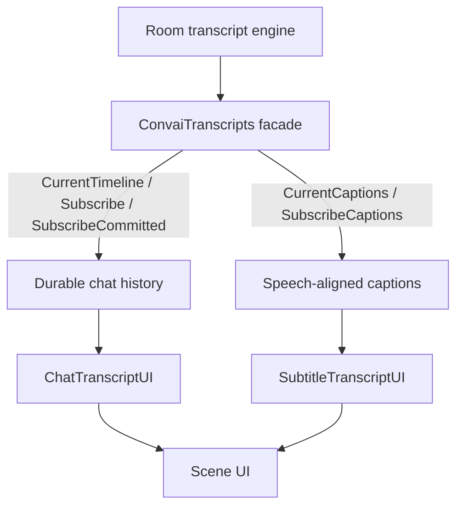

`ConvaiManager.ActiveManager.Transcripts` is the single entry point for transcript data in the Convai Unity SDK. It exposes two purposes side by side — a durable turn-by-turn chat history and a stream of speech-aligned captions — so your scene UI can show conversation history and live subtitles without building either pipeline yourself.


**Breaking change in SDK 4.4.0.** `ITranscriptUI`, `ITranscriptListener`, `TranscriptViewModel`, `TranscriptUIController`, and `ITranscriptPresentationStrategy` were removed. Custom transcript displays now subscribe directly through `ConvaiManager.ActiveManager.Transcripts` — see the durable and caption paths below.


## How transcript data reaches your scene UI

The runtime's internal transcript engine maintains room state and exposes it through the `ConvaiTranscripts` facade at `ConvaiManager.ActiveManager.Transcripts`. That facade splits into two independent read paths.

Both paths read from the same room session, so a character's speech always appears in history and, if a caption UI is present, as a caption at the same time.

## Durable chat history vs. speech-aligned captions

`CurrentTimeline`, `Subscribe`, and `SubscribeCommitted` give you the durable side of the transcript: a timeline of committed conversation turns that persists for the life of the room, suitable for scroll-back chat panels, post-session review, and export. `ChatTranscriptUI` is built on this path.

`CurrentCaptions` and `SubscribeCaptions` give you the ephemeral side: text aligned to what is currently being spoken, replaced as soon as the next segment starts. Caption text is never written into the durable chat history — it exists only to drive a subtitle-style overlay. `SubtitleTranscriptUI` is built on this path.

Choose the durable path when the reader needs to see or query what was said. Choose the caption path when the reader needs to see what is being said right now.

## Built-in presentation components

`ChatTranscriptUI` ships as a ready-to-use component with two prefabs in the <code class="expression">space.vars.sdk_package_id</code> package: `Prefabs/TranscriptUI/TranscriptUI_Chat.prefab` for a screen-space chat panel, and `Prefabs/TranscriptUI/TranscriptUI_Chat_WorldSpace.prefab` for the same component rendered on a world-space `Canvas` — for example a panel mounted above a character or kiosk. Both prefabs subscribe to the durable timeline on `Start` (and re-subscribe on `OnEnable`) and render committed and in-progress turns as message bubbles.

`SubtitleTranscriptUI` ships as sample reference code at `SamplesShared/Scripts/UI/Transcript/Subtitle/SubtitleTranscriptUI.cs` rather than a drop-in prefab. It subscribes to captions and renders the current speaker's text with auto-hide after a configurable delay, and is meant to be copied into your project and adapted.

Neither component is the only option. Any script can call `Subscribe`, `SubscribeCommitted`, or `SubscribeCaptions` directly to drive a custom display.

## Hide presentation without losing history

`IsPresentationEnabled` and the `PresentationEnabledChanged` event let shipped presentation components hide their rendered content — for example while a cutscene or menu is on screen — without stopping the room from recording. `ChatTranscriptUI` and `SubtitleTranscriptUI` both clear their rendered content when presentation is disabled, then resubscribe with replay enabled when it turns back on, so no turns are lost from the durable history while the UI was hidden.

## Next steps

You have covered how the durable and caption paths split and which shipped component reads each. Continue to querying the durable timeline from code, configuring the two built-in display modes, or controlling transcript visibility from the settings panel.


[transcript-history-and-queries.md](transcript-history-and-queries.md)



[chat-and-subtitle-modes.md](chat-and-subtitle-modes.md)



[settings-panel](../settings-panel/)

