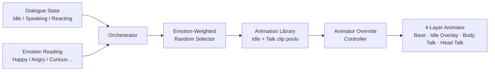

# Dialogue Animation

The Dialogue Animation module connects an AI character's conversation state to Unity's Animator. When the character is idle, it crossfades through a pool of ambient gestures. When the character speaks or reacts, it fades in talk-layer clips selected by the detected emotion. All selection logic runs locally — no Convai communication is involved.

The module uses an `AnimatorOverrideController` to inject clips at runtime. Your Animator Controller defines the layer structure; the module fills the clip slots and manages layer weights automatically.

## How It Works

The orchestrator reads dialogue state and the current emotion each frame. The selector picks clips from the library, weighting candidates that match the current emotion affinity. Clips are injected into the Animator via runtime override — no per-clip Animator states are needed.

## Key Concepts

* **DialogueAnimationLibrary** — ScriptableObject holding two clip pools: idle clips and talk clips. Each clip entry carries emotion affinity tags, a gender tag, and a selection weight.
* **DialogueAnimationRuntimeConfig** — ScriptableObject controlling all timing and blending behavior: fade durations, idle rotation cadence, speech energy modulation, and clip selection bias.
* **DialogueAnimatorContract** — ScriptableObject mapping layer indices and state names between the SDK and your Animator Controller.
* **ConvaiDialogueAnimationProfile** — ScriptableObject that bundles all three assets above into a single per-character preset.

## In This Section

<table data-view="cards"><thead><tr><th></th><th data-hidden data-card-target data-type="content-ref"></th></tr></thead><tbody><tr><td><strong>Quick Start</strong> Add dialogue animations to a character in minutes using bundled assets.</td><td><a href="/broken/pages/175a97cf891c519d92138c47238e54f5e70227b7">Broken link</a></td></tr><tr><td><strong>Animation Libraries &#x26; Profiles</strong> Complete reference for all ScriptableObject types and their fields.</td><td><a href="/broken/pages/a313ce2201628c94622ae8596ae14d4429d9ecaa">Broken link</a></td></tr><tr><td><strong>Animator Controller Setup</strong> Configure the four-layer Animator Controller structure — sample fast path and from-scratch guide.</td><td><a href="/broken/pages/5dbea01cb3512a0f6ae94dda842f95aa384fe0aa">Broken link</a></td></tr><tr><td><strong>Usage Examples</strong> Complete Inspector and scripted examples for training simulations and interactive experiences.</td><td><a href="/broken/pages/b688f4e0fc42f15e4c00410471b27f7266115add">Broken link</a></td></tr><tr><td><strong>Scripting API</strong> Hot-swap libraries and configs at runtime; read active clip and layer weight state.</td><td><a href="/broken/pages/0506a1630550e50910297f49af73121090cf985f">Broken link</a></td></tr><tr><td><strong>Troubleshooting</strong> Fix common setup issues: missing assets, wrong gender clips, layer conflicts.</td><td><a href="/broken/pages/2dd3530469e0e4328823e20f4e26ef38c84bc076">Broken link</a></td></tr></tbody></table>
