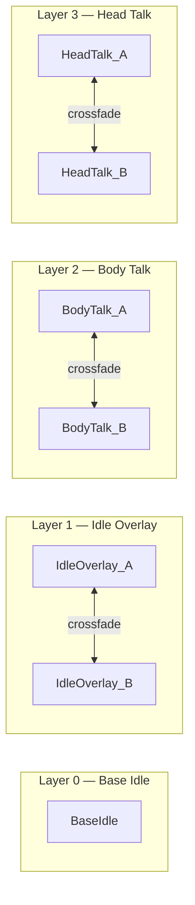

# animator setup

The Dialogue Animation module requires an Animator Controller with a specific four-layer structure. Rather than authoring clips directly as Animator states, the module injects animation clips at runtime through an `AnimatorOverrideController`. Your controller defines the layer structure and placeholder slots; the SDK fills them dynamically.

This page covers the recommended fast path (duplicating the sample controller), a full explanation of the structure for customization, and a from-scratch build guide for advanced setups.

***

## Using the Sample Controller (Recommended)

The SDK ships a sample Animator Controller with all four layers pre-configured, correct state names, and all placeholder clips already wired. Duplicate it into your project to avoid modifying the package.



**Navigate to the Sample Controller**

In the Project window, expand:\
`Packages` → `Convai SDK for Unity` → `SamplesShared` → `Art` → `Animations` → `Dialogue` → `Controllers`

You will see **ConvaiSample\_Animator Controller**.



**Duplicate and Move**

Right-click **ConvaiSample\_Animator Controller** → **Copy Asset** (or select and press **Ctrl+D**).

Move the duplicate into your project's `Assets/` folder — for example, `Assets/Characters/Animators/`.


Keeping your copy in `Assets/` means SDK updates to the sample controller won't overwrite your version, and you can rename states or add layers freely.




**Assign to Your Character**

Select your character's root GameObject. On its `Animator` component, drag the duplicated controller into the **Controller** field.

Open **Window** → **Animator** and verify the controller shows four layers in the left panel.




When the Dialogue Animation module builds at runtime, it clones this controller into a hidden `AnimatorOverrideController` and begins swapping placeholder clips. You do not need to modify the controller further for basic operation.


***

## Understanding the Four-Layer Structure

The module's orchestrator distributes animation across four Animator layers. Each layer has a specific role and uses a ping-pong pattern (two alternating states) to allow crossfades without per-clip state authoring.

| Layer Index | Layer Name   | Role                                                                  | States                           |
| ----------- | ------------ | --------------------------------------------------------------------- | -------------------------------- |
| 0           | Base Idle    | Full-body foundation idle — always playing at low weight              | `BaseIdle`                       |
| 1           | Idle Overlay | Ambient gesture rotation — crossfades between variations every 8–20 s | `IdleOverlay_A`, `IdleOverlay_B` |
| 2           | Body Talk    | Upper-body talk clips — fades in when speaking or reacting            | `BodyTalk_A`, `BodyTalk_B`       |
| 3           | Head Talk    | Head and neck talk clips — fades in when speaking or reacting         | `HeadTalk_A`, `HeadTalk_B`       |

The module always crossfades to the **inactive** state in each ping-pong pair. Before triggering the crossfade, it swaps the inactive state's placeholder clip for the newly selected animation. This avoids state explosion — you need only two states per layer regardless of how many clips are in your library.

### Why an Override Controller?

The `AnimatorOverrideController` wraps your controller at runtime and intercepts specific clip references by name. When the orchestrator selects a new idle clip, it replaces the `ConvaiDialogueSlot_IdleOverlayB` placeholder in the override controller — the next time `IdleOverlay_B` plays, it plays the new clip. All of this is invisible in the Animator window while in Play Mode, but you can observe layer weight changes in real time.

***

## Placeholder Clips

Each state in the controller references a placeholder animation clip. These clips must exist in the controller's override source by name. The SDK identifies them by the exact names listed below.

| Placeholder Name                  | Layer            | State           |
| --------------------------------- | ---------------- | --------------- |
| `ConvaiDialogueSlot_BaseIdle`     | Base Idle (0)    | `BaseIdle`      |
| `ConvaiDialogueSlot_IdleOverlayA` | Idle Overlay (1) | `IdleOverlay_A` |
| `ConvaiDialogueSlot_IdleOverlayB` | Idle Overlay (1) | `IdleOverlay_B` |
| `ConvaiDialogueSlot_BodyTalkA`    | Body Talk (2)    | `BodyTalk_A`    |
| `ConvaiDialogueSlot_BodyTalkB`    | Body Talk (2)    | `BodyTalk_B`    |
| `ConvaiDialogueSlot_HeadTalkA`    | Head Talk (3)    | `HeadTalk_A`    |
| `ConvaiDialogueSlot_HeadTalkB`    | Head Talk (3)    | `HeadTalk_B`    |

The sample controller ships with seven tiny placeholder clips pre-wired to these names. If you build a controller from scratch, you must create these placeholder clips and assign them to the correct states.


Placeholder clip names are case-sensitive and must match exactly. If a placeholder is missing or misnamed, `DialogueRuntimeBuilder` logs a warning and skips building the affected layer. Check the Console after entering Play Mode — any mismatch appears immediately.


***

## Avatar Masks

By default, the sample controller ships without Avatar masks on any layer — all four layers affect the full body. For characters where the body and head need independent animation layers (for example, a body gesture that continues while the head reacts independently), add masks.

| Layer            | Recommended Mask                                                           |
| ---------------- | -------------------------------------------------------------------------- |
| Base Idle (0)    | No mask — full body                                                        |
| Idle Overlay (1) | No mask — full body, or upper-body only if lower body is handled elsewhere |
| Body Talk (2)    | Upper body (waist up, excluding neck/head)                                 |
| Head Talk (3)    | Head and neck only                                                         |

To create an Avatar mask:

1. In the Project window, **Create** → **Avatar Mask**
2. In the Inspector, expand the humanoid figure and uncheck joints you want to exclude
3. Assign the mask to the layer in the Animator Controller window — select the layer and find the **Mask** field in its settings gear


If you notice the body talk and head talk layers fighting each other (one overriding the other's gestures), adding proper Avatar masks is the fix.


***

## Building from Scratch

Use this path only if you cannot base your setup on the sample controller — for example, when integrating Dialogue Animation into an existing complex Animator Controller.



**Create the Animator Controller**

In the Project window, **Create** → **Animator Controller**. Name it appropriately for your character.



**Create Placeholder Clips**

Create seven empty `AnimationClip` assets and name them exactly:

* `ConvaiDialogueSlot_BaseIdle`
* `ConvaiDialogueSlot_IdleOverlayA`
* `ConvaiDialogueSlot_IdleOverlayB`
* `ConvaiDialogueSlot_BodyTalkA`
* `ConvaiDialogueSlot_BodyTalkB`
* `ConvaiDialogueSlot_HeadTalkA`
* `ConvaiDialogueSlot_HeadTalkB`

These clips can be completely empty — they are replaced at runtime. The names are all that matter.



**Configure Layer 0 — Base Idle**

In the Animator window:

1. Select **Layer 0** (the default layer) — rename it to `Base Idle` for clarity
2. In the layer graph, rename the default **New State** to `BaseIdle`
3. Drag `ConvaiDialogueSlot_BaseIdle` onto the `BaseIdle` state's **Motion** field
4. Set layer weight to **1** in the layer settings gear



**Configure Layers 1, 2, and 3 — Ping-Pong Layers**

For each of Idle Overlay, Body Talk, and Head Talk:

1. Add a new layer (click **+** in the Layers panel). Name it `Idle Overlay`, `Body Talk`, or `Head Talk`
2. Add two states: name them `IdleOverlay_A` and `IdleOverlay_B` (or the equivalent pair)
3. Assign the corresponding placeholder clips to each state's **Motion** field
4. Add **Any State** → both states transitions. Set **Transition Duration** to 0 and **Can Transition to Self** to off — the SDK will call `CrossFade` directly and does not use these transitions for its blending logic. Set **Has Exit Time** off
5. Set layer weight to **1** in the settings gear. Set **Blending** to **Override**

Repeat for all three ping-pong layers.



**Create a DialogueAnimatorContract**

Create a `DialogueAnimatorContract` asset (**Create** → **Convai/Embodiment/Dialogue Animator Contract**) and verify:

* Layer indices match your actual layer positions (0, 1, 2, 3 if following the guide above)
* State names match exactly (e.g., `BaseIdle`, `IdleOverlay_A`, etc.)
* Placeholder names match the clip assets you created

Assign the contract to the **Animator Contract** field on `ConvaiDialogueAnimationController` or in the profile.




Enter Play Mode. If the build succeeds, no warnings appear in the Console and the module begins animating. Open the Animator window to watch layer weights change as the character idles and speaks.


***

## Customizing Layer Order

If your existing Animator Controller already has layers that must appear before the dialogue layers, update the `DialogueAnimatorContract` to match your layer positions.

For example, if you need a physics interaction layer at index 0:

| Layer Index | Layer               | Contract Field              |
| ----------- | ------------------- | --------------------------- |
| 0           | Physics Interaction | (not in contract)           |
| 1           | Base Idle           | `BaseIdleLayerIndex = 1`    |
| 2           | Idle Overlay        | `IdleOverlayLayerIndex = 2` |
| 3           | Body Talk           | `BodyTalkLayerIndex = 3`    |
| 4           | Head Talk           | `HeadTalkLayerIndex = 4`    |

Set these values on your `DialogueAnimatorContract` asset, then assign it on the controller.

***

## Next Steps


[Broken link](/broken/pages/cc256e6610756212db3fdf852998767014ffb0ff)

