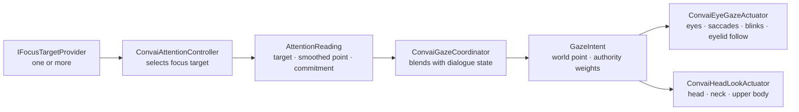

# Gaze and Attention

Two cooperating systems produce believable gaze behavior. The **Attention** system selects a focus target from available candidates using priority, distance relevance, and an interest budget model. The **Gaze** system reads that selection and drives the character's eyes and head toward it, layering procedural detail — saccades, micro-tremor, blinks, eyelid follow, and idle exploration — on top of the Animator's base pose. Both systems run entirely within Unity.

## The Pipeline

The Attention controller converts provider candidates into a smoothed focus point and a commitment value (0–1). The coordinator multiplies that commitment by a per-dialogue-state authority weight, then passes the resulting intent to the actuators. Each actuator adds its own procedural layer before writing final bone rotations in `LateUpdate`.

## Attention System

`ConvaiAttentionController` discovers `IFocusTargetProvider` components in the character hierarchy and collects candidates every frame. The built-in `DefaultFocusTargetProvider` targets the main camera (or an explicit transform) and fades relevance with distance. When multiple providers are present, candidates are ranked by priority and then by a relevance × interest score. The interest budget ensures the character naturally scans rather than staring at a single target indefinitely.

## Gaze System

`ConvaiGazeCoordinator` reads the attention result and the current dialogue state from the character's `EmbodimentContext`. Each dialogue state (Idle, Speaking, Listening, etc.) has a configured authority weight and an eye-to-head share — for example, Speaking drives strong head commitment toward the target, while Idle suppresses attention to let the eyes explore freely. The `ConvaiEyeGazeActuator` and `ConvaiHeadLookActuator` actuators read `GazeIntent` each `LateUpdate` and apply bone rotations through the reference frame of the character's rig root, making the math invariant to bind-pose roll.

## In This Section

<table data-view="cards"><thead><tr><th></th><th data-hidden data-card-target data-type="content-ref"></th></tr></thead><tbody><tr><td><strong>Quick Start</strong> Add eye and head tracking to a character in three component additions.</td><td><a href="/broken/pages/058673a7cf6ce53e1ff99ee8c3b574446bf824b2">Broken link</a></td></tr><tr><td><strong>Profiles &#x26; Tuning</strong> Complete field reference for all four profile ScriptableObjects — attention, coordination, eye, and head.</td><td><a href="/broken/pages/1ad75e9f7701d84d3ad33625ee019a79732ac98c">Broken link</a></td></tr><tr><td><strong>Usage Examples</strong> Complete Inspector and scripted examples for training simulations and interactive experiences.</td><td><a href="/broken/pages/55ff12117bf78cf2446e48d55ccaf3dab0337e53">Broken link</a></td></tr><tr><td><strong>Scripting API</strong> Read attention state, register custom focus providers, and access gaze intent at runtime.</td><td><a href="/broken/pages/3da4c6ec3c0a7ae8a8a53f3c9f7990d4a52def1f">Broken link</a></td></tr><tr><td><strong>Troubleshooting</strong> Fix common issues: eyes not tracking, rig bone conflicts, eyelid clipping, wrong focus target.</td><td><a href="/broken/pages/9334e3a41f03171ff4d1828f07b925c0a7c25853">Broken link</a></td></tr></tbody></table>
