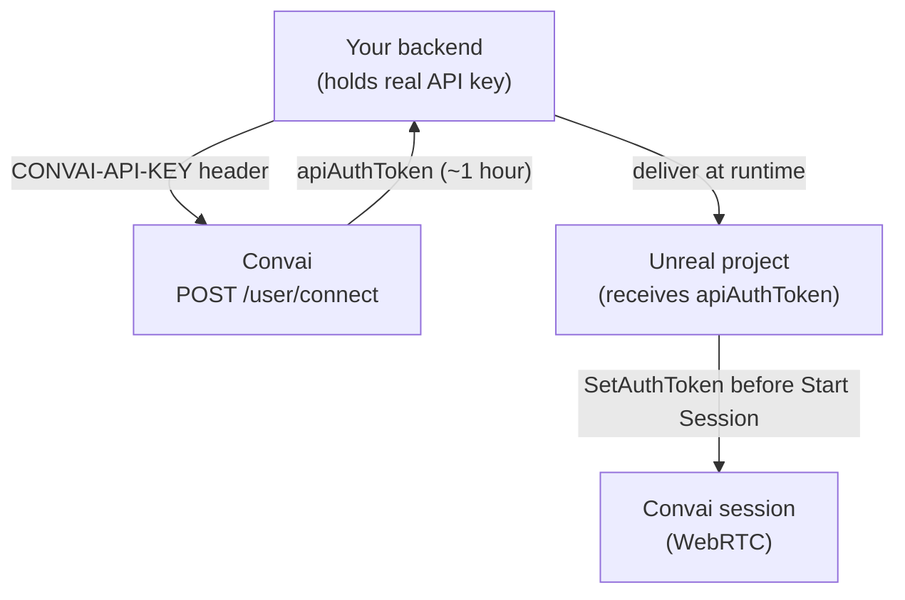

By default, the Convai Unreal Engine plugin stores your API key in `UConvaiSettings.API_Key` — through the Convai editor window on UE 5.2+, or in `Config/DefaultEngine.ini` on UE 5.0 and 5.1. That flow is appropriate for editor testing and early prototypes. In a **packaged application**, anyone who inspects the build can read a stored API key and use it against your Convai account.

**Personal access tokens (PATs)** avoid that exposure. Your real API key stays on a **backend** — a server-side application you control (Node.js, Python, .NET, AWS Lambda, and similar). The backend calls Convai to generate a short-lived `apiAuthToken` (valid for about one hour) and returns it to your Unreal project at runtime. The plugin sends that token when a session starts. If the token is intercepted, it expires within the hour.


**Should I use this?** Use the normal [Configure your API key](../getting-started/configure-your-api-key.md) flow for local editor testing. Use personal access tokens when you ship a packaged build and must not embed the real API key.


## Prerequisites

- The Convai Unreal Engine plugin is installed and you have completed a successful conversation test with a normal API key. See [Configure your API key](../getting-started/configure-your-api-key.md) and [Add your first Convai character](../getting-started/add-your-first-convai-character.md).
- A backend you control that can store the real Convai API key as a server-side secret.
- Outbound HTTPS from the backend to `https://api.convai.com`.

## How the token flow works

Three roles participate in a PAT flow:

| Role | What it holds | What it does |
|---|---|---|
| **Backend** | Real Convai API key | Calls Convai token endpoints; never exposes the key to the Unreal build. |
| **Convai** | Your account and characters | Returns a short-lived `apiAuthToken`. |
| **Unreal project** | The `apiAuthToken` only | Sets the token on the plugin before a session starts. |



The Unreal project must **never** call `https://api.convai.com/user/connect` directly. That endpoint requires the real API key — embedding it in the client defeats the purpose of PATs.

## Generate a token on your backend

All token endpoints target `https://api.convai.com` and require your real API key in the `CONVAI-API-KEY` header. Make these calls from your backend only.

### Generate a token

```http
POST https://api.convai.com/user/connect
```

| Header | Value |
|---|---|
| `Content-Type` | `application/json` |
| `CONVAI-API-KEY` | Your Convai API key |

**Request body:** `{}`

**Response:**

```json
{
  "apiAuthToken": "eyJhbGciOi...",
  "expirationTime": "2024-01-15T14:30:00Z"
}
```

| Field | Description |
|---|---|
| `apiAuthToken` | The short-lived token to deliver to the Unreal project. |
| `expirationTime` | UTC timestamp of expiry — approximately one hour from generation. |

You can generate a new token while the current one is still active. Generating a new token does not invalidate the previous one.

**Backend example (Python):**

```python
import requests

def get_api_auth_token(api_key: str) -> str:
    url = "https://api.convai.com/user/connect"
    headers = {
        "CONVAI-API-KEY": api_key,
        "Content-Type": "application/json",
    }
    response = requests.post(url, headers=headers, json={})
    response.raise_for_status()
    return response.json()["apiAuthToken"]
```

### Extend a token

```http
POST https://api.convai.com/user/extend-token
```

Headers: same as Generate.

```json
{
  "apiAuthToken": "eyJhbGciOi..."
}
```

Resets the expiry clock on an existing token without invalidating it.

### Revoke a token

```http
POST https://api.convai.com/user/revoke-token
```

Headers: same as Generate.

```json
{
  "apiAuthToken": "eyJhbGciOi..."
}
```

Immediately invalidates the token. Call this on logout or whenever the token is no longer needed. Prefer proxying revocation through your backend so the real API key never ships in the client.

## Use the token in Unreal Engine

The plugin reads credentials through `UConvaiUtils::GetAuthHeaderAndKey()`. When `UConvaiSettings.API_Key` is **not empty**, the plugin uses the API key with the `CONVAI-API-KEY` header. When `API_Key` is empty and `AuthToken` is set, the plugin sends the token with the `API-AUTH-TOKEN` header instead.

For production PAT flows, **clear the embedded API key** and set the token at runtime **before** `Start Session` runs on any Convai component.

| Component | When auto-init runs | When to set the token |
|---|---|---|
| `UConvaiChatbotComponent` | `BeginPlay` when **Auto Initialize Session** is enabled | Before that component's `BeginPlay` completes — for example from `GameMode` or an earlier startup Actor. |
| `UConvaiPlayerComponent` | When the global connection reaches `Connected` | Before the subsystem reports `Connected` — not necessarily in `BeginPlay`. |






### Fetch the token from your backend

When the player signs in — or at application startup — call your backend endpoint. Authenticate that request with your own app session (for example a bearer token from your login system). Your backend returns the `apiAuthToken` string.

Do not call `https://api.convai.com/user/connect` from Blueprint or from any client-side graph.



### Clear the embedded API key

In the same Blueprint graph, call **Set API Key** (`Convai|Settings`) and pass an empty string. This ensures the plugin uses the auth token instead of a key stored in `DefaultEngine.ini` or the Convai editor window.

Skip this step only when you are certain the packaged build contains no stored API key.



### Set the auth token

Call **Set Auth Token** (`Convai|Settings`). Connect the `apiAuthToken` value from your backend response to the **Auth Token** input pin.



### Start or reconnect the session

If **Auto Initialize Session** is enabled, set the token before auto-init fires — in `BeginPlay` for the chatbot component, or before the global connection reaches `Connected` for the player component. When timing is uncertain, disable **Auto Initialize Session** and call **Start Session** manually after the token is set.

See [Session lifecycle](../core-concepts/session-lifecycle.md) for manual session control.







Include `ConvaiUtils.h` and set the token before the Convai session starts. Clear any embedded API key so the plugin selects the auth-token path.


```cpp
#include "ConvaiUtils.h"

void ApplyPersonalAccessToken(const FString& ApiAuthToken)
{
    // API_Key takes precedence when non-empty — clear it for PAT-only production builds.
    UConvaiUtils::SetAPI_Key(TEXT(""));
    UConvaiUtils::SetAuthToken(ApiAuthToken);
}
```


Call `ApplyPersonalAccessToken` after your backend HTTP request completes and before `StartSession` on the chatbot or player component. When **Auto Initialize Session** is enabled, apply the token during early startup — from `GameMode` or player controller `BeginPlay` for chatbots, and before the global connection reaches `Connected` for player components.





Never call `https://api.convai.com/user/connect` from the Unreal project — that requires the real API key in the client build. Do not persist `apiAuthToken` to disk in packaged builds; fetch a fresh token from your backend at each launch. Prefer `UConvaiUtils::SetAuthToken()` over `UConvaiSettings::SetAuthToken()` for short-lived runtime tokens.


## Choose Blueprint or C++

Both paths write to the same `UConvaiSettings.AuthToken` field. The plugin behavior is identical after the token is set.

| Project type | Recommended path |
|---|---|
| Blueprint-only | **Set Auth Token** and **Set API Key** nodes under `Convai|Settings` |
| C++ or mixed C++/Blueprint | `UConvaiUtils::SetAuthToken()` and `UConvaiUtils::SetAPI_Key()` from `ConvaiUtils.h` |

Use whichever path matches where your login or session bootstrap already lives. Blueprint-only projects rarely need C++ for PAT setup.

## Token expiry and sessions

Once a Convai WebRTC session starts, the token is not re-checked for the duration of that session. A token that expires mid-session does not disconnect the player. The PAT is consumed at connect time.

| Scenario | Behavior |
|---|---|
| Token expires before **Start Session** | Connection fails — fetch a fresh token from your backend and retry. |
| Token expires during an active session | Session continues until it ends naturally. |
| Application restarts after token expiry | Fetch a fresh token at startup — do not reuse a cached token across launches. |

Your backend can call `/user/extend-token` or generate a fresh token before the player starts a new session.

## Usage example: corporate training kiosk

A corporate safety training kiosk authenticates each learner through an LMS backend. When the learner signs in, the backend returns a Convai PAT alongside the LMS session data. The Unreal project clears any embedded API key, sets the token, and starts the conversation.

```cpp
// PatKioskBootstrap.cpp — pseudocode pattern
void APatKioskBootstrap::OnLearnerSignedIn(const FString& LmsSessionBearer)
{
    Backend->FetchConvaiToken(LmsSessionBearer, [this](const FString& ApiAuthToken)
    {
        UConvaiUtils::SetAPI_Key(TEXT(""));
        UConvaiUtils::SetAuthToken(ApiAuthToken);
        // StartSession on player/chatbot components after token is applied.
    });
}
```

On logout, the backend can call `/user/revoke-token` so the PAT cannot be reused on a shared device.

## Troubleshooting

| Symptom | Likely cause | Fix |
|---|---|---|
| Connection fails immediately | `apiAuthToken` is null — backend fetch failed | Verify your backend URL, auth headers, and that the backend returns a non-empty token string. |
| `401` auth error on connect | Token expired or revoked before **Start Session** | Fetch a fresh token immediately before starting the session. |
| PAT ignored; API key still used | `UConvaiSettings.API_Key` is still populated in `Config/DefaultEngine.ini` | Sign out from the Convai editor window, call **Set API Key** with an empty string at runtime, or clear `API_Key` in `Config/DefaultEngine.ini` before packaging. See [Configure your API key](../getting-started/configure-your-api-key.md#remove-or-clear-the-api-key). |
| Token works in editor but fails in packaged build | Packaged build still contains a stored API key, or no PAT is fetched at startup | Confirm runtime token fetch completes before auto-init; clear embedded keys from shipping config. |
| `apiAuthToken` is null in backend response | Missing `CONVAI-API-KEY` header or malformed body on the backend call | Ensure the body is `{}` and the header is present. Log the raw backend response. |

## Next steps


[Configure your API key](../getting-started/configure-your-api-key.md)



[Session lifecycle](../core-concepts/session-lifecycle.md)



[Convai utility functions](../blueprint-reference/convai-utility-functions.md)



[Connection and API key issues](../troubleshooting/connection-and-api-key-issues.md)

