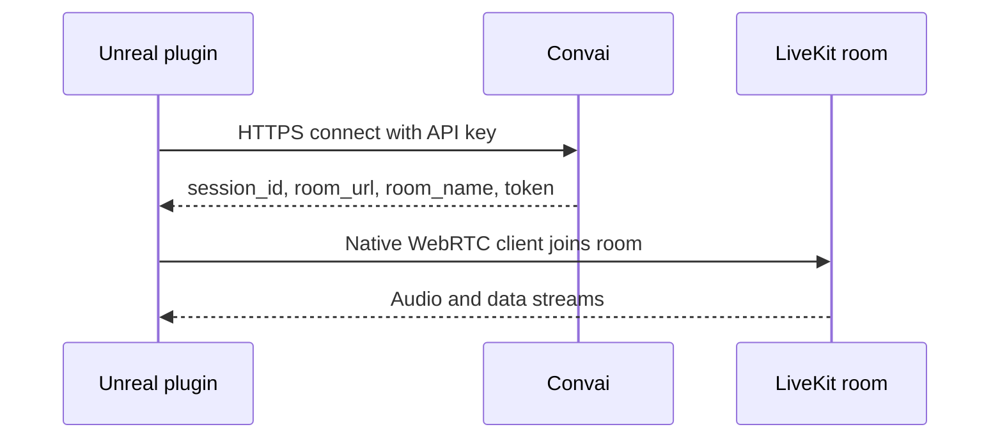

The Convai Unreal Engine plugin requires outbound internet access during runtime. Session setup uses Convai HTTPS endpoints, and realtime audio and data travel through a LiveKit room managed by the bundled WebRTC client. Use this page when preparing a corporate network, validating a firewall allowlist, or confirming that Play In Editor reaches Convai successfully.

## Required outbound access

Runtime sessions use Convai HTTPS endpoints plus LiveKit hosts used after session setup. Allow outbound traffic from the machine running Unreal Engine to the hosts below.

### Convai endpoints

| Host | Port | Protocol | Purpose |
| --- | --- | --- | --- |
| `realtime-api.convai.com` | `443` | HTTPS | Realtime connect — default URL `https://realtime-api.convai.com/connect` |
| `api.convai.com` | `443` | HTTPS | Character data, REST API, and editor network diagnostics |

Override the realtime endpoint through **Edit > Project Settings > Plugins > Convai > Custom URL**, or launch the editor with `-ConvaiStreamURL=` when testing against a non-default connect URL.

### LiveKit minimum requirements

After Convai accepts the connect request, the native WebRTC client joins a LiveKit room. Minimum outbound rules for LiveKit Cloud connectivity:

| Host | Port | Protocol | Purpose |
| --- | --- | --- | --- |
| `convai-technologies-lfslae7c.livekit.cloud` | `443` | TCP | Convai LiveKit signaling endpoint |
| `*.livekit.cloud` | `443` | TCP | LiveKit WebSocket signaling |
| `*.turn.livekit.cloud` | `443` | TCP | TURN/TLS fallback when UDP is blocked |

### Recommended for best audio quality

Allow these rules when your network policy permits UDP. They reduce latency and improve voice quality in training simulations and interactive experiences.

| Host | Port | Protocol | Purpose |
| --- | --- | --- | --- |
| `*.host.livekit.cloud` | `3478` | UDP | TURN/UDP connectivity |
| All LiveKit hosts | `50000`–`60000` | UDP | WebRTC media transport |
| All LiveKit hosts | `7881` | TCP | WebRTC TCP fallback |

No inbound ports are required on the client machine. The public Unreal plugin source does not expose separate TURN, STUN, WSS, or UDP settings — the bundled `ConvaiWebRTC` client selects transport paths after connect. For the full LiveKit firewall reference, see [Configuring firewalls](https://docs.livekit.io/deploy/admin/firewall/) in the LiveKit documentation.

## How realtime sessions connect

Each character session follows this sequence:



The Connect API returns the same room fields documented in [Connect API](../../../api-reference/core-api-reference/live-apis-beta/connect-api.md):

| Connect response field | Runtime use |
| --- | --- |
| `session_id` | Convai session ID for the live session |
| `character_session_id` | Conversation continuity across reconnects |
| `room_url` | LiveKit WebSocket endpoint — for example `wss://convai-technologies-lfslae7c.livekit.cloud` |
| `room_name` | LiveKit room name the client joins |
| `token` | Temporary LiveKit room token used to join the room |

The Unreal plugin passes connect credentials to the native WebRTC client internally. The public plugin source does not read or log `room_url`, `room_name`, or `token` directly — those values are handled inside `ConvaiWebRTC` after the HTTPS connect step completes. The example host `convai-technologies-lfslae7c.livekit.cloud` is one Convai deployment; your session may receive a different `room_url` over time.

## Authentication

Two credential types are involved in a runtime session.

### API key

Your project API key authenticates requests to Convai. Configure it through the Convai editor window (**Window > Open Convai Editor**). The key is stored on `UConvaiSettings.API_Key` and appears in **Edit > Project Settings > Plugins > Convai > API Key**.

| Request type | Header | Used for |
| --- | --- | --- |
| HTTPS REST (`api.convai.com`) | `CONVAI-API-KEY` | Character metadata, long-term memory, and other REST calls |
| Realtime connect | `X-API-Key` | Starting a realtime session — the subsystem remaps `CONVAI-API-KEY` to `X-API-Key` before calling the WebRTC client |

When `API_Key` is empty and a personal access token is configured on `UConvaiSettings.AuthToken`, realtime connect uses `API-AUTH-TOKEN` instead. See [Personal access token](../advanced-topics/personal-access-token.md).

### LiveKit room token

Each successful connect response includes a temporary `token`. The native WebRTC client uses this token to join the LiveKit room. The token is short-lived and grants access only to that room. Treat it like a password — do not share it in public forums, support tickets, or version control.

## Find connection details in logs

The public Unreal plugin source does not print `token`, `room_url`, or `room_name` in the Output Log. Room join details are handled inside the native WebRTC client. Use the logs below to confirm that Convai accepted the session.

### Confirm the realtime connect URL

At connect time, the subsystem logs the stream URL and character ID under `ConvaiSubsystemLog`:

```text
StreamURL: https://realtime-api.convai.com/connect
```

Search the Output Log for `StreamURL` if you need to confirm which connect endpoint the plugin used.

### Confirm session IDs after connect

When the WebRTC client connects successfully, the subsystem logs Convai session identifiers:

```text
OnConnectedToServer called SessionID: <session_id>, CharSessionID: <character_session_id>
```

| Log value | Meaning |
| --- | --- |
| `SessionID` | Convai session ID for the live session |
| `CharSessionID` | Convai character session ID for conversation continuity |

Enable **Verbose** logging for `ConvaiClientLog` to surface additional native WebRTC client messages forwarded through `OnLog`.


Do not share LiveKit room tokens publicly. Although the Unreal plugin does not log `token` in public source, support exports may contain sensitive session data. Redact credentials before posting logs outside your organization.


For full diagnostic export steps, see [Diagnostics and log export](../troubleshooting/diagnostics-and-log-export.md).

## Firewall validation checklist

Work through this checklist with your network or IT team before deploying to a restricted environment.

1. Confirm outbound TCP `443` to `realtime-api.convai.com` and `api.convai.com`.
2. Confirm outbound TCP `443` to `convai-technologies-lfslae7c.livekit.cloud`, `*.livekit.cloud`, and `*.turn.livekit.cloud`.
3. When UDP is permitted, allow UDP `3478` to `*.host.livekit.cloud` and outbound UDP `50000`–`60000`.
4. Exclude Convai and LiveKit hostnames from TLS inspection if your proxy performs man-in-the-middle decryption on HTTPS or WSS traffic.
5. Enter Play In Editor and confirm `OnConnectedToServer called SessionID:` appears in the Output Log under `ConvaiSubsystemLog`.
6. Call **Get Chatbot Connection State** on the `Convai Chatbot` component and confirm the state becomes `Connected`.

If step 5 or 6 fails, see [Connection and API key issues](../troubleshooting/connection-and-api-key-issues.md).

## Troubleshooting

| Symptom | Likely cause | Fix | Verify |
| --- | --- | --- | --- |
| All requests time out | Convai endpoints blocked on TCP `443` | Allow `realtime-api.convai.com` and `api.convai.com` | **Get Chatbot Connection State** returns `Connected` |
| `Failed to establish connection` with valid API key | LiveKit hosts blocked after connect | Add LiveKit minimum and recommended firewall rules from this page | `OnConnectedToServer` log appears; character responds in Play mode |
| `bot-ready not received within` timeout | Slow network or blocked WebRTC path | Confirm LiveKit firewall rules; verify `CharacterID` on the dashboard | Session becomes ready within the client-ready timeout |
| No `OnConnectedToServer` log line | Session never reached the WebRTC layer | Confirm API key through the Convai editor window; verify `CharacterID` on the `Convai Chatbot` component | Log line appears after Play begins |
| API key field empty in Project Settings | Key not saved through the Convai editor window | Open **Window > Open Convai Editor**, sign in, and save the key | `API Key` field is populated in Project Settings |
| Audio is choppy in Play mode | UDP media range blocked | Allow UDP `50000`–`60000` and UDP `3478` to `*.host.livekit.cloud` | Voice quality improves on the same network |


Proxy servers that block or inspect HTTPS traffic can prevent session setup or REST API requests. Allow outbound HTTPS traffic to Convai endpoints and exclude LiveKit hostnames from TLS inspection when your environment uses a corporate proxy.


## Next steps

With network requirements confirmed, install the plugin or review connection troubleshooting.


[Install the Convai Unreal Engine plugin](../getting-started/install-the-convai-plugin.md)



[Connection and API key issues](../troubleshooting/connection-and-api-key-issues.md)

