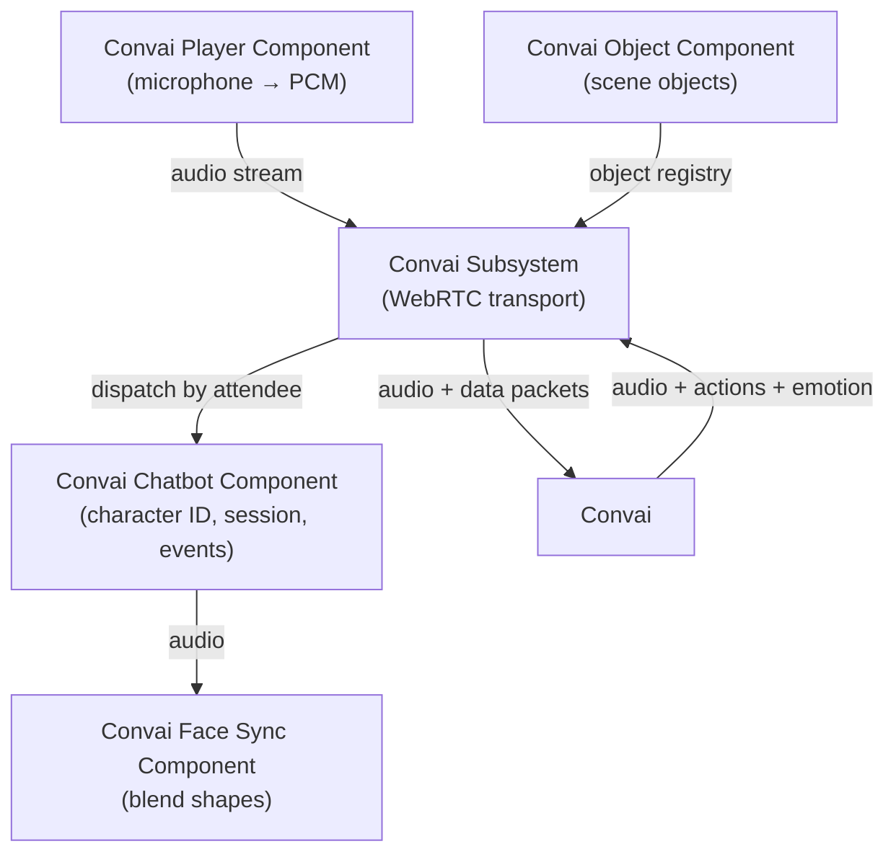

The Convai Unreal Engine plugin is built around a small set of components that each own a single responsibility. Understanding what each component does — and how they relate — makes it easier to configure characters, handle events, and extend the plugin for your project.

## The component model

Every Convai interaction in a level involves at least two participants: a character (an NPC or an AI-driven `Actor`) and a player. The plugin models each participant as a distinct Unreal `Component` derived from the shared abstract base `UConvaiConversationComponent`.

| Component | Blueprint display name | Responsibility |
|---|---|---|
| `UConvaiChatbotComponent` | Convai Chatbot | Represents an AI-driven character. Owns the character ID, session, voice, emotion state, and action queue. |
| `UConvaiPlayerComponent` | Convai Player | Represents the human participant. Owns microphone capture, audio streaming, and push-to-talk state. |
| `UConvaiObjectComponent` | — | Registers an in-scene object or prop so all chatbots can reference it by name in actions and context. |
| `UConvaiFaceSyncComponent` | Convai Face Sync | Drives blend-shape or viseme animation from the character's incoming audio. |
| `UConvaiSubsystem` | Convai Subsystem | Game-instance subsystem. Manages the underlying WebRTC connection, component registry, and global connection state. |

The subsystem is a singleton — it starts automatically with the game instance and is always available through Blueprint's **Get Game Instance → Get Subsystem (Convai Subsystem)** chain.

## How the pieces fit

The chatbot and player components do not communicate directly with each other in Blueprint. They both depend on the subsystem, which owns the actual transport layer. When the player speaks, audio travels from `UConvaiPlayerComponent` through the subsystem to Convai. The character's audio response arrives at the subsystem, which dispatches it to the correct `UConvaiChatbotComponent` by attendee ID.

The diagram above shows runtime data flow. The object component registers with the subsystem at `BeginPlay` so every chatbot can discover it at session start without explicit wiring.

## Conversation state

A session connects one player to one chatbot. Both sides must call `StartSession` (or enable `bAutoInitializeSession`) before a conversation can begin. The session establishes the WebRTC channel through the subsystem and remains open until `StopSession` is called or the game instance ends.

The chatbot tracks three speech-state flags that Blueprint can read at any time: `IsListening`, `IsProcessing` (displayed as "Is Thinking"), and `GetIsTalking`. These form the basis of the conversation flow described in [Conversation flow](conversation-flow.md).

## Pages in this section

<table data-view="cards">
<thead>
<tr>
<th></th>
<th data-hidden data-card-target data-type="content-ref"></th>
</tr>
</thead>
<tbody>
<tr>
<td><strong>Runtime architecture</strong> Roles, ownership, and relationships between every component and the subsystem.</td>
<td><a href="runtime-architecture.md">runtime-architecture.md</a></td>
</tr>
<tr>
<td><strong>Session lifecycle</strong> How sessions start, stop, and recover — including multiplayer considerations and the subsystem Blueprint surface.</td>
<td><a href="session-lifecycle.md">session-lifecycle.md</a></td>
</tr>
<tr>
<td><strong>Conversation flow</strong> Listening, processing, and talking states; transcription; and interruption.</td>
<td><a href="conversation-flow.md">conversation-flow.md</a></td>
</tr>
<tr>
<td><strong>Event system</strong> Every Blueprint-assignable delegate on the chatbot and player components, organized by category.</td>
<td><a href="event-system.md">event-system.md</a></td>
</tr>
</tbody>
</table>
