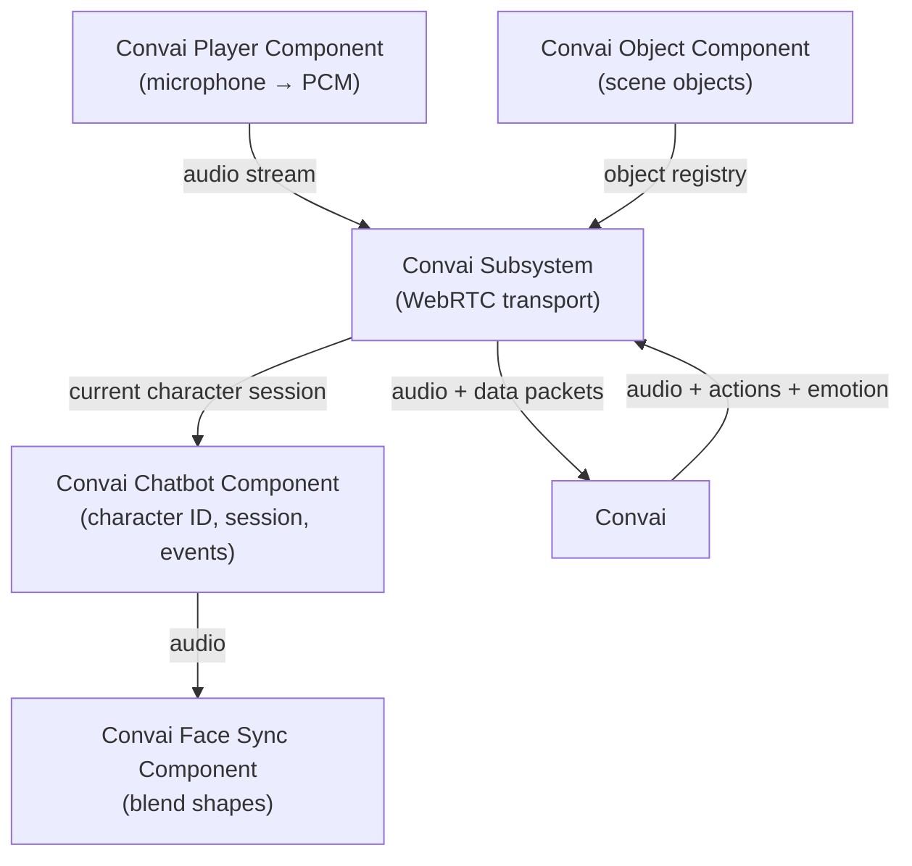

The Convai Unreal Engine plugin is built around a small set of runtime types that each own a single responsibility. Understanding what each type does — and how they relate — helps you configure characters, handle events, and extend the plugin for your project.

Start with **Runtime architecture** if you are new to the plugin internals. Read the remaining pages when you need to understand a specific system — session management, conversation state, or Blueprint events.

## The runtime model

Most Convai interactions in a level involve a chatbot component and a player component. Both derive from the shared abstract base `UConvaiConversationComponent`, which gives them the common conversation event surface. Object and face-sync behavior use separate component types, while `UConvaiSubsystem` is a `UGameInstanceSubsystem`, not an `Actor` component.

| Runtime type | Blueprint display name | Responsibility |
|---|---|---|
| `UConvaiChatbotComponent` | **Convai Chatbot** | Represents an AI-driven character. Owns the character ID, session state, emotion state, environment data, and action queue. |
| `UConvaiPlayerComponent` | **Convai Player** | Represents the player-side participant. Owns microphone capture, audio streaming, push-to-talk state, and gaze attention. |
| `UConvaiObjectComponent` | **Convai Object Component** | Registers an in-scene object or prop so all chatbots can reference it by name in actions and context. |
| `UConvaiFaceSyncComponent` | **Convai Face Sync** | Drives blend-shape or viseme animation from the character's incoming audio. |
| `UConvaiSubsystem` | **Convai Subsystem** | Game-instance subsystem. Manages the underlying WebRTC connection, component registry, and global connection state. |

The subsystem is a singleton — it starts automatically with the game instance and is always available through Blueprint's **Get Game Instance → Get Subsystem (Convai Subsystem)** chain.

## How the pieces fit

The chatbot and player components do not communicate directly with each other in Blueprint. They both depend on the subsystem, which owns the actual transport layer. When the player speaks, audio travels from `UConvaiPlayerComponent` through the subsystem to Convai. The character's audio response arrives at the subsystem and is forwarded to the current character session.

The diagram above shows runtime data flow. The object component registers with the subsystem at `BeginPlay` so every chatbot can discover it at session start without explicit wiring.

## Conversation state

A conversation depends on the chatbot session and the player-side audio path being initialized. The session establishes the WebRTC channel through the subsystem and remains open until `StopSession` is called or the game instance ends.

The chatbot exposes speech-state helper functions such as `GetIsTalking`, `IsListening`, `IsProcessing` (displayed as **Is Thinking**), and `IsInConversation`. In the current plugin version, `GetIsTalking` is the reliable playback-state helper; see [Conversation flow](conversation-flow.md) for the exact behavior.

## Pages in this section

<table data-view="cards">
<thead>
<tr>
<th></th>
<th data-hidden data-card-target data-type="content-ref"></th>
</tr>
</thead>
<tbody>
<tr>
<td><strong>Runtime architecture</strong> Roles, ownership, and relationships between every component and the subsystem.</td>
<td><a href="runtime-architecture.md">runtime-architecture.md</a></td>
</tr>
<tr>
<td><strong>Session lifecycle</strong> How sessions start, stop, and recover — including multiplayer considerations and the subsystem Blueprint surface.</td>
<td><a href="session-lifecycle.md">session-lifecycle.md</a></td>
</tr>
<tr>
<td><strong>Conversation flow</strong> Listening, processing, and talking states; transcription; and interruption.</td>
<td><a href="conversation-flow.md">conversation-flow.md</a></td>
</tr>
<tr>
<td><strong>Event system</strong> Every Blueprint-assignable delegate on the chatbot and player components, organized by category.</td>
<td><a href="event-system.md">event-system.md</a></td>
</tr>
</tbody>
</table>
