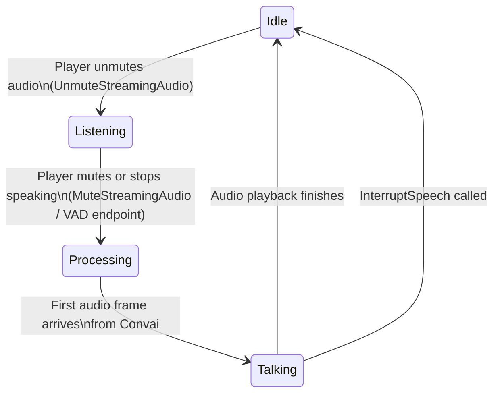

After a session is established, a chatbot moves through a predictable sequence of states for each turn. Understanding these states and the timing of transcription events allows Blueprint to drive character animations, UI feedback, and logic gates that depend on what the character is currently doing.

## Turn states

`UConvaiChatbotComponent` exposes four `BlueprintPure` state functions that can be polled at any time or used in conditions:

| Function | Blueprint display name | Returns `true` when |
|---|---|---|
| `IsListening` | Is Listening | The character is actively receiving audio from the player — the player's microphone is open and the session is forwarding frames. |
| `IsProcessing` | Is Thinking | The character has received the player's utterance and Convai is generating a response, but the first audio frame has not yet arrived. |
| `GetIsTalking` | Is Talking | The character is playing back audio received from Convai. |
| `IsInConversation` | Is In Conversation | Any of the above three is true — the character is in any active phase of a turn. |

These states are mutually exclusive in practice: a character transitions from listening to processing and then to talking before returning to idle. They are not replicated as flags but are derived from the connection state of the underlying session proxy, so they reflect the local component's view.

The diagram above shows the happy-path state machine. Interruption (see below) can cut the Talking state short at any point. The "VAD endpoint" transition in the diagram refers to voice activity detection — the player component can automatically detect when the user has stopped speaking and close the audio stream without requiring an explicit `MuteStreamingAudio` call.

## Timing helpers

Two additional `BlueprintPure` functions on `UConvaiChatbotComponent` give precise timing information during playback:

- `GetTalkingTimeElapsed` — returns the number of seconds that have elapsed since the character started the current talking state.
- `GetTalkingTimeRemaining` — returns the estimated remaining audio duration.

These are useful for synchronizing animations or subtitles to the character's speech without manually tracking timers.

## Voice input modes

`UConvaiPlayerComponent` supports two modes for controlling when audio is forwarded to Convai.

### Push-to-talk

In push-to-talk mode, the game logic explicitly opens and closes the audio stream. Call `UnmuteStreamingAudio` on `UConvaiPlayerComponent` when the player starts speaking and `MuteStreamingAudio` when they stop. The chatbot receives audio only during the open window; closing the stream signals the end of the player's utterance and triggers the transition to the `IsProcessing` state.

Use push-to-talk in training simulations with ambient noise — machinery sounds, classroom ambience, or multiple co-located users — where automatic voice detection may produce false end-of-turn cuts.

### Voice activity detection

Voice activity detection (VAD) lets the server automatically detect when a user has stopped speaking, without requiring a `MuteStreamingAudio` call. Enable it by calling `UpdateVadBP` on the player component with a populated `FConvaiVADSettings` struct.

| Field | Type | Default | Description |
|---|---|---|---|
| `bUseServerDefault` | `bool` | `true` | When `true`, all per-field values below are ignored and the server applies its own defaults. Set to `false` to override individual fields. |
| `Confidence` | `float` | `0.7` | Minimum VAD model probability that a frame contains speech. Raise this value to reduce false positives from background noise; lower it if the character misses quiet speakers. |
| `StartSecs` | `float` | `0.2` | Seconds of sustained speech before the "user started speaking" event fires. Higher values ignore brief bursts. |
| `StopSecs` | `float` | `2.2` | Seconds of silence before the "user stopped speaking" event fires and the stream closes automatically. Lower values produce faster end-of-turn detection at the cost of cutting off slow speakers. |
| `MinVolume` | `float` | `0.6` | Normalized amplitude floor below which audio is treated as silence. Raise this value to reject quiet background voices. |

VAD is suited for hands-free or mobile scenarios where holding a push-to-talk button is impractical.

## Transcription

Transcription is surfaced through `OnTranscriptionReceivedDelegate`, a `BlueprintAssignable` delegate on `UConvaiConversationComponent` (inherited by both chatbot and player components). It fires multiple times per utterance — once for each intermediate result and once more for the final result.

The delegate parameters are:

| Parameter | Type | Description |
|---|---|---|
| `Speaker` | `UConvaiConversationComponent*` | The component whose audio produced the transcription (typically the player component). |
| `Listener` | `UConvaiConversationComponent*` | The component receiving the event (typically the chatbot component). |
| `Transcription` | `FString` | The transcription text at this point in the utterance. |
| `IsTranscriptionReady` | `bool` | `true` when the string is ready to display. |
| `IsFinal` | `bool` | `true` when this is the final update for the utterance. |

The reason transcription fires on the chatbot rather than only on the player is that a scene may contain multiple chatbots. Binding to a specific chatbot's `OnTranscriptionReceivedDelegate` lets each character display subtitles relevant to its own conversation without cross-talk from other characters' sessions.

## Text input

A player can also send text instead of audio. `UConvaiPlayerComponent::SendText` takes a target `UConvaiConversationComponent` (the chatbot) and an `FString`. The chatbot processes the text as if the player had spoken it — it enters the same action, emotion, and audio response pipeline as a voice utterance, and `OnTranscriptionReceivedDelegate` fires with the submitted text as the transcript. This is useful for accessibility scenarios, push-to-talk text UI panels, facilitator-controlled overrides during a training simulation, and automated test harnesses that inject scripted dialogue without microphone input.

## Action queue execution

When Convai returns a response that includes character actions, `OnActionReceivedEvent_V2` fires and the full action sequence is appended to `ActionsQueue`. The character's audio response begins playing in parallel — action execution does not wait for speech to finish unless the action template's `bWaitForBotSpeech` flag is set.

The standard queue-driven execution pattern in Blueprint:

1. Bind to `OnActionReceivedEvent_V2` in `BeginPlay`.
2. When the event fires, call `FetchFirstAction` to pop the first `FConvaiResultAction` from the queue.
3. Execute the action in your game logic (move to a location, play an animation, open a door).
4. Call `HandleActionCompletion(true)` on success. The plugin reports the outcome to Convai and the next queued action (if any) is ready to fetch.
5. Call `HandleActionCompletion(false)` on failure. Convai is notified and may generate a recovery response.
6. If an action fails unrecoverably — for example, the target actor no longer exists — call `AbortActionSequence` to discard all remaining actions in the queue.

The `bWaitForBotSpeech` flag on an action template causes the **first** action in a newly-arrived sequence to wait until the character finishes its current audio before `FetchFirstAction` returns a result. Subsequent actions in the same sequence fire immediately after the prior `HandleActionCompletion`. This flag is set per template in the **Details** panel — not per response.

## Interruption

`InterruptSpeech` on `UConvaiChatbotComponent` stops the character's current playback by fading out the audio over `InVoiceFadeOutDuration` seconds. The fade duration is also configurable as a default through the `InterruptVoiceFadeOutDuration` property on the component.

In multiplayer, `InterruptSpeech` uses the `Broadcast_InterruptSpeech` `NetMulticast Reliable` RPC to apply the fade-out on all connected clients simultaneously, keeping audio state consistent across the network.

The `OnInterruptedEvent` delegate fires after an interruption is applied. It carries the chatbot component and the interacting player component, allowing Blueprint to transition animations or reset UI state.

The reason the plugin supports a gradual fade rather than an instant cut is that abrupt audio stops create perceptual artifacts. The fade duration gives designers control over whether the interruption sounds natural or abrupt.

## Invoke speech and narrative triggers

Two `BlueprintCallable` functions let Blueprint drive the character's speech without player input:

- `ExecuteNarrativeTrigger` (Blueprint display name **Invoke Speech**) — sends a free-form trigger message that causes the character to speak. Used for scripted moments, cutscenes, or timed NPC dialogue. The Blueprint node is labelled **Invoke Speech**; the C++ name `ExecuteNarrativeTrigger` is only visible in code.
- `InvokeNarrativeDesignTrigger` (Blueprint display name **Invoke Narrative Design Trigger**) — fires a named trigger defined in the Convai dashboard's Narrative Design tool. The dashboard maps trigger names to specific sections of a narrative graph.


Use `ExecuteNarrativeTrigger` for one-off, freeform prompts where the exact wording can vary at runtime. Use `InvokeNarrativeDesignTrigger` when the trigger name is a stable contract with the dashboard — this ensures predictable branching in the narrative graph and makes the flow testable.


Both functions accept `InGenerateActions` (whether the response should include character actions) and `InReplicateOnNetwork` (whether the trigger should be broadcast to other session attendees). If the session is not yet connected when either function is called, the trigger is queued and fires automatically once the connection is established.

## Usage examples

### Talk-to-character interaction with push-to-talk

A medical training simulation where a learner speaks to a patient character by holding a button.

1. Bind a **Pressed** event on the interaction input action to **Unmute Streaming Audio** on the player component — this opens the audio stream.
2. Bind the **Released** event to **Mute Streaming Audio** — this closes the stream and triggers the `IsProcessing` state.
3. While `IsListening` returns `true`, show a "Recording" indicator on the HUD. While `IsProcessing` returns `true`, show a "Thinking" indicator. While `GetIsTalking` returns `true`, show the character's subtitles.

Expected result: The patient character responds to each utterance after the player releases the button. The HUD indicators track the turn state without polling on tick — read the state functions only in response to Blueprint events that might change them.

### Facilitator text injection

A training simulation where a facilitator can type a message that the AI character receives and responds to, without using a microphone.

1. Build a simple in-editor or runtime UI widget with a text field and a **Send** button.
2. Wire the **Send** button's **On Clicked** event to **Send Text** on the player component, passing the chatbot component as the target and the text field's content as the input string.

Expected result: The character responds to the typed message with audio and actions, as if the facilitator had spoken the words aloud. The `OnTranscriptionReceivedDelegate` fires with the typed text as the transcript, allowing subtitle UI to display it.

## Troubleshooting

| Symptom | Likely cause | Fix | Verify |
|---|---|---|---|
| Character stays in `IsProcessing` indefinitely | Network interruption after the player's utterance was forwarded | Call `GetChatbotConnectionState`. If the state is `Reconnecting`, wait for automatic reconnection. If the state is stuck, call `StopSession` then `StartSession` to reopen the channel. | `IsProcessing` returns `false` and `GetIsTalking` returns `true` when the first audio response arrives. |
| `IsListening` is `true` but the character never enters `IsProcessing` | The audio stream was not closed — `MuteStreamingAudio` was never called and VAD did not detect a natural endpoint | Call **Mute Streaming Audio** explicitly after the player finishes speaking, or ensure voice activity detection is enabled via `UpdateVadBP` and the player has stopped speaking for the detection window. | `IsProcessing` becomes `true` immediately after the stream closes. |
| Actions arrive in `OnActionReceivedEvent_V2` but nothing executes | `FetchFirstAction` was not called inside the event handler, or `HandleActionCompletion` was not called after each action executed | Call **Fetch First Action** inside the **On Actions Received** handler. After executing the action, always call **Handle Action Completion** with `true` on success or `false` on failure. | A **Print String** on the dequeued action name confirms receipt. The next action in the sequence becomes available after each completion call. |
| `InterruptSpeech` has no visible effect | Called while `GetIsTalking` is `false` — no audio is playing | Guard the call with a **Get Is Talking** check. Call `InterruptSpeech` only when the character is in the talking state. | `OnInterruptedEvent` fires and `GetIsTalking` returns `false` after the fade-out completes. |

## Related concepts


[Session lifecycle](session-lifecycle.md)



[Event system](event-system.md)

