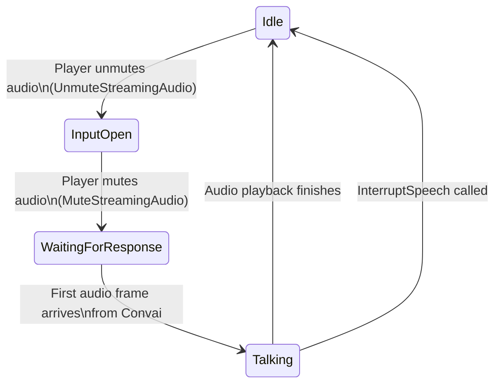

After a session is established, the player component forwards audio or text input, Convai returns transcripts and character output, and the chatbot component plays audio, updates face and emotion data, and queues actions. Understanding which parts are event-driven and which helper functions are reliable in the current SDK helps Blueprint drive UI and gameplay without depending on unsupported state assumptions.

## Playback and helper state

`UConvaiChatbotComponent` exposes several `BlueprintPure` state and playback helpers:

| Function | Blueprint display name | Current behavior |
|---|---|---|
| `GetIsTalking` | Is Talking | Returns the component's current audio playback flag. Use this for subtitle timing, animation transitions, and interrupt buttons. |
| `GetTalkingTimeElapsed` | — | Returns the elapsed playback time for the current audio response. |
| `GetTalkingTimeRemaining` | — | Returns the estimated remaining playback time. |
| `IsListening` | Is Listening | Present in the Blueprint API, but currently returns `false` in the SDK source. |
| `IsProcessing` | Is Thinking | Present in the Blueprint API, but currently returns `false` in the SDK source. |
| `IsInConversation` | Is In Conversation | Combines the helper states. Because `IsListening` and `IsProcessing` currently return `false`, this is effectively tied to `GetIsTalking` in the current SDK. |

For current builds, treat `GetIsTalking`, the audio playback delegates, transcription events, and action events as the reliable runtime signals. Do not build critical UI logic around `IsListening` or `IsProcessing` until the SDK implementation changes.

The diagram above shows the conceptual happy path. It is not a one-to-one map to all helper functions in the current SDK.

## Voice input modes

`UConvaiPlayerComponent` supports two modes for controlling when audio is forwarded to Convai.

### Push-to-talk

In push-to-talk mode, the game logic explicitly opens and closes the audio stream. Call `UnmuteStreamingAudio` on `UConvaiPlayerComponent` when the player starts speaking and `MuteStreamingAudio` when they stop. The player component forwards audio only during the open window.

Use push-to-talk in training simulations with ambient noise — machinery sounds, classroom ambience, or multiple co-located users — where automatic voice detection may produce false end-of-turn cuts.

### Voice activity detection

Voice activity detection (VAD) is toggled on the player component by calling `UpdateVadBP(bool EnableVAD)`. The detailed VAD thresholds live in `FConvaiVADSettings` on the Convai project settings object and can be read or changed through the utility settings functions.

| Field | Type | Default | Description |
|---|---|---|---|
| `bUseServerDefault` | `bool` | `true` | When `true`, all per-field values below are ignored and Convai applies its own defaults. Set to `false` to override individual fields. |
| `Confidence` | `float` | `0.7` | Minimum VAD model probability that a frame contains speech. Raise this value to reduce false positives from background noise; lower it if the character misses quiet speakers. |
| `StartSecs` | `float` | `0.2` | Seconds of sustained speech before the "user started speaking" event fires. Higher values ignore brief bursts. |
| `StopSecs` | `float` | `2.2` | Seconds of silence before the VAD endpoint is reached. Lower values produce faster end-of-turn detection at the cost of cutting off slow speakers. |
| `MinVolume` | `float` | `0.6` | Normalized amplitude floor below which audio is treated as silence. Raise this value to reject quiet background voices. |

VAD is suited for hands-free or mobile scenarios where holding a push-to-talk button is impractical.

## Transcription

Transcription is surfaced through `OnTranscriptionReceivedDelegate`, a `BlueprintAssignable` delegate on `UConvaiConversationComponent` (inherited by both chatbot and player components). The subsystem forwards user transcripts to the player session and bot transcripts to the chatbot session.

The delegate parameters are:

| Parameter | Type | Description |
|---|---|---|
| `Speaker` | `UConvaiConversationComponent*` | The component broadcasting the transcription event. Current broadcast sites pass `this`. |
| `Listener` | `UConvaiConversationComponent*` | Present in the delegate signature. Current broadcast sites pass `nullptr`. |
| `Transcription` | `FString` | The transcription text at this point in the utterance. |
| `IsTranscriptionReady` | `bool` | Readiness marker from the current transcript path. Bot transcript text is forwarded with `true`; user transcript text can arrive with `false`, followed by an empty final marker with `true`. |
| `IsFinal` | `bool` | `true` when this is the final update for the utterance. |

Bind to the player component when you need user utterance transcripts. Bind to the chatbot component when you need bot response transcripts. For user subtitles, display the non-empty `Transcription` payload instead of gating display only on `IsTranscriptionReady`.

## Text input

A player can also send text instead of audio. `UConvaiPlayerComponent::SendText` takes a target `UConvaiConversationComponent` parameter and an `FString`, but the current implementation sends the text through the subsystem as a `user_text_message` and does not use the target parameter for routing. It also does not directly broadcast `OnTranscriptionReceivedDelegate` with the submitted text. Use this path for accessibility input, facilitator-controlled overrides during a training simulation, and automated test harnesses that inject scripted dialogue without microphone input.

## Action queue execution

When Convai returns a response that includes character actions, `OnActionReceivedEvent_V2` fires and the sequence is added to `ActionsQueue`. If the queue is empty, the new sequence becomes the queue. If the queue already contains an action, the current first action is preserved and the new sequence replaces the remaining queued items.

The standard queue-driven execution pattern in Blueprint:

1. Bind to `OnActionReceivedEvent_V2` in `BeginPlay`.
2. When the event fires, call `FetchFirstAction` to read the first `FConvaiResultAction` from the queue.
3. Execute the action in your game logic (move to a location, play an animation, open a door).
4. Call `HandleActionCompletion(true)` on success. The plugin reports the outcome to Convai and the next queued action (if any) is ready to fetch.
5. Call `HandleActionCompletion(false)` on failure. Convai is notified and may generate a recovery response.
6. If an action fails unrecoverably — for example, the target actor no longer exists — call `AbortActionSequence` to discard all remaining actions in the queue.

The `bWaitForBotSpeech` flag on an action template gates `StartFirstAction` for the first action in a newly arrived sequence. The gate can release when bot speech starts, bot speech finishes, the response has no bot audio, or the wait timer expires. Subsequent queue advancement is driven by `HandleActionCompletion`.

## Interruption

`InterruptSpeech` on `UConvaiChatbotComponent` stops the character's current playback by fading out the audio over `InVoiceFadeOutDuration` seconds. The fade duration is also configurable as a default through the `InterruptVoiceFadeOutDuration` property on the component.

The class also exposes `Broadcast_InterruptSpeech` as a `NetMulticast Reliable` RPC for network-wide interruption paths. `InterruptSpeech` itself applies the fade request on the component where it is called.

The `OnInterruptedEvent` delegate fires when an interruption is applied while the chatbot is talking or processing. The current implementation broadcasts the chatbot component and passes `nullptr` for the player component.

The reason the plugin supports a gradual fade rather than an instant cut is that abrupt audio stops create perceptual artifacts. The fade duration gives designers control over whether the interruption sounds natural or abrupt.

## Invoke speech and narrative triggers

Two `BlueprintCallable` functions let Blueprint drive the character's speech without player input:

- `ExecuteNarrativeTrigger` (Blueprint display name **Invoke Speech**) — adds the provided text as a dynamic context event with `EC_RunLLMOption::Always`. The Blueprint node is labelled **Invoke Speech**; the C++ name `ExecuteNarrativeTrigger` is only visible in code.
- `InvokeNarrativeDesignTrigger` (Blueprint display name **Invoke Narrative Design Trigger**) — queues or invokes a named Narrative Design trigger through the chatbot component.


Use `ExecuteNarrativeTrigger` for one-off, freeform prompts where the exact wording can vary at runtime. Use `InvokeNarrativeDesignTrigger` when the trigger name is a stable contract with Narrative Design.


Both functions expose `InGenerateActions` and `InReplicateOnNetwork` parameters in the Blueprint API. In the current implementation, `ExecuteNarrativeTrigger` routes through `AddContextEvent` and does not use those two parameters. `InvokeNarrativeDesignTrigger` uses the internal trigger path and queues disconnected trigger calls until the session is established.

## Usage examples

### Talk-to-character interaction with push-to-talk

A medical training simulation where a learner speaks to a patient character by holding a button.

1. Bind a **Pressed** event on the interaction input action to **Unmute Streaming Audio** on the player component — this opens the audio stream.
2. Bind the **Released** event to **Mute Streaming Audio** — this closes the stream.
3. Track your own recording indicator from the input events. Use `GetIsTalking` and the audio playback delegates to show subtitle or talking indicators while the character response plays.

Expected result: The patient character receives audio only while the player holds the button. The response playback indicator follows `GetIsTalking` or the playback delegates.

### Facilitator text injection

A training simulation where a facilitator can type a message that the AI character receives and responds to, without using a microphone.

1. Build a simple in-editor or runtime UI widget with a text field and a **Send** button.
2. Wire the **Send** button's **On Clicked** event to **Send Text** on the player component, passing the text field's content as the input string.

Expected result: The player component sends the typed message through the subsystem as text input. Display the submitted text from your UI state if you need local subtitles for the facilitator message.

## Troubleshooting

| Symptom | Likely cause | Fix | Verify |
|---|---|---|---|
| Character does not start talking after input | Session is not connected, audio was not sent, or the text message was not submitted | Check `GetChatbotConnectionState`, confirm the player component is initialized, and verify that your input event calls `MuteStreamingAudio` or `SendText`. | `GetIsTalking` becomes `true` when the first audio response plays. |
| Recording indicator never turns off | The UI is tied to `IsListening`, which currently returns `false` | Drive recording UI from your input pressed/released events instead of `IsListening`. | The indicator follows the button state exactly. |
| Actions arrive in `OnActionReceivedEvent_V2` but nothing executes | `FetchFirstAction` was not called inside the event handler, or `HandleActionCompletion` was not called after each action executed | Call **Fetch First Action** inside the **On Actions Received** handler. After executing the action, always call **Handle Action Completion** with `true` on success or `false` on failure. | A **Print String** on the fetched action name confirms receipt. The next action in the sequence becomes available after each completion call. |
| `InterruptSpeech` has no visible effect | Called while `GetIsTalking` is `false` — no audio is playing | Guard the call with a **Get Is Talking** check. Call `InterruptSpeech` only when the character is in the talking state. | `GetIsTalking` returns `false` after the fade-out completes. |

## Related concepts


[Session lifecycle](session-lifecycle.md)



[Event system](event-system.md)

