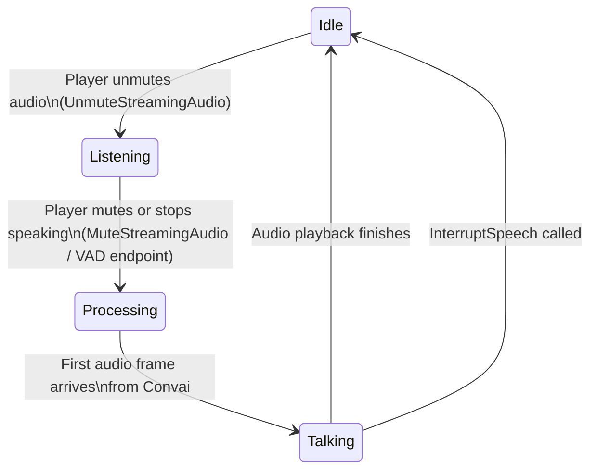

After a session is established, a chatbot moves through a predictable sequence of states for each turn. Understanding these states and the timing of transcription events allows Blueprint to drive character animations, UI feedback, and logic gates that depend on what the character is currently doing.

## Turn states

`UConvaiChatbotComponent` exposes four `BlueprintPure` state functions that can be polled at any time or used in conditions:

| Function | Blueprint display name | Returns `true` when |
|---|---|---|
| `IsListening` | Is Listening | The character is actively receiving audio from the player — the player's microphone is open and the session is forwarding frames. |
| `IsProcessing` | Is Thinking | The character has received the player's utterance and Convai is generating a response, but the first audio frame has not yet arrived. |
| `GetIsTalking` | Is Talking | The character is playing back audio received from Convai. |
| `IsInConversation` | Is In Conversation | Any of the above three is true — the character is in any active phase of a turn. |

These states are mutually exclusive in practice: a character transitions from listening to processing and then to talking before returning to idle. They are not replicated as flags but are derived from the connection state of the underlying session proxy, so they reflect the local component's view.

The diagram above shows the happy-path state machine. Interruption (see below) can cut the Talking state short at any point. The "VAD endpoint" transition in the diagram refers to voice activity detection — the player component can automatically detect when the user has stopped speaking and close the audio stream without requiring an explicit `MuteStreamingAudio` call.

## Timing helpers

Two additional `BlueprintPure` functions on `UConvaiChatbotComponent` give precise timing information during playback:

- `GetTalkingTimeElapsed` — returns the number of seconds that have elapsed since the character started the current talking state.
- `GetTalkingTimeRemaining` — returns the estimated remaining audio duration.

These are useful for synchronizing animations or subtitles to the character's speech without manually tracking timers.

## Transcription

Transcription is surfaced through `OnTranscriptionReceivedDelegate`, a `BlueprintAssignable` delegate on `UConvaiConversationComponent` (inherited by both chatbot and player components). It fires multiple times per utterance — once for each intermediate result and once more for the final result.

The delegate parameters are:

| Parameter | Type | Description |
|---|---|---|
| `Speaker` | `UConvaiConversationComponent*` | The component whose audio produced the transcription (typically the player component). |
| `Listener` | `UConvaiConversationComponent*` | The component receiving the event (typically the chatbot component). |
| `Transcription` | `FString` | The transcription text at this point in the utterance. |
| `IsTranscriptionReady` | `bool` | `true` when the string is ready to display. |
| `IsFinal` | `bool` | `true` when this is the final update for the utterance. |

The reason transcription fires on the chatbot rather than only on the player is that a scene may contain multiple chatbots. Binding to a specific chatbot's `OnTranscriptionReceivedDelegate` lets each character display subtitles relevant to its own conversation without cross-talk from other characters' sessions.

## Text input

A player can also send text instead of audio. `UConvaiPlayerComponent::SendText` takes a target `UConvaiConversationComponent` (the chatbot) and an `FString`. The chatbot processes the text as if the player had spoken it, producing the same action, emotion, and audio response pipeline. This is useful for push-to-talk text UI, automated testing, and accessibility scenarios.

## Interruption

`InterruptSpeech` on `UConvaiChatbotComponent` stops the character's current playback by fading out the audio over `InVoiceFadeOutDuration` seconds. The fade duration is also configurable as a default through the `InterruptVoiceFadeOutDuration` property on the component.

In multiplayer, `InterruptSpeech` uses the `Broadcast_InterruptSpeech` `NetMulticast Reliable` RPC to apply the fade-out on all connected clients simultaneously, keeping audio state consistent across the network.

The `OnInterruptedEvent` delegate fires after an interruption is applied. It carries the chatbot component and the interacting player component, allowing Blueprint to transition animations or reset UI state.

The reason the plugin supports a gradual fade rather than an instant cut is that abrupt audio stops create perceptual artifacts. The fade duration gives designers control over whether the interruption sounds natural or abrupt.

## Invoke speech and narrative triggers

Two `BlueprintCallable` functions let Blueprint drive the character's speech without player input:

- `ExecuteNarrativeTrigger` (Blueprint display name **Invoke Speech**) — sends a free-form trigger message that causes the character to speak. Used for scripted moments, cutscenes, or timed NPC dialogue. The Blueprint node is labelled **Invoke Speech**; the C++ name `ExecuteNarrativeTrigger` is only visible in code.
- `InvokeNarrativeDesignTrigger` (Blueprint display name **Invoke Narrative Design Trigger**) — fires a named trigger defined in the Convai dashboard's Narrative Design tool. The dashboard maps trigger names to specific sections of a narrative graph.

Both functions accept `InGenerateActions` (whether the response should include character actions) and `InReplicateOnNetwork` (whether the trigger should be broadcast to other session attendees). If the session is not yet connected when either function is called, the trigger is queued and fires automatically once the connection is established.

## Related concepts


[Session lifecycle](session-lifecycle.md)



[Event system](event-system.md)

