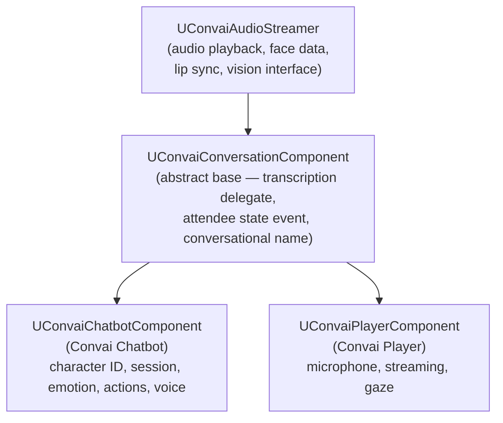

The Convai Unreal Engine plugin partitions responsibility across five distinct types: a chatbot component, a player component, an object component, a face sync component, and a game-instance subsystem. Each type owns a narrow slice of the system; none duplicates the responsibility of another.

## Component hierarchy

All conversation-capable components share a two-level base:

- `UConvaiAudioStreamer` — the lowest layer. It manages audio playback from a procedural sound wave and delivers per-frame blendshape face data to any component that implements `IConvaiLipSyncInterface`. It also hosts a vision slot (`IConvaiVisionInterface`) for webcam or render-target input. Both interfaces are extension points: `IConvaiLipSyncInterface` is how `UConvaiFaceSyncComponent` (and any custom lip-sync driver) receives face data, and `IConvaiVisionInterface` is how camera-feed or render-target components supply visual context to the AI. Both chatbot and player inherit audio and face capabilities from this class.
- `UConvaiConversationComponent` — extends `UConvaiAudioStreamer`. It adds the shared conversational-name helper (`GetConversationalName`) plus the two delegates inherited by both chatbot and player: `OnTranscriptionReceivedDelegate` and `OnAttendeeConnectionStateChangedEvent`.

## Convai Chatbot component

`UConvaiChatbotComponent` (Blueprint display name **Convai Chatbot**) is the central component for an AI-driven character. It owns:

- **Identity.** `CharacterID` identifies the character to load, and `CharacterName` stores the loaded character name. Broader character configuration is managed outside this runtime architecture page.
- **Session.** The `bAutoInitializeSession` flag and the `StartSession` / `StopSession` functions manage the WebRTC channel through the subsystem. See [Session lifecycle](session-lifecycle.md) for detail.
- **Conversation state.** Read-only state functions such as `GetIsTalking`, `IsListening`, `IsProcessing`, and `IsInConversation` expose the current helper surface. In the current SDK, `GetIsTalking` reflects audio playback; see [Conversation flow](conversation-flow.md) for the exact behavior of each helper.
- **Action queue.** When Convai sends a sequence of actions, they land in `ActionsQueue` as `FConvaiResultAction` items. Blueprint reads the current head item by calling `FetchFirstAction`, executes the action, then calls `HandleActionCompletion`. A successful completion dequeues the current action and advances the queue. Call `AbortActionSequence` to clear the queue when an action fails unrecoverably.
- **Emotion state.** `EmotionState` (type `FConvaiEmotionState`) is replicated. `LockEmotionState` prevents incoming updates from overwriting a manually set emotion.
- **Environment.** `EnvironmentData` (type `FConvaiEnvironmentData`) holds the action templates, objects, and characters the AI can reference. Mutate it at runtime through the granular methods `AddObject`, `RemoveObject`, `AddCharacter`, and `SetObjectInAttention` — not by writing the property directly. Action templates in `EnvironmentData.Actions` are fixed at `/connect` time; only objects and characters can be updated mid-session.
- **Dynamic context.** `UpdateContext`, `SetContextState`, `SetContextStates`, `AddContextEvent`, and `ResetDynamicContext` push real-time world state to the AI during a live session. Updates are batched using a debounce window controlled by `ContextDebounceWindow` and `ContextMaxDebounceWindow`.
- **Session value reset.** `SessionID` defaults to `"-1"`, and `ResetConversation` resets it to `"-1"`. The current WebRTC connect path does not expose `SessionID` as a resume parameter.
- **Attention targeting.** `ConversationPartner`, `LookAtTarget`, and `PointAtTarget` are replicated properties that track which player the character is speaking with and what it is looking at or pointing to.

The chatbot component also implements `IConvaiConnectionInterface`, which is how the subsystem routes incoming audio, actions, emotion data, and face data to the correct component.

## Convai Player component

`UConvaiPlayerComponent` (Blueprint display name **Convai Player**) represents the human side of the conversation. It owns:

- **Identity.** `PlayerName` is replicated through `SetPlayerName` and its server RPC counterpart. `EndUserID` and `EndUserMetadata` have setter functions and server RPC counterparts, but they are not registered for replication in the current SDK build.
- **Session.** The same `bAutoInitializeSession`, `StartSession`, `StopSession`, and `IsPlayerConnected` surface as the chatbot, but for the player-side WebRTC channel.
- **Microphone.** `UnmuteStreamingAudio` / `MuteStreamingAudio` control live streaming. `StartRecording` / `FinishRecording` capture a full utterance as a `USoundWave`. Device selection is available through `SetCaptureDeviceByIndex`, `SetCaptureDeviceByName`, and related query functions.
- **Gaze attention.** When `bEnableGazeAttention` is `true`, the component traces from the player camera each tick. Sustained gaze on a `UConvaiObjectComponent` is forwarded through the object component to eligible registered chatbots, and each chatbot may accept it as the current object in attention.
- **Push-to-talk and VAD.** `bMute` silences microphone submission. `UpdateVadBP` toggles voice activity detection.

The player component implements two interfaces: `IConvaiConnectionInterface` (same as the chatbot — used by the subsystem for session routing and event dispatch) and `IConvaiProcessedAudioReceiver`. Audio-processing middleware implements `IConvaiAudioProcessingInterface`; the player component is the processed-audio receiver that accepts processed frames before they are forwarded to the subsystem.

## Convai Object component

`UConvaiObjectComponent` registers any `Actor` in the level as a named object that all chatbots can reference. Drop it on a door, lever, room, or prop and fill in `ObjectEntry` (name and description). The component registers itself with the subsystem at `BeginPlay`. Every chatbot that starts a session after that automatically receives the object in its environment; chatbots already connected receive the object via `AddOrUpdateObjectFromComponent`.

Optionally, `TrackedProperties` lets designers bind `UPROPERTY` fields on the owning actor to the AI context. All object components share a polling clock (approximately every `0.25` seconds). On each poll, the subsystem evaluates every tracked property and pushes a `SetContextState` update to registered chatbots only when the value has changed — not on every tick. With `bAutoGenerateProximityState` enabled (the default), the component also synthesizes a per-chatbot proximity description — for example, "close by, in front and to the right" — and maintains it as a state key that updates as the chatbot or object moves.

The component exposes four gaze events (`OnGazedIn`, `OnGazedOut`, `OnAttentionGained`, `OnAttentionLost`) so Blueprint can react to player focus independently of the chatbot.

## Convai Face Sync component

`UConvaiFaceSyncComponent` (Blueprint display name **Convai Face Sync**) is a `USceneComponent` that implements `IConvaiLipSyncInterface`. It receives pre-computed face data from the chatbot's audio pipeline and drives blend shapes each tick.

The `LipSyncMode` property (`EC_LipSyncMode`) selects the target blend-shape format:

| Value | Display name | Use for |
|---|---|---|
| `Off` | Off | Disable lip sync |
| `Auto` | Auto | Let the plugin choose |
| `VisemeBased` | Viseme Based | Generic viseme targets |
| `BS_MHA` | MetaHuman Blendshapes | MetaHuman rigs (default) |
| `BS_ARKit` | ARKit Blendshapes | ARKit-compatible rigs |
| `BS_CC4_Extended` | CC4 Extended Blendshapes | Reallusion CC4 rigs |

The face sync component is passive — it does not initiate any network activity. Face data is routed through the chatbot's audio-streamer pipeline to components that implement `IConvaiLipSyncInterface`, and the face sync component exposes the resulting blendshape values to the character's Anim Blueprint each tick.

To apply blendshapes from an Anim Blueprint, add the **Convai Face Sync** AnimGraph node (`FAnimNode_ConvaiFaceSync`) to the character's animation graph. The node takes a `UConvaiChatbotComponent` pin (shown by default) and samples the blendshape data on each animation tick. It supports upper/lower face alpha controls based on blendshape name lists, blendshape name remapping via a `BlendshapeMapping` table, global multiplier and offset, and configurable starvation blend-in/out when no face data has arrived recently.

## Convai Subsystem

`UConvaiSubsystem` is a `UGameInstanceSubsystem` — it starts and stops with the game instance. It is the single point of contact between the plugin's Unreal layer and the underlying WebRTC transport (`convai::ConvaiClient`).

The subsystem is responsible for:

- **Connection management.** `ConnectSession` and `DisconnectSession` are called by the component session proxies; no Blueprint interaction is needed.
- **Component registry.** The subsystem keeps lists of registered chatbot, player, and object components so runtime data can be forwarded to the current session and related component callbacks.
- **Tracked-property polling.** The subsystem runs a shared polling clock (approximately every 0.25 seconds) that evaluates all registered `UConvaiObjectComponent` tracked properties in lockstep. Values are pushed to registered chatbots only when they change, preventing unnecessary context traffic.
- **Global connection state.** `GetServerConnectionState` returns the current `EC_ConnectionState` value. The enum includes `Disconnected`, `Connecting`, `Connected`, and `Reconnecting`, but the current runtime path drives `Disconnected`, `Connecting`, and `Connected`. `OnServerConnectionStateChangedEvent` fires whenever the driven state changes.
- **Idle management.** `ResetIdleTimer` and `InvalidateOrphanedConnection` let Blueprint intervene when the subsystem detects an idle or stale connection. `OnUserIdleWarning` fires before the idle timeout elapses to give the game a chance to prevent a disconnection.

The subsystem's full Blueprint surface is covered in [Session lifecycle](session-lifecycle.md).

## Ownership and lifetime

| Component | Owned by | Lifetime |
|---|---|---|
| `UConvaiChatbotComponent` | The NPC `Actor` | Same as the actor |
| `UConvaiPlayerComponent` | The player `Actor` (pawn or controller) | Same as the actor |
| `UConvaiObjectComponent` | Any in-scene `Actor` | Same as the actor |
| `UConvaiFaceSyncComponent` | The NPC `Actor` (alongside the chatbot component) | Same as the actor |
| `UConvaiSubsystem` | The `UGameInstance` | Entire game session |

Chatbot, player, and object components register with the subsystem in `BeginPlay` and unregister in `EndPlay`, so components that are destroyed mid-game (for example a character that is killed) cleanly remove themselves from the subsystem registry. The face sync component is attached to the character but does not register with the subsystem.

## Related concepts

Read the lifecycle page next when you need to control connection timing, the flow page when you need turn-level behavior, and the event page when you need Blueprint delegate details.


[Session lifecycle](session-lifecycle.md)



[Conversation flow](conversation-flow.md)



[Event system](event-system.md)

