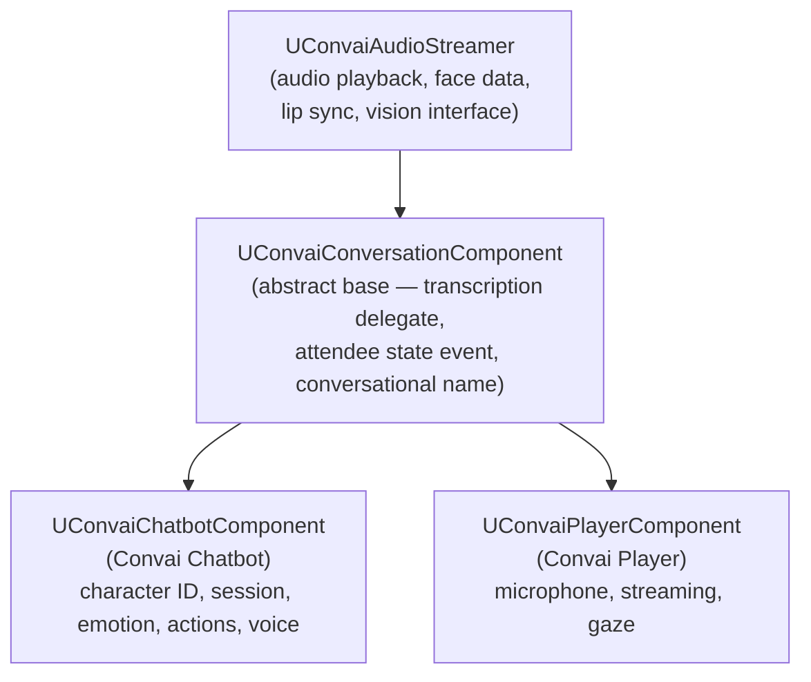

The Convai Unreal Engine plugin partitions responsibility across five distinct types: a chatbot component, a player component, an object component, a face sync component, and a game-instance subsystem. Each type owns a narrow slice of the system; none duplicates the responsibility of another.

## Component hierarchy

All conversation-capable components share a two-level base:

- `UConvaiAudioStreamer` — the lowest layer. It manages audio playback from a procedural sound wave, delivers per-frame blendshape face data to any attached `IConvaiLipSyncInterface`, and hosts the vision interface (`IConvaiVisionInterface`) for webcam or render-target input. Both chatbot and player inherit audio and face capabilities from this class.
- `UConvaiConversationComponent` — extends `UConvaiAudioStreamer`. It adds the two properties every participant exposes to the system — whether it is a player (`IsPlayer`) and its conversational name (`GetConversationalName`) — plus the two delegates inherited by both chatbot and player: `OnTranscriptionReceivedDelegate` and `OnAttendeeConnectionStateChangedEvent`.

## Convai Chatbot component

`UConvaiChatbotComponent` (Blueprint display name **Convai Chatbot**) is the central component for an AI-driven character. It owns:

- **Identity.** `CharacterID` (replicated), `CharacterName`, `VoiceType`, `Backstory`, `LanguageCode`, `ReadyPlayerMeLink`, and `AvatarImageLink` are loaded from the Convai dashboard when `LoadCharacter` is called or when the component starts a session.
- **Session.** The `bAutoInitializeSession` flag and the `StartSession` / `StopSession` functions manage the WebRTC channel through the subsystem. See [Session lifecycle](session-lifecycle.md) for detail.
- **Conversation state.** Three read-only state functions — `IsListening`, `IsProcessing`, and `GetIsTalking` — describe where the character is in the turn cycle. See [Conversation flow](conversation-flow.md).
- **Action queue.** When Convai sends a sequence of actions, they land in `ActionsQueue` as `FConvaiResultAction` items. Blueprint advances the queue by calling `FetchFirstAction` (which pops the first item), executing the action, then calling `HandleActionCompletion`. The `bWaitForBotSpeech` flag on an action template defers the first action in a sequence until the character finishes speaking. Call `AbortActionSequence` to clear the queue when an action fails unrecoverably.
- **Emotion state.** `EmotionState` (type `FConvaiEmotionState`) is replicated. `LockEmotionState` prevents incoming updates from overwriting a manually set emotion.
- **Environment.** `EnvironmentData` (type `FConvaiEnvironmentData`) holds the action templates, objects, and characters the AI can reference. Mutate it at runtime through the granular methods `AddObject`, `RemoveObject`, `AddCharacter`, and `SetObjectInAttention` — not by writing the property directly. Action templates in `EnvironmentData.Actions` are fixed at `/connect` time; only objects and characters can be updated mid-session.
- **Dynamic context.** `UpdateContext`, `SetContextState`, `SetContextStates`, `AddContextEvent`, and `ResetDynamicContext` push real-time world state to the AI during a live session. Updates are batched using a debounce window controlled by `ContextDebounceWindow` and `ContextMaxDebounceWindow`.
- **Session memory.** `SessionID` (default `"-1"`) links conversations across sessions for long-term memory. Call `ResetConversation` to clear it.
- **Attention targeting.** `ConversationPartner`, `LookAtTarget`, and `PointAtTarget` are replicated properties that track which player the character is speaking with and what it is looking at or pointing to.

The chatbot component also implements `IConvaiConnectionInterface`, which is how the subsystem routes incoming audio, actions, emotion data, and face data to the correct component.

## Convai Player component

`UConvaiPlayerComponent` (Blueprint display name **Convai Player**) represents the human side of the conversation. It owns:

- **Identity.** `PlayerName` (replicated via `SetPlayerName`), `EndUserID`, and `EndUserMetadata` for long-term memory.
- **Session.** The same `bAutoInitializeSession`, `StartSession`, `StopSession`, and `IsPlayerConnected` surface as the chatbot, but for the player-side WebRTC channel.
- **Microphone.** `UnmuteStreamingAudio` / `MuteStreamingAudio` control live streaming. `StartRecording` / `FinishRecording` capture a full utterance as a `USoundWave`. Device selection is available through `SetCaptureDeviceByIndex`, `SetCaptureDeviceByName`, and related query functions.
- **Gaze attention.** When `bEnableGazeAttention` is true, the component traces from the player camera each tick. Sustained gaze on a `UConvaiObjectComponent` promotes it to "object in attention" on the active chatbot. This is entirely client-side — the chatbot only learns about it through `SetObjectInAttention` calls that the player component makes on its behalf.
- **Push-to-talk and VAD.** `bMute` silences microphone submission. `UpdateVadBP` toggles voice activity detection.

The player component implements two interfaces: `IConvaiConnectionInterface` (same as the chatbot — used by the subsystem for session routing and event dispatch) and `IConvaiProcessedAudioReceiver`. The second interface is the extension point for audio-processing middleware: noise-reduction and acoustic echo cancellation (AEC) plugins implement `IConvaiProcessedAudioReceiver` to intercept raw microphone frames before they are forwarded to the subsystem.

## Convai Object component

`UConvaiObjectComponent` registers any `Actor` in the level as a named object that all chatbots can reference. Drop it on a door, lever, room, or prop and fill in `ObjectEntry` (name and description). The component registers itself with the subsystem at `BeginPlay`. Every chatbot that starts a session after that automatically receives the object in its environment; chatbots already connected receive the object via `AddOrUpdateObjectFromComponent`.

Optionally, `TrackedProperties` lets designers bind `UPROPERTY` fields on the owning actor to the AI context. All object components share a polling clock (approximately every 0.25 seconds). On each poll, the subsystem evaluates every tracked property and pushes a `SetContextState` update to active chatbots only when the value has changed — not on every tick. With `bAutoGenerateProximityState` enabled (the default), the component also synthesises a per-chatbot proximity description — for example, "close by, in front and to the right" — and maintains it as a state key that updates as the player moves.

The component exposes four gaze events (`OnGazedIn`, `OnGazedOut`, `OnAttentionGained`, `OnAttentionLost`) so Blueprint can react to player focus independently of the chatbot.

## Convai Face Sync component

`UConvaiFaceSyncComponent` (Blueprint display name **Convai Face Sync**) is a `USceneComponent` that implements `IConvaiLipSyncInterface`. It receives pre-computed face data from the chatbot's audio pipeline and drives blend shapes each tick.

The `LipSyncMode` property (`EC_LipSyncMode`) selects the target blend-shape format:

| Value | Display name | Use for |
|---|---|---|
| `Off` | Off | Disable lip sync |
| `Auto` | Auto | Let the plugin choose |
| `VisemeBased` | Viseme Based | Generic viseme targets |
| `BS_MHA` | MetaHuman Blendshapes | MetaHuman rigs (default) |
| `BS_ARKit` | ARKit Blendshapes | ARKit-compatible rigs |
| `BS_CC4_Extended` | CC4 Extended Blendshapes | Reallusion CC4 rigs |

The face sync component is passive — it does not initiate any network activity. Its only input is the `FAnimationSequence` delivered by the chatbot component when audio arrives, and its only output is the `CurrentBlendShapesMap` used by the character's Anim Blueprint each tick.

## Convai Subsystem

`UConvaiSubsystem` is a `UGameInstanceSubsystem` — it starts and stops with the game instance. It is the single point of contact between the plugin's Unreal layer and the underlying WebRTC transport (`convai::ConvaiClient`).

The subsystem is responsible for:

- **Connection management.** `ConnectSession` and `DisconnectSession` are called by the component session proxies; no Blueprint interaction is needed.
- **Component registry.** The subsystem keeps lists of all registered chatbot, player, and object components so that incoming data packets, action sequences, and emotion events can be dispatched to the right component by attendee ID.
- **Tracked-property polling.** The subsystem runs a shared polling clock (approximately every 0.25 seconds) that evaluates all registered `UConvaiObjectComponent` tracked properties in lockstep. Values are pushed to active chatbots only when they change, preventing unnecessary context traffic.
- **Global connection state.** `GetServerConnectionState` returns the current `EC_ConnectionState` value (`Disconnected`, `Connecting`, `Connected`, or `Reconnecting`). `OnServerConnectionStateChangedEvent` fires whenever this changes.
- **Idle management.** `ResetIdleTimer` and `InvalidateOrphanedConnection` let Blueprint intervene when the subsystem detects an idle or stale connection. `OnUserIdleWarning` fires before the idle timeout elapses to give the game a chance to prevent a disconnection.

The subsystem's full Blueprint surface is covered in [Session lifecycle](session-lifecycle.md).

## Ownership and lifetime

| Component | Owned by | Lifetime |
|---|---|---|
| `UConvaiChatbotComponent` | The NPC `Actor` | Same as the actor |
| `UConvaiPlayerComponent` | The player `Actor` (pawn or controller) | Same as the actor |
| `UConvaiObjectComponent` | Any in-scene `Actor` | Same as the actor |
| `UConvaiFaceSyncComponent` | The NPC `Actor` (alongside the chatbot component) | Same as the actor |
| `UConvaiSubsystem` | The `UGameInstance` | Entire game session |

Components register with the subsystem in `BeginPlay` and unregister in `EndPlay`, so components that are destroyed mid-game (for example a character that is killed) cleanly remove themselves from the dispatch table.

## Related concepts


[Session lifecycle](session-lifecycle.md)



[Conversation flow](conversation-flow.md)



[Event system](event-system.md)

