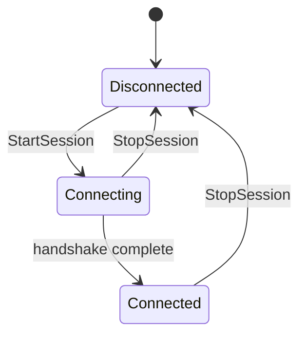

A **session** is the live connection between your Unreal project and Convai for a specific character or player component. While a session is open, voice can stream, text can be sent, and the character can receive responses, actions, and face data. When no session is open, the character cannot converse.

Think of two parallel sessions in a typical scene:

- **Chatbot session** — on `UConvaiChatbotComponent`; Convai knows which character is speaking and can send responses back to that Actor.
- **Player session** — on `UConvaiPlayerComponent`; the player's microphone and text input reach Convai through this channel.

Both sessions depend on `UConvaiSubsystem`, which owns the shared WebRTC connection to Convai.

## When sessions start

By default, sessions open automatically when Play mode begins.

Both `UConvaiChatbotComponent` and `UConvaiPlayerComponent` expose **Auto Initialize Session** (`bAutoInitializeSession`) in the **Convai | Session** category of the **Details** panel.

| Component | What happens when auto-init is enabled |
|---|---|
| **Convai Chatbot** | Calls `StartSession` from `BeginPlay`. |
| **Convai Player** | Registers with the subsystem at `BeginPlay`, then starts its session once the global connection reaches `Connected`. |

Set **Auto Initialize Session** to `false` when you want to delay the conversation — for example, until a training pre-test completes or until the player enters a dialogue zone.

## Starting and stopping a session manually

Call **Start Session** and **Stop Session** from Blueprint when you need explicit control.



### Start the chatbot session

On the character's `UConvaiChatbotComponent`, call **Start Session**. This opens the character-side channel so Convai can send audio, actions, emotion data, and face data to that Actor.



### Start the player session

On the player's `UConvaiPlayerComponent`, call **Start Session**. This opens the player-side channel so microphone audio and text input can reach Convai. The call returns `true` when initialization succeeds.



### Stop a session

Call **Stop Session** on either component to tear down that component's session. The Actor stays in the level. Call **Start Session** again to reconnect.



For dynamic actions or objects that depend on runtime state, override **Gather Environment Extras** on the chatbot component before **Start Session** runs. That Blueprint event adds extra actions, objects, or characters to the payload sent at connect time. Static changes to `EnvironmentData.Actions` after a session has started take effect on the **next** session start.

## Connection states

Each component reports connection state through the `EC_ConnectionState` enum:

| State | Meaning |
|---|---|
| `Disconnected` | No active channel. |
| `Connecting` | Handshake in progress. |
| `Connected` | Channel is open; conversation can proceed. |
| `Reconnecting` | Reserved in the enum; not currently driven by the runtime connection path. |

Check state from Blueprint:

| Component | Function | Returns |
|---|---|---|
| Chatbot | `GetChatbotConnectionState` | Current `EC_ConnectionState` for the character session. |
| Player | `IsPlayerConnected` | `true` when the player session is `Connected`. |
| Subsystem | `GetServerConnectionState` | Global connection state for the shared WebRTC channel. |

Subscribe to `OnAttendeeConnectionStateChangedEvent` on either conversation component to react when connection state changes.

## Reset the local conversation marker

`SessionID` on `UConvaiChatbotComponent` defaults to `"-1"`. The current WebRTC connect path does not use `SessionID` as a resume token. Call **Reset Conversation** to reset the local value to `"-1"` before starting a fresh interaction — for example, on a shared kiosk between users.

Set `EndUserID` and `EndUserMetadata` on the player or chatbot component before **Start Session** when long-term memory should identify a specific user. If `EndUserID` is empty, the SDK falls back to a generated device ID.

## Connection subsystem Blueprint surface

`UConvaiSubsystem` exposes Blueprint nodes for monitoring the global connection. Access the subsystem from any Blueprint through **Get Game Instance → Get Subsystem (Convai Subsystem)**.

### Blueprint-callable functions

| Function | Category | Purpose |
|---|---|---|
| `GetServerConnectionState` | `Convai\|Connection` | Returns the current `EC_ConnectionState` for the global WebRTC channel. |
| `ResetIdleTimer` | `Convai\|Connection` | Resets the idle timer. Call when the player performs an action that indicates continued engagement, to prevent an idle disconnect. |
| `InvalidateOrphanedConnection` | `Convai\|Connection` | Requests cleanup when a previous connection was parked in the manager's internal `Orphaned` state. No-op when no orphaned connection exists. |

### Blueprint-assignable events

| Event | Category | When it fires |
|---|---|---|
| `OnServerConnectionStateChangedEvent` | `Convai\|Connection` | Fires whenever the global `EC_ConnectionState` changes. |
| `OnUserIdleWarning` | `Convai\|Event` | Fires when Convai detects user idle time. Carries `RemainingSeconds` before automatic disconnect. Call `ResetIdleTimer` to prevent the disconnect. |

## Usage examples

### Auto-start at level load

A training simulation where an AI instructor should be ready as soon as the level loads:

1. Set **Auto Initialize Session** to `true` on both the chatbot and player components.
2. Enter Play mode.

Expected result: Both sessions reach `Connected` without manual **Start Session** calls.

### Delay the session until the player is ready

A safety drill where conversation should not begin until the learner finishes a pre-test:

1. Set **Auto Initialize Session** to `false` on both components.
2. When the pre-test passes, call **Start Session** on the chatbot, then on the player.
3. Optionally show a connecting indicator while `GetChatbotConnectionState` returns `Connecting`.

Expected result: No connection at level start. Conversation begins only after your gate condition passes.

### Reset between users on a shared device

A kiosk where each new learner should start clean:

1. Call **Reset Conversation** on the chatbot component.
2. Call **Start Session** again (or rely on auto-init on the next Play session).

Expected result: The local `SessionID` returns to `"-1"` before the next interaction.

## Troubleshooting

| Symptom | Likely cause | Fix | Verify |
|---|---|---|---|
| Character does not respond at level start | **Auto Initialize Session** is `false` and **Start Session** was never called | Enable auto-init or call **Start Session** explicitly. | `GetChatbotConnectionState` returns `Connected`. |
| State stays `Connecting` | Invalid API key or blocked network | Confirm the API key (see [Configure your API key](../getting-started/configure-api-key.md)) and network access. | State transitions to `Connected`. |
| Stale connection after an orphaned-connection log | Previous connection parked in `Orphaned` state | Call `InvalidateOrphanedConnection`, then **Start Session** again. | Next connection attempt succeeds. |
| Actions missing during the session | Actions added after **Start Session** | Use **Gather Environment Extras** or add actions before **Start Session**. | Expected actions appear in the first response. |

## Related concepts


[Runtime architecture](runtime-architecture.md)



[Conversation flow](conversation-flow.md)



[Event system](event-system.md)

