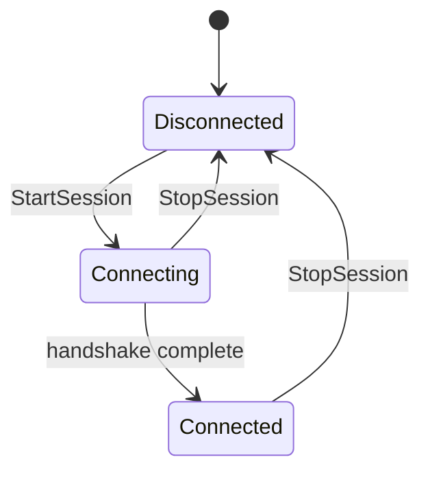

A session is the active WebRTC channel between a component (chatbot or player) and Convai. Before a session is open, audio cannot be streamed and actions cannot be received. Understanding when sessions start, what states they move through, and how they interact with multiplayer replication prevents common setup mistakes.

## Auto-initialization

Both `UConvaiChatbotComponent` and `UConvaiPlayerComponent` expose `bAutoInitializeSession` in the **Convai | Session** category of the **Details** panel. On the chatbot component, this flag calls `StartSession` from `BeginPlay`. On the player component, `BeginPlay` registers the component with the subsystem, and the player session starts after the global server connection reaches `Connected`. Set the flag to `false` when you need precise control over the moment the session opens — for example, when a training simulation should gate the session behind a pre-activity check.

## Starting and stopping a session

`StartSession` and `StopSession` are `BlueprintCallable` functions on both components.

**Chatbot session:** `UConvaiChatbotComponent::StartSession` opens the character-side channel. Before connecting, it invokes `GatherEnvironmentExtras` — a `BlueprintNativeEvent` you can override in Blueprint to add dynamic action, object, and character entries to the environment sent at `/connect` time. The override provides three output arrays: `OutExtraActions` (`TArray<FConvaiAction>`), `OutExtraObjects` (`TArray<FConvaiObjectEntry>`), and `OutExtraCharacters` (`TArray<FConvaiObjectEntry>`). Populate any combination of these arrays; the plugin merges them with the static entries from `EnvironmentData` before assembling the `/connect` payload. Entries with the same name replace the existing action, object, or character entry during the merge. This is the recommended pattern for injecting actions or objects that depend on runtime state, such as inventory items, earned abilities, or NPCs that are conditionally present in a scene, rather than hard-coding them in the component's `EnvironmentData` at edit time. Once connected, the chatbot receives audio, actions, emotion data, and face data from Convai.

**Player session:** `UConvaiPlayerComponent::StartSession` opens the player-side channel and returns `true` if the session initialized successfully. Once connected, the player component begins forwarding microphone audio to the subsystem.

Calling `StopSession` tears down the component's session handle. Depending on connection-proxy lifetime settings, a chatbot session proxy can be released into the connection manager's internal orphaned state before final disconnect. The component remains in the level; calling `StartSession` again opens or reacquires a session path.


Runtime mutations to `EnvironmentData.Actions` (via `AddAction`, `RemoveAction`, and related methods) take effect on the **next** session start. The action set is fixed at `/connect` time. Brand-new object and character entries can be pushed mid-session through the update-scene-metadata pipeline; same-name replacements for entries already sent at `/connect` are local changes that take effect on the next reconnect.


## Connection states

Both components and the subsystem track connection state using the `EC_ConnectionState` enum:

| Value | Meaning |
|---|---|
| `Disconnected` | No active channel. |
| `Connecting` | Handshake in progress. |
| `Connected` | Channel is open and ready. |
| `Reconnecting` | Defined by the enum, but not currently driven by the runtime connection path. |

In the current SDK, the runtime connection path drives `Disconnected`, `Connecting`, and `Connected`. Treat `Reconnecting` as a reserved enum value unless source changes wire it into the runtime state machine.

On `UConvaiChatbotComponent`, call `GetChatbotConnectionState` (`BlueprintPure`) to read the current state. On `UConvaiPlayerComponent`, call `IsPlayerConnected` (`BlueprintPure`) to check whether its channel is in the `Connected` state. For the subsystem's current global connection state, use `UConvaiSubsystem::GetServerConnectionState` (see [Connection subsystem Blueprint surface](#connection-subsystem-blueprint-surface) below).

The `OnAttendeeConnectionStateChangedEvent` delegate on the base `UConvaiConversationComponent` broadcasts attendee state callbacks surfaced by the component implementation. Both chatbot and player components inherit this delegate. It carries the component reference, the attendee ID, and the new `EC_ConnectionState` value.

## Narrative template keys

`NarrativeTemplateKeys` on `UConvaiChatbotComponent` is a `TMap<FString, FString>` of key-value pairs used by Narrative Design flows. Set these before calling `StartSession` when you want values ready as soon as the attendee connection finishes. The current SDK also exposes `UpdateNarrativeTemplateKeys`, which can send updated template keys while the chatbot is connected.

## Session memory and conversation reset

`SessionID` on `UConvaiChatbotComponent` defaults to `"-1"`. The current WebRTC connection path does not expose a `SessionID` field in its connect parameters, so do not rely on setting `SessionID` before `StartSession` as a resume mechanism for WebRTC sessions. To clear the local value, call `ResetConversation`, which resets `SessionID` to `"-1"`.

`EndUserID` and `EndUserMetadata` exist on both the chatbot and player components. For chatbot session connections, the current connect path reads the values through the chatbot's `IConvaiConnectionInterface`; if `EndUserID` is empty, the SDK falls back to a generated device ID. The player component also exposes `SetEndUserID` and `SetEndUserMetadata` with server RPC counterparts for updating those fields on the server.

## Multiplayer replication considerations

The Convai Unreal Engine plugin is designed for a server-authoritative multiplayer model where the chatbot components run on the server (or on a listen server host).


Call `StartSession` and `StopSession` on the **server** (or listen-server host). The WebRTC transport runs server-side. Client machines receive replicated property updates and RPC broadcasts — they do not manage sessions independently.


**Replicated properties.** `CharacterID`, `CharacterName`, `SessionID`, `EmotionState`, `LockEmotionState`, `EnvironmentData`, `ConversationPartner`, `LookAtTarget`, and `PointAtTarget` on `UConvaiChatbotComponent` are registered for replication. On `UConvaiPlayerComponent`, `PlayerName` is registered for replication.

**Interruption.** `InterruptSpeech` applies a local fade-out on the chatbot component where it is called. The class also exposes `Broadcast_InterruptSpeech` as a `NetMulticast Reliable` RPC for network-wide interruption paths.

**Player names.** `SetPlayerName`, `SetEndUserID`, and `SetEndUserMetadata` on `UConvaiPlayerComponent` each have a `Server Reliable` RPC counterpart (`SetPlayerNameServer`, etc.) so clients can update their own identity from a locally owned pawn and have the change propagate to the server.

## Connection subsystem Blueprint surface

`UConvaiSubsystem` exposes a focused set of Blueprint nodes for monitoring and managing the global connection. These are accessible from any Blueprint by getting the subsystem from the game instance.

### Blueprint-callable functions

| Function | Category | Purpose |
|---|---|---|
| `GetServerConnectionState` | `Convai\|Connection` | Returns the current `EC_ConnectionState` for the global WebRTC channel. |
| `ResetIdleTimer` | `Convai\|Connection` | Resets the server-side idle timer. Call this when the user performs an action that indicates continued engagement, to prevent an `OnUserIdleWarning`-triggered disconnection. |
| `InvalidateOrphanedConnection` | `Convai\|Connection` | Caller-initiated cleanup request for a connection the manager has parked in the internal `Orphaned` state. It is a no-op when no orphaned connection exists. |

### Blueprint-assignable events

| Event | Category | When it fires |
|---|---|---|
| `OnServerConnectionStateChangedEvent` | `Convai\|Connection` | Fires on the game thread whenever the global `EC_ConnectionState` changes. Carries the new `EC_ConnectionState` value. |
| `OnUserIdleWarning` | `Convai\|Event` | Fires when the server detects that the user has been idle. Carries `RemainingSeconds` — the number of seconds before the connection is automatically closed. Call `ResetIdleTimer` to prevent the disconnection. |

## Usage examples

### Single-player: auto-start at level load

A training simulation where an AI instructor should be ready to talk as soon as the level loads.

1. On the chatbot component in the **Details** panel, set **Auto Initialize Session** to `true`.
2. On the player component, set **Auto Initialize Session** to `true`.
3. Click **Play** in the editor to start Play In Editor.

Expected result: The chatbot starts its session from `BeginPlay`. The player component registers with the subsystem and starts its session once the global server connection reaches `Connected`.

### Multiplayer: server-authoritative session

A multiplayer experience where an AI character runs on a dedicated server and multiple clients can approach and speak to it.

1. Set **Auto Initialize Session** to `false` on the chatbot component to prevent clients from calling `StartSession` independently.
2. In the character Blueprint's `Event BeginPlay`, add a **Switch Has Authority** node.
3. Connect the **Authority** output pin to **Start Session** on the chatbot component.

Expected result: `StartSession` runs only on the server. Replicated properties — `CharacterID`, `EmotionState`, `ConversationPartner` — are pushed to all clients automatically. Client machines observe the character's state through replication without managing a session channel.

### Resetting the local conversation ID

A kiosk experience where the next learner should start from a clean local conversation value.

1. Before starting the next chatbot session, call `ResetConversation` on the chatbot component.
2. Start the chatbot session normally.

Expected result: The local `SessionID` value is reset to `"-1"` before the next session starts.

### Pre-activity gate — delaying the session until a learner is ready

A safety training simulation where the AI instructor should only become active after the learner has completed a written pre-test and confirmed they are ready to begin.

1. Set **Auto Initialize Session** to `false` on both the chatbot component and the player component — no session opens at level start.
2. Display the pre-test UI. When the learner submits and passes, call **Start Session** on the chatbot component, then **Start Session** on the player component.
3. Optionally, show a "Connecting..." indicator while `GetChatbotConnectionState` returns `Connecting`, and dismiss it once it returns `Connected`.

Expected result: Neither component connects at level start. The AI instructor and the player's microphone channel both open only after the pre-test passes. Once both sessions reach `Connected`, the interaction proceeds identically to an auto-initialized session.

## Troubleshooting

| Symptom | Likely cause | Fix | Verify |
|---|---|---|---|
| Character does not respond at level start | `bAutoInitializeSession` is `false` and `StartSession` was never called | Set **Auto Initialize Session** to `true` on the chatbot component, or call **Start Session** explicitly in the character's `BeginPlay`. | `GetChatbotConnectionState` eventually returns `Connected` after a successful handshake. |
| `GetChatbotConnectionState` returns `Connecting` indefinitely | Invalid API key or network cannot reach Convai | Open the **Convai Editor window**, confirm and save the API key, then test connectivity to `convai.com`. | State transitions to `Connected` after a valid handshake. |
| Stale connection behavior continues after cleanup logs mention an orphaned connection | A previous connection path was parked in the manager's internal `Orphaned` state | Call `InvalidateOrphanedConnection` on the subsystem, then call `StartSession` again if the session should reopen. | The orphaned connection state is cleared and the next connection attempt can proceed. |
| Actions defined in Blueprint are not available during the session | `EnvironmentData.Actions` was modified after `StartSession` — action templates are fixed at `/connect` time | Move dynamic action setup into the `GatherEnvironmentExtras` override, or ensure all `AddAction` calls complete before `StartSession`. | The first `OnActionReceivedEvent_V2` response includes the expected actions. |
| `SessionID` does not resume a WebRTC conversation | The current WebRTC connect path does not send `SessionID` as a connect parameter | Do not use `SessionID` as the WebRTC resume mechanism. Use `ResetConversation` only when you need to clear the local value. | `SessionID` returns to `"-1"` after `ResetConversation`. |

## Related concepts

Read these pages next to connect session timing with component ownership, turn behavior, and Blueprint events.


[Runtime architecture](runtime-architecture.md)



[Conversation flow](conversation-flow.md)



[Event system](event-system.md)

