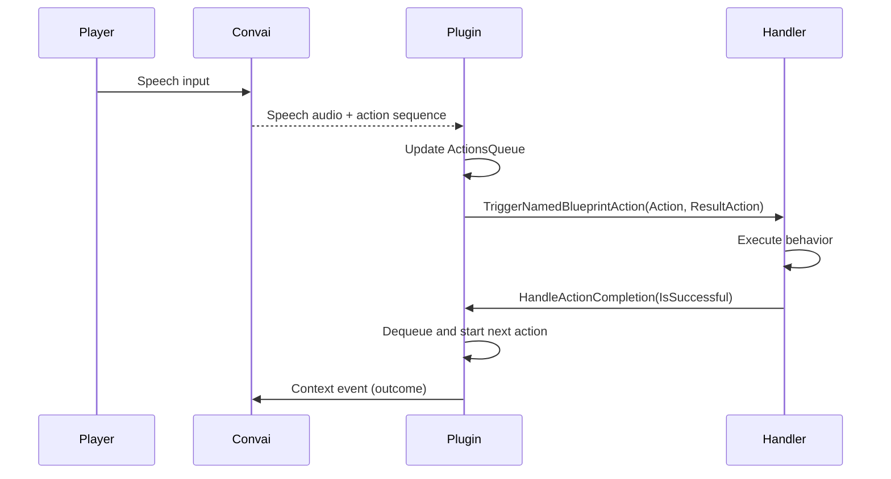

Character actions allow Convai to instruct a character to perform physical behaviors — moving to a location, following a player, interacting with an object — as part of a normal conversation response. The plugin receives a structured sequence of named actions from Convai alongside the spoken reply, then dispatches those actions to matching Blueprint handlers on the owning Actor or, as a fallback, on the chatbot component.

## Required setup

| Component / resource | Required for | Notes |
|---|---|---|
| `Convai Chatbot` component | All actions | Carries the `Environment` property (action templates, objects, characters) and the `ActionsQueue`. |
| `Convai Player` component | All actions | Required on the player pawn for speech input. |
| Blueprint handler functions | Every action that should execute | One function per action name, accepting `FConvaiResultAction`. |
| AI Controller on the NPC Actor | Movement actions (`Move To`, `Follow`) | Required for `AI Move To` to work. Use Unreal's built-in `AIController`. |
| `Nav Mesh Bounds Volume` (built) | Movement actions | Must cover the NPC spawn point and all navigation targets. Rebuild after level changes. |

For non-movement actions (custom behaviors, animations, state changes), only the chatbot component and Blueprint handlers are required.

## Key concepts

| Concept | What it means |
|---|---|
| **Action contract** (`action_config`) | The list of action templates, scene objects, and characters sent to Convai at session start. Defines what the character is allowed to do and what it can reference. |
| **Action pipeline** | Two parallel lanes: a speech lane that plays audio and an action lane that stores a sequence of `FConvaiResultAction` structs in the queue. |
| **Queue and dispatch** | The plugin maintains an `ActionsQueue`. On each `HandleActionCompletion(true)`, the queue advances by one. A name-based dispatcher calls the matching Blueprint function on the owning Actor or chatbot component. |
| **Completion model** | Handlers are responsible for calling `HandleActionCompletion`. Without it, the queue stalls. `false` clears the remaining queue; `AbortActionSequence` discards everything and optionally asks Convai for a fresh plan. |
| **Wait-for-speech gate** | A per-action `bWaitForBotSpeech` flag that delays firing until the character begins or finishes speaking, so movement and speech stay synchronized. |
| **Runtime mutation** | Objects and characters can be added or removed at runtime; the local environment changes immediately, while scene-context updates are sent to the live session when applicable. |

## The action_config contract

Before a session starts, the chatbot component serializes a description of the character's affordances into a JSON structure called `action_config`. This contract is sent to Convai at `/connect` time and tells Convai which actions the character can perform, which objects exist in the scene, and which characters are present.

The contract has three parts:

- **Actions** — an ordered list of `FConvaiAction` templates, each with a name, an optional description, and optional typed parameters. The list is defined in the `Environment` property of `UConvaiChatbotComponent`, under the `Actions` field.
- **Objects** — an array of `FConvaiObjectEntry` values describing interactable scene objects. Each entry has a `Name`, an optional `Description`, and navigation targeting fields.
- **Characters** — an array of `FConvaiObjectEntry` values describing other characters present in the scene.

The `bEnableActions` flag on `FConvaiEnvironmentData` (shown as **Enable Actions** in the Details panel) acts as the master switch. It defaults to `true` on every new `Convai Chatbot` component, so the feature is on out of the box. When `bEnableActions` is `false`, no `action_config` is sent at `/connect` and the character behaves as a purely conversational NPC.


The action set is fixed at `/connect` time. Adding or removing actions at runtime via `AddAction` / `RemoveAction` only affects the next session — the live session retains the set it was connected with.


## Action pipeline

When the player talks to a Convai character, the plugin processes the response through two parallel lanes:

1. **Speech lane** — audio streams to the character's audio component for playback. The chatbot fires `On Actions Received` and `OnStartedTalking` / `OnFinishedTalking` events as speech progresses.
2. **Action lane** — Convai parses the response against the `action_config` contract and returns a sequence of `FConvaiResultAction` structs. The plugin stores this sequence in the `ActionsQueue` on `UConvaiChatbotComponent`.

The two lanes are independent. Speech plays while the action queue executes.

## Queue and dispatch

The plugin maintains a queue of `FConvaiResultAction` items in `ActionsQueue`. When a new action sequence arrives, the plugin:

1. If the queue already contains an in-progress action, keeps that first action and replaces the remaining queued actions with the incoming sequence. If the queue is empty, stores the incoming sequence as-is.
2. Calls `StartFirstAction`, which reads the first entry from the queue and calls `TriggerNamedBlueprintAction`.
3. `TriggerNamedBlueprintAction` looks for a Blueprint function or event whose name matches the `Action` field of the result. It checks the owning Actor first, then the chatbot component. The handler may accept one `FConvaiResultAction` parameter or no parameters.

The dispatcher is name-based. Unreal resolves handler names case-insensitively, but spaces and punctuation must still match. If no matching function is found on either target, the plugin logs a warning, the handler is not invoked, and the queue stalls until `HandleActionCompletion` or `AbortActionSequence` is called.

## The wait-for-speech gate

`FConvaiAction` has a `bWaitForBotSpeech` flag. When set on an action template and that action arrives as the first action of a freshly-received sequence (i.e., the queue was empty when the sequence arrived), the plugin delays starting the action until Convai begins speaking (`OnStartedTalking`) or finishes speaking (`OnFinishedTalking`), whichever fires first. A per-character timeout (`ActionWaitForBotSpeechTimeoutSec`, default `2.0` seconds, not exposed to Blueprint) fires the action anyway if neither speech event arrives in time.

An optional `DelayAfterBotSpeechSec` field adds additional delay after the speech condition resolves.

## Completion model

Handlers are responsible for reporting outcomes. After the handler finishes its work, it must call `HandleActionCompletion` on the `UConvaiChatbotComponent`:

- `IsSuccessful = true` — the plugin dequeues the current action and starts the next one.
- `IsSuccessful = false` — the plugin clears the remaining queue. The character will not attempt the next action.

When `bAutoReport` is `true` (the default), the plugin also sends a context event to Convai describing the outcome. Convai uses this information when generating the character's next spoken response.

If a handler encounters an unrecoverable error and wants Convai to generate a completely fresh action plan, it calls `AbortActionSequence` instead, optionally passing a text description of what went wrong.

The diagram above shows a single action. When a sequence contains multiple actions, each `HandleActionCompletion(true)` advances the queue by one step.

## Runtime environment mutation

Objects and characters can be added or removed from the local environment at runtime using the `AddObject`, `RemoveObject`, `AddCharacter`, and `RemoveCharacter` family of methods on `UConvaiChatbotComponent`. The local `EnvironmentData` mirror changes immediately and is used by the plugin when parsing later action results.

Runtime mutations do not change the action set itself, which is fixed until the next reconnect. For live sessions, scene-context updates are sent through `update-scene-metadata` when the changed entry is not already part of the connect-time scene metadata snapshot.

## Next steps


[Configuring actions](configuring-actions.md)



[Built-in action handlers](built-in-action-handlers.md)



[Building custom action handlers](building-custom-action-handlers.md)



[Actions Blueprint reference](actions-blueprint-reference.md)

