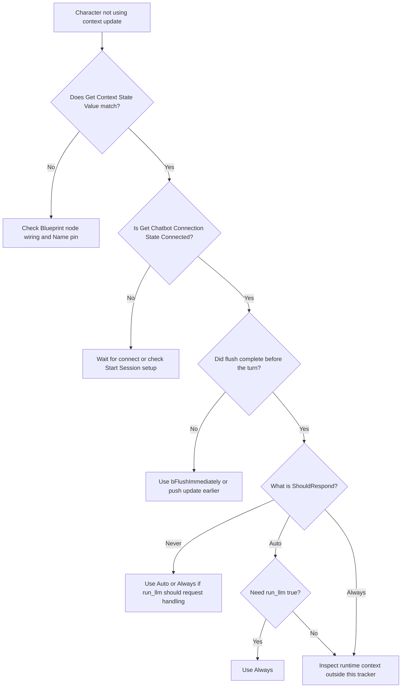

Use this page when a dynamic context update does not appear to work. Start with the four checks below, then follow the symptom sections if the issue persists.

## First-line checks

Run these four checks before diving into detailed symptoms:

| Check | How to verify | What it tells you |
|---|---|---|
| Session is connected | **Get Chatbot Connection State** returns `Connected` | Whether a network flush can reach Convai |
| Local tracker accepted the value | **Get Context State Value** returns expected `OutValue` immediately after **Set Context State** | Whether the Blueprint wiring and `Name` pin are correct |
| Flush completed before the conversation turn | Wait one debounce cycle (`ContextDebounceWindow`, default `0.5` s), or set `bFlushImmediately = true` after connect | Whether timing caused the character to respond before the update arrived |
| `ShouldRespond` matches your intent | `Never` → `run_llm: "false"`; `Auto` → `run_llm: "auto"`; `Always` → `run_llm: "true"` | Whether the update was sent with the wire value you expected |



### Confirm the session is connected

Call **Get Chatbot Connection State** on the `Convai Chatbot` component. The return value should be `Connected` before you expect a network flush to reach Convai.

Default debounced updates staged before connect queue safely in `PendingContextBatch`. After the session connects, they flush on the first tick where the debounce deadline has elapsed. That is expected behavior, not an error.



### Verify the local tracker accepted the value

Call **Get Context State Value** immediately after **Set Context State** and print the `OutValue` pin. If `OutValue` returns the expected value, the local tracker accepted the update.

If the local value is correct but the runtime conversation test does not reflect it, confirm that the network flush completed before the test turn.



### Allow the debounce window to elapse

Unless `bFlushImmediately` is `true`, the plugin waits `ContextDebounceWindow` seconds (default `0.5`) after the last staged update before flushing. Wait at least one full debounce cycle before starting a conversation turn that depends on the new context.



### Check the ShouldRespond setting

If the update reached Convai but the wire `run_llm` value was not what you intended, verify `ShouldRespond` on the node that staged the update.



## Context update appears ignored

### Runtime conversation test does not reflect the state

**Symptom:** You called `Set Context State` before an end-to-end runtime test, but the test did not reflect the state value.

**Cause 1 — Update arrived after the conversation turn.** The debounce timer fires after the last staged update. If the player spoke before the timer elapsed, Convai processed the turn without the update.

**Fix:** Send the update earlier in the gameplay flow, or set `bFlushImmediately = true` when timing is critical.

**Verify:** **Get Context State Value** returns the expected value locally. If it does and the character still omits the state, increase lead time before the conversation turn or use `bFlushImmediately = true`.

---

**Cause 2 — `ShouldRespond` is `Never`, so the update used `run_llm: "false"`.**

**Fix:** If this update should use a different wire value, use `ShouldRespond = Auto` or `ShouldRespond = Always` for that call. Keep `Never` for background facts that should only update context.

**Verify:** Confirm the node pin uses the intended `ShouldRespond` value before the update is staged.

---

**Cause 3 — Session was not connected when you expected a network flush.** Staged updates accumulate offline but do not reach Convai until connect plus debounce.

**Fix:** Check **Get Chatbot Connection State** before testing conversation behavior.

**Verify:** **Get Chatbot Connection State** returns `Connected` before the dependent test turn.

---

### Remove Context State has no visible effect

**Symptom:** You called `Remove Context State` but the character still references the removed value.

**Cause:** The removal was staged but not yet flushed when the conversation turn occurred, or the same fact exists outside the dynamic context tracker.

**Fix:** Set `bFlushImmediately = true` on the **Remove Context State** call after the chatbot is connected. If the value is gone from the tracker after a confirmed flush, inspect other project-specific context sources outside this dynamic context page.

**Verify:** **Get Context State Value** for the removed key returns `false` after the flush.

---

## Debounce timing surprises

### Multiple rapid updates merge into one flush

**Symptom:** You called `Set Context State` ten times in a single tick but observed one dynamic context send.

**Cause:** Intended debounce behavior. Rapid updates within `ContextDebounceWindow` coalesce into one flush.

**Fix:** No fix required. If you need separate sends, space calls outside the debounce window. Sending individual immediate flushes on every state change is not recommended for real-time gameplay.

**Verify:** Wait one debounce cycle and confirm the final local value with **Get Context State Value**.

---

### Update arrives too late after a fast conversation turn

**Symptom:** A test turn starts immediately after a game event pushes a state update, before the flush has completed.

**Cause:** The debounce window delayed the flush past the conversation turn.

**Fix:** Set `bFlushImmediately = true` on the context update call, or push the update earlier (for example, at zone entry rather than at conversation start). For important events, **Add Context Event** with `ShouldRespond = Always` sends `run_llm: "true"`.

**Verify:** Confirm **Get Chatbot Connection State** is `Connected` and allow the flush to complete before the dependent conversation turn.

---

### ContextMaxDebounceWindow is not visible in the Details panel

**Symptom:** You want to adjust the debounce cap but cannot find `ContextMaxDebounceWindow`.

**Cause:** The underlying fields `ContextDebounceWindow` and `ContextMaxDebounceWindow` are **Advanced Display** properties under **Convai > DynamicContext**.

**Fix:** Expand the **Advanced** section in the Details panel and look for **Context Debounce Window (s)** and **Max Debounce Window (s)**.

**Verify:** Both labels are visible after expanding **Advanced**.

---

## ShouldRespond misuse

### Health update sends `run_llm` unexpectedly

**Symptom:** Each call to `Set Context State` for `PlayerHealth` is staged with `ShouldRespond = Auto` or `Always`.

**Cause:** `ShouldRespond` is set to `Auto` or `Always` on the **Set Context State** node.

**Fix:** Use `ShouldRespond = Never` for background state. Reserve `Auto` or `Always` for updates where the wire `run_llm` value should be `"auto"` or `"true"`.

**Verify:** The **Set Context State** node for `PlayerHealth` has `ShouldRespond` set to `Never`.

---

### Event update does not send the intended `run_llm`

**Symptom:** You called `Add Context Event` for a significant context event but the update did not use the `run_llm` value you expected.

**Cause:** `ShouldRespond` was not set to the enum value you intended, or another staged item in the same debounce window changed the aggregate rank.

**Fix:** Set `ShouldRespond = Always` when the update should send `run_llm: "true"`. Use **Is Talking** only as a local status check when sequencing your own Blueprint logic.

**Verify:** Temporarily switch to `ShouldRespond = Always` in isolation and confirm the update is sent with `run_llm` set to `"true"`.

---

## Reset Dynamic Context and reconnect

### Local state still appears after Reset Dynamic Context

**Symptom:** You called `Reset Dynamic Context`, but **Get Context State Value** still returns `true` for a key you expected to clear.

**Cause:** The Reset has not flushed yet, or new state was staged after the Reset call.

**Fix:** Allow the reset flush to complete before staging new state values when starting from empty dynamic context.

**Verify:** **Get Context State Value** for cleared keys returns `false` after the Reset flush.

---

### Reset did not clear everything

**Symptom:** `Reset Dynamic Context` completed, but related runtime data still appears in the project.

**Cause:** `Reset Dynamic Context` operates on the **runtime dynamic context tracker only**. It clears tracked state and events after sending the `Reset` `context-update`, but other update paths are separate.

**Fix:** Change `DynamicEnvironmentInfo` explicitly if that text also needs to change. Update action and scene metadata through their own environment metadata paths.

**Verify:** **Get Context State Value** returns `false` for cleared keys, and any remaining data is handled through the relevant non-tracker update path.


`Reset Dynamic Context` clears the local state tracker and sends a Reset `context-update`. It does not clear `DynamicEnvironmentInfo` or environment metadata.


---

### Staged updates disappeared after offline Reset

**Symptom:** You called `Reset Dynamic Context` in `BeginPlay`, then staged new states, but the character never sees the new data.

**Cause:** `Reset Dynamic Context` marks a pending `Reset` that fires **after** staged content at the first post-connect flush. This applies to staged updates in the same offline window whether they were staged before or after the Reset call.

**Fix:** Let the reset flush complete after connect, then stage the new **Set Context State** or **Add Context Event** calls.

**Verify:** After the first post-connect flush, **Get Context State Value** returns `false` for keys that should have been cleared.

---

## Context update diagnostic flow

Use this flow after the first-line checks. Follow the branches from local tracker state to connection state, flush timing, and the intended `run_llm` value.

## Next steps


[Sync behavior and timing](sync-behavior-and-timing.md)



[Dynamic context Blueprint reference](dynamic-context-blueprint-reference.md)

