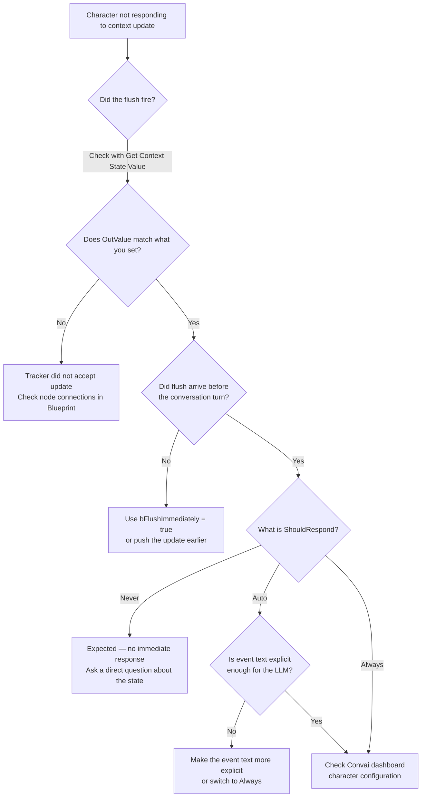

Use this page when dynamic context updates do not appear to reach the character, arrive after the conversation turn that should have used them, or trigger more spoken responses than expected.

## First-line investigation



### Check the Output Log

Open the Output Log (**Window → Output Log**) and look for messages in the Convai log category. Context update debug messages appear here when `ConvaiDebugMode` is enabled in the plugin settings.



### Verify the session is connected

Use `Get Chatbot Connection State` in the Blueprint graph to check whether the session is active. A context update staged before the session connects queues safely and flushes automatically when the session becomes connected — this is expected behavior, not an error.



### Verify the local tracker accepted the value

Call `Get Context State Value` immediately after any `Set Context State` call and print the `OutValue` pin. If `OutValue` returns the expected value, the local tracker accepted the update. If the character still does not reference it in conversation, the issue is timing — the flush arrived after the conversation turn.



### Check the ShouldRespond setting

If the update reached the character but it did not respond immediately, verify `ShouldRespond`:

- `Never` — context is stored silently. The character references the new state in its next natural turn. This is expected behavior.
- `Auto` — Convai decides whether to respond. For a guaranteed immediate response, use `Always`.
- `Always` — always triggers a spoken response immediately after the update arrives.



## Context update appears ignored

### Character does not reference the state in conversation

**Symptom:** You called `Set Context State` before speaking to the character, but the character's response does not reflect the state value.

**Cause 1 — Update arrived after the conversation turn.** The debounce timer fires `0.5 s` after the last staged update. If the player spoke before the timer elapsed, Convai processed the turn without the update.

**Fix:** Send the update earlier in the gameplay flow, or set `bFlushImmediately = true` on the `Set Context State` call to bypass the timer when timing is critical.

**Verify:** Call `Get Context State Value` immediately after `Set Context State` and print the `OutValue` pin. If it returns the expected value, the local tracker accepted the update. If the character still does not reference it after a flush, the update arrived after the conversation turn — increase lead time.

---

**Cause 2 — The update staged correctly but the flush arrived after the conversation turn.** Updates staged before the session connects are safe — they queue in `PendingContextBatch` and flush automatically when the session becomes connected. The issue is not lost updates but timing: if the player initiates a conversation immediately after the session connects and before the debounce timer fires, the update may not have reached Convai yet.

**Fix:** Push the update earlier in the gameplay flow (for example, in `BeginPlay` rather than just before speaking), or set `bFlushImmediately = true` to bypass the debounce timer for time-critical updates.

**Verify:** Call `Get Context State Value` to confirm the local tracker holds the expected value. If it does but the character did not reference it, the flush arrived after the conversation turn — increase lead time or use `bFlushImmediately = true`.

---

**Cause 3 — `ShouldRespond` is `Never`, and the test question did not prompt recall.** `Never` updates land silently. The character uses the state only when the conversation turn relates to it.

**Fix:** Ask a direct question that references the state (for example, "What is my health?" or "What zone am I in?"). If the character still does not know, the flush may not have arrived — verify using `Get Context State Value`.

---

### Remove Context State has no visible effect

**Symptom:** You called `Remove Context State` but the character still references the removed value.

**Cause:** The removal was staged but not yet flushed when the conversation turn occurred, or the character's prior in-session memory of the value is still influencing responses.

**Fix:** Set `bFlushImmediately = true` on the `Remove Context State` call to flush immediately. If the character continues to reference it after the flush, the character's session memory contains earlier mentions of the value — consider resetting the session with `SessionID = "-1"` to start a clean conversation.

**Verify:** Call `Get Context State Value` for the removed key after the flush. If `OutValue` is empty, the tracker accepted the removal. A character that still references the value after this point is drawing on in-session conversational memory, not the dynamic context layer.

---

## Debounce timing surprises

### Multiple rapid updates merge into one response

**Symptom:** You called `Set Context State` ten times in a single tick but the character only reacted once.

**Cause:** This is the intended debounce behavior. Rapid updates within the `ContextDebounceWindow` are coalesced into one flush.

**Fix:** This is correct behavior — no fix required. If you need each update to trigger a separate response, increase the delay between calls so each falls outside the debounce window. Sending individual flushes on every state change is not recommended for real-time gameplay.

---

### Update arrives too late after a fast conversation turn

**Symptom:** The player speaks immediately after a game event pushes a state update. The character's first response does not reflect the event; the second response does.

**Cause:** The debounce window delayed the flush past the conversation turn.

**Fix:** Set `bFlushImmediately = true` on the context update call, or push the update earlier (for example, at zone entry rather than at conversation start). For time-critical events that must precede a specific exchange, call `Add Context Event` instead of `Set Context State` — events with `ShouldRespond = Auto` let Convai decide whether to react, so the update arrives and the character can reference it in the very next turn.

**Verify:** After setting `bFlushImmediately = true`, confirm with `Get Context State Value` that the local tracker holds the expected value before the player speaks.

---

### ContextMaxDebounceWindow is not visible in the Details panel

**Symptom:** You want to adjust the debounce cap but cannot find `ContextMaxDebounceWindow` in the Details panel.

**Cause:** Both `ContextDebounceWindow` and `ContextMaxDebounceWindow` are marked **Advanced Display** in the `Convai|DynamicContext` category.

**Fix:** In the Details panel, scroll to the **Convai > DynamicContext** category and click the **▼ Advanced** expander to reveal both properties.

---

## ShouldRespond misuse

### Character speaks unexpectedly after every health update

**Symptom:** Each call to `Set Context State` for `"PlayerHealth"` causes the character to interrupt play and comment on the health change.

**Cause:** `ShouldRespond` is set to `Auto` or `Always` on the `Set Context State` node.

**Fix:** Use `ShouldRespond = Never` for background state that the character should know silently. Reserve `Auto` for contextually meaningful changes and `Always` for dramatic beats that must trigger an immediate reaction.

---

### Character never reacts to important events

**Symptom:** You called `Add Context Event` for a significant narrative moment but the character said nothing.

**Cause:** `ShouldRespond = Never` was set explicitly, or the event arrived while the character was speaking — characters do not interrupt themselves.

**Fix:** Set `ShouldRespond = Always` to force a response, or use `ShouldRespond = Auto` and verify that the event text is explicit enough for the LLM to determine a reaction is warranted. If the character is currently speaking, wait for `OnFinishedTalking` before sending the event.

**Verify:** Temporarily switch to `ShouldRespond = Always` in isolation. If the character now responds, the original event text was not explicit enough for `Auto` — make it more descriptive or keep `Always`.

---

## ResetDynamicContext and reconnect

### Character still knows old state values after Reset Dynamic Context

**Symptom:** You called `Reset Dynamic Context` but the character's responses still reflect values from the previous session.

**Cause:** `Reset Dynamic Context` clears the local tracker and the `PendingTriggers` queue, then sends a Reset message to Convai at the next flush. The session's conversational memory (`SessionID`) still carries prior mentions of the state values.

**Fix:** After `Reset Dynamic Context`, also call `Stop Session`, set `SessionID = "-1"`, then call `Start Session`. This starts a clean conversation with no prior memory and a blank dynamic layer.

**Verify:** Call `Get Context State Value` for any key you expected to be cleared. If `OutValue` is empty, the local tracker was reset. A character that still references the value is drawing on in-session conversational memory — the session restart above is required.

---

## Reset did not clear everything

`Reset Dynamic Context` operates on the **runtime dynamic context layer only**. Three sources of character knowledge are outside its scope.

**System prompt and backstory.** Facts baked into the character's system prompt on the Convai dashboard are not part of the dynamic context layer. No Blueprint node affects them at runtime.

**Initial `DynamicEnvironmentInfo`.** The value of `DynamicEnvironmentInfo` sent at `/connect` time is part of the session snapshot. `Reset Dynamic Context` does not re-send it and cannot clear it. Ending and restarting the session is the only way to change what was sent at connection time.

**In-session LLM memory.** The character's language model retains conversational context across turns within the same session. `Reset Dynamic Context` sends a Reset message to Convai but does not clear the model's in-session conversational memory. Starting a new session (set `SessionID = "-1"` and call `Start Session`) is the only way to clear in-session memory.


`Reset Dynamic Context` clears the local state tracker and pending triggers, and sends a Reset message to Convai. It does not clear the character's system prompt, the initial connection-time context, or the LLM's in-session conversational memory. To clear all three, end and restart the session with a fresh `SessionID`.


---

## Character not responding to context updates

The flowchart below covers the full troubleshooting surface for updates that appear to have no effect.

---

## Diagnostic checklist

| Check | How to verify |
|---|---|
| Session is connected before staging updates | Check the connection state with `Get Chatbot Connection State`; staged updates queue safely and flush at connect |
| Local tracker accepted the value | Call `Get Context State Value` and print `OutValue` immediately after `Set Context State` |
| Flush arrived before the conversation turn | Use `bFlushImmediately = true` on time-critical updates |
| `ShouldRespond` matches the intent | `Never` for silent background facts; `Auto` for contextual events; `Always` for dramatic beats |
| Debounce properties are accessible | Expand Advanced in the `Convai|DynamicContext` Details panel section |
| `Reset Dynamic Context` cleared pending updates | If called before connect, any staged updates in the same `BeginPlay` sequence are discarded. Call `Reset Dynamic Context` before staging new updates, not after. |
| Character is currently speaking | Characters do not interrupt themselves. Wait for `OnFinishedTalking` before sending events with `ShouldRespond = Always`. |

## Next steps


[Sync behavior and timing](sync-behavior-and-timing.md)



[Dynamic context Blueprint reference](dynamic-context-blueprint-reference.md)

