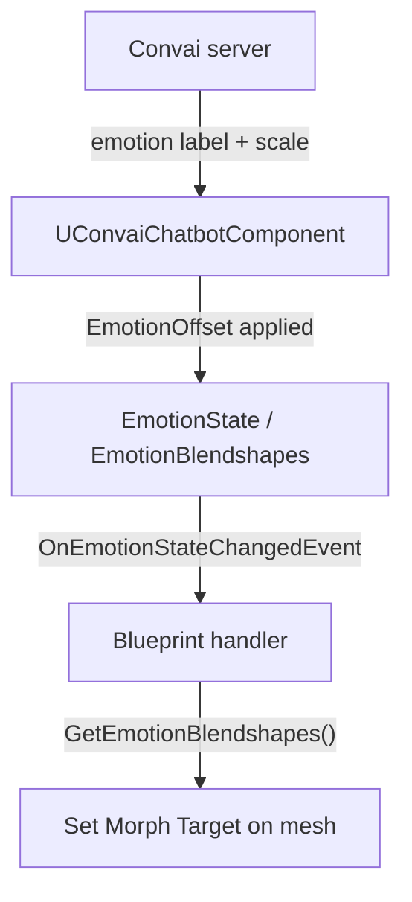

When a Convai character responds, the server analyzes the generated speech and sends back an emotion state alongside the audio. The Convai Unreal Engine plugin stores that state on `UConvaiChatbotComponent`, exposes per-emotion float scores and ready-to-apply blendshape weights through Blueprint, and fires an event each time the state updates.

## Emotion categories and intensity

The plugin models emotion as a set of seven visible categories defined by `EBasicEmotions`, each at one of three intensity levels defined by `EEmotionIntensity`.

**Emotion categories (`EBasicEmotions`):**

| Enum value | Blueprint display name |
|---|---|
| `Joy` | `Happy` |
| `Trust` | `Calm` |
| `Fear` | `Afraid` |
| `Surprise` | `Surprise` |
| `Sadness` | `Sad` |
| `Disgust` | `Bored` |
| `Anger` | `Angry` |

**Intensity levels (`EEmotionIntensity`):**

| Enum value | Blueprint display name | Effect |
|---|---|---|
| `Basic` | `Basic` | Baseline expression strength |
| `LessIntense` | `Less Intense` | Subdued expression — lower score multiplier |
| `MoreIntense` | `More Intense` | Amplified expression — higher score multiplier |

The server produces a single dominant emotion per response. Each update overwrites the previous state unless `LockEmotionState` is set to `true` (see [Locking emotion state](#locking-emotion-state)).

## Emotion scores

Each category carries a float score in the range `0.0`–`1.0`. The score reflects both the intensity level and the order in which emotions appear in the server response — more prominent emotions receive higher scores. Read the score for a specific emotion using `GetEmotionScore(EBasicEmotions Emotion)` on the `UConvaiChatbotComponent`.

### EmotionOffset

The `EmotionOffset` property on `UConvaiChatbotComponent` shifts all computed scores by a fixed amount. The value is a `float` in the range `−1` to `1`:

- A positive offset amplifies the perceived intensity of every emotion.
- A negative offset diminishes it.
- Scores are always clamped to `0.0`–`1.0` after the offset is applied.

`EmotionOffset` is applied at the moment the emotion state is computed and affects both server-driven updates and scores set via `ForceSetEmotion`.

## Blendshape weights

In addition to scores, the component provides a ready-to-use blendshape map from `GetEmotionBlendshapes()`. This returns a `TMap<FName, float>` where each key is a morph target name on the character's Skeletal Mesh and each value is a weight in `0.0`–`1.0`. You apply these weights directly with `Set Morph Target` in Blueprint or in your Animation Blueprint.

The blendshape keys depend on the rig and content assets configured for the character. The plugin ships `Full_Emotion_spectrum` and `Full_Emotion_NoMouth_spectrum` as content assets that represent the full emotion range for MetaHuman-compatible rigs.

## Locking emotion state

Setting `LockEmotionState` to `true` on `UConvaiChatbotComponent` prevents incoming server updates from changing the current emotion. The state will hold whatever values it had when the lock was applied — either from a previous server update or from a `ForceSetEmotion` call — until `LockEmotionState` is set back to `false`.

This is useful when you want a character to hold a specific expression during a cutscene or cinematic regardless of what the server sends.

## Forcing an emotion

`ForceSetEmotion(EBasicEmotions BasicEmotion, EEmotionIntensity Intensity, bool ResetOtherEmotions)` overwrites the emotion state from Blueprint without waiting for a server update. When `ResetOtherEmotions` is `true`, all other emotion scores are zeroed first, so only the forced emotion is active. When `false`, the forced score is added to (or replaces the same-category score in) the current state.

## The state-changed event

`OnEmotionStateChangedEvent` fires on the game thread each time the emotion state is updated, whether by the server or by `ForceSetEmotion`. Its signature delivers the chatbot component and the player component that triggered the conversation turn, letting you read scores or blendshapes in the handler and update your character immediately.

The following diagram shows the full flow from server delivery through score computation to Blueprint handler:

## Related pages


[Emotion Blueprint reference](emotion-blueprint-reference.md)



[Usage examples](usage-examples.md)

