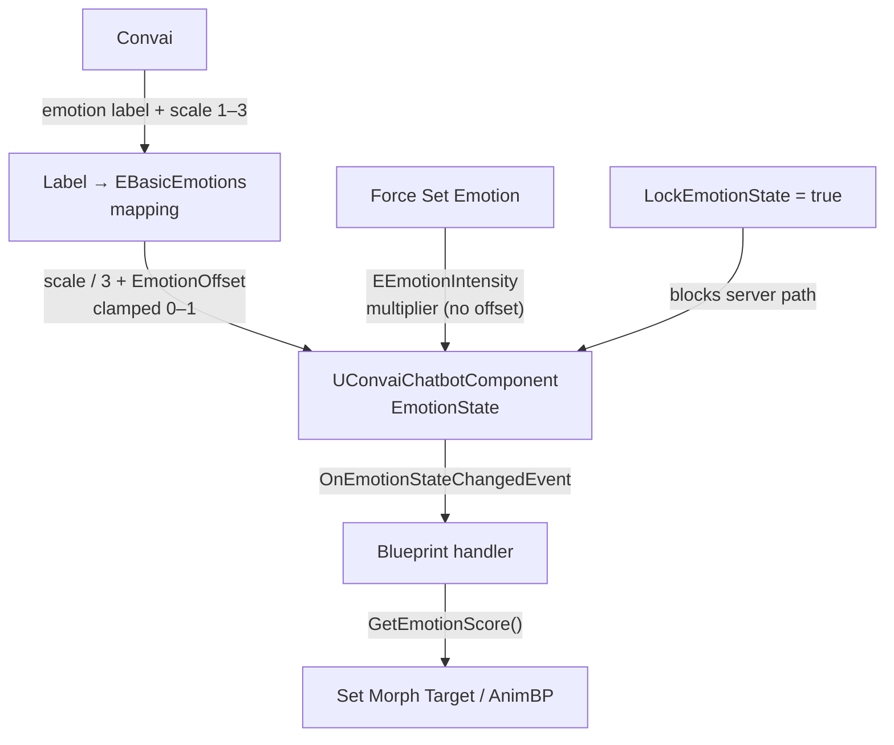

When a Convai character responds, Convai analyzes the generated speech and sends back an emotion state alongside the audio. The Convai Unreal Engine plugin stores that state on `UConvaiChatbotComponent`, exposes per-emotion float scores through Blueprint, and fires an event each time the state updates.

## Key concepts

| Concept | What it is |
|---|---|
| `UConvaiChatbotComponent` | The Blueprint component that owns the emotion state for one character. Score and state APIs live here. |
| `EBasicEmotions` | Enum of seven visible emotion categories (`Happy`, `Calm`, `Afraid`, `Surprise`, `Sad`, `Bored`, `Angry`). |
| `EEmotionIntensity` | Enum of three intensity levels (`Less Intense`, `Basic`, `More Intense`) used by `Force Set Emotion` — not by the server score path. |
| `EmotionOffset` | A `float` bias added to every server-driven emotion score before clamping. Shifts perceived intensity up or down. |
| `LockEmotionState` | A `bool` flag that blocks incoming server emotion updates and suppresses `On Emotion State Changed` on the server path until released. |
| `OnEmotionStateChangedEvent` | Delegate that fires on the game thread when emotion state changes — the main hook for Blueprint expression logic. |
| `GetEmotionScore` | Returns the current `float` score (`0.0`–`1.0`) for one `EBasicEmotions` category. Use this to drive morph targets or Animation Blueprint variables. |
| `GetEmotionsProvider` | Utility function on `UConvaiUtils` that returns the active emotion provider identifier. |

## Emotion categories

The plugin models emotion as seven visible categories defined by `EBasicEmotions`:

| Enum value | Blueprint display name |
|---|---|
| `Joy` | `Happy` |
| `Trust` | `Calm` |
| `Fear` | `Afraid` |
| `Surprise` | `Surprise` |
| `Sadness` | `Sad` |
| `Disgust` | `Bored` |
| `Anger` | `Angry` |

The current `bot-emotion` packet path provides one emotion label and one scale value for each update. Each update overwrites the previous state unless `LockEmotionState` is `true` (see [Locking emotion state](#locking-emotion-state)).

## Server emotion labels

The server sends a short emotion label string alongside an intensity scale (`1`–`3`). The plugin maps those labels to `EBasicEmotions` enum values through `GetTTSEmotion`. The eight recognized labels are:

| Server label | Maps to (`EBasicEmotions`) |
|---|---|
| `"Joy"` | `Joy` |
| `"Calm"` | `Trust` |
| `"Fear"` | `Fear` |
| `"Surprise"` | `Surprise` |
| `"Sadness"` | `Sadness` |
| `"Bored"` | `Disgust` |
| `"Anger"` | `Anger` |
| `"Neutral"` | `None` (no active emotion) |

When a server update arrives, the plugin first resets all emotion scores, then writes the score for the resolved category. A label the plugin does not recognize maps to `None` — the scores are still reset, so the character returns to a neutral score table rather than preserving the previous expression. If a specific emotion never appears during conversation, verify that Convai is sending one of the labels listed above — see [Troubleshooting and diagnostics](troubleshooting-and-diagnostics.md).

## Emotion scores

Each category carries a float score in the range `0.0`–`1.0`. Read the score for a specific emotion using `Get Emotion Score` (`EBasicEmotions Emotion`) on the `UConvaiChatbotComponent`.

### Server-driven scores

On the server path, the plugin parses the emotion string and scale from the `bot-emotion` packet, divides the scale by `3`, adds `EmotionOffset`, and clamps the result to `0.0`–`1.0`. A scale of `1` yields approximately `0.33` before offset; a scale of `3` yields `1.0` before offset.

The `EEmotionIntensity` multipliers (`0.25`, `0.60`, `1.00`) apply only to `Force Set Emotion`, not to server-driven updates.

### EmotionOffset

The `EmotionOffset` property on `UConvaiChatbotComponent` shifts all computed scores by a fixed amount when a server-driven emotion update arrives. The source comment describes a useful range of `-1` to `1`:

- A positive offset amplifies the perceived intensity of every emotion.
- A negative offset diminishes it.
- Scores are always clamped to `0.0`–`1.0` after the offset is applied.

`EmotionOffset` applies only to server-driven updates. It does **not** apply to scores set via `Force Set Emotion` — that function uses the `EEmotionIntensity` multiplier directly.

## Applying scores to the face

The plugin does not populate a ready-made morph-target map on the server emotion path. To show expressions, read scores with `Get Emotion Score` and apply them to morph targets with `Set Morph Target` in Blueprint, or drive Animation Blueprint blend poses from score variables. Map each `EBasicEmotions` category to the morph target names on your character's Skeletal Mesh.

## Locking emotion state

Setting `LockEmotionState` to `true` on `UConvaiChatbotComponent` prevents incoming server updates from changing the current emotion. On the server path, `OnEmotionReceived` returns before updating state or broadcasting `On Emotion State Changed`, so the event does not fire for server-driven updates while the lock is active.

The state holds whatever values it had when the lock was applied — either from a previous server update or from a `Force Set Emotion` call — until `LockEmotionState` is set back to `false`. `Force Set Emotion` and `Reset Emotion State` still update state and fire the event while locked.

This is useful when you want a character to hold a specific expression during a cutscene or cinematic regardless of what Convai sends.


`LockEmotionState` is a replicated property. Its value is synchronized across the network in multiplayer sessions. Confirm it is reset to `false` after any locking sequence, or subsequent clients that receive the component's state will also see the locked expression.


## Forcing an emotion

`Force Set Emotion (EBasicEmotions BasicEmotion, EEmotionIntensity Intensity, bool ResetOtherEmotions)` overwrites the emotion state from Blueprint without waiting for a server update. When `ResetOtherEmotions` is `true`, all other emotion scores are zeroed first. When `false`, the forced score is added to (or replaces the same-category score in) the current state.

The score applied equals the `EEmotionIntensity` multiplier for the chosen level (`Less Intense` = `0.25`, `Basic` = `0.60`, `More Intense` = `1.00`). `EmotionOffset` is not applied.

## The state-changed event

`On Emotion State Changed` fires on the game thread when the emotion state is updated by the server (when not locked), `Force Set Emotion`, or `Reset Emotion State`. Its signature delivers the chatbot component and an interacting player component pin — in the current plugin, the **Interacting Player Component** output is always `null` on every path. Null-check that pin before using it.

The following diagram shows the full flow from server delivery through score computation to Blueprint handler:

## Emotion provider

The active emotion provider identifier is available at runtime through `Get Emotions Provider` on `UConvaiUtils`. The default is `"nrclex"`. Override it with `Set Custom Param` (`EmotionsProvider`, ...) under **Convai | Settings** if your Convai configuration requires a different provider.

## Related pages


[Emotion Blueprint reference](emotion-blueprint-reference.md)



[Usage examples](usage-examples.md)

