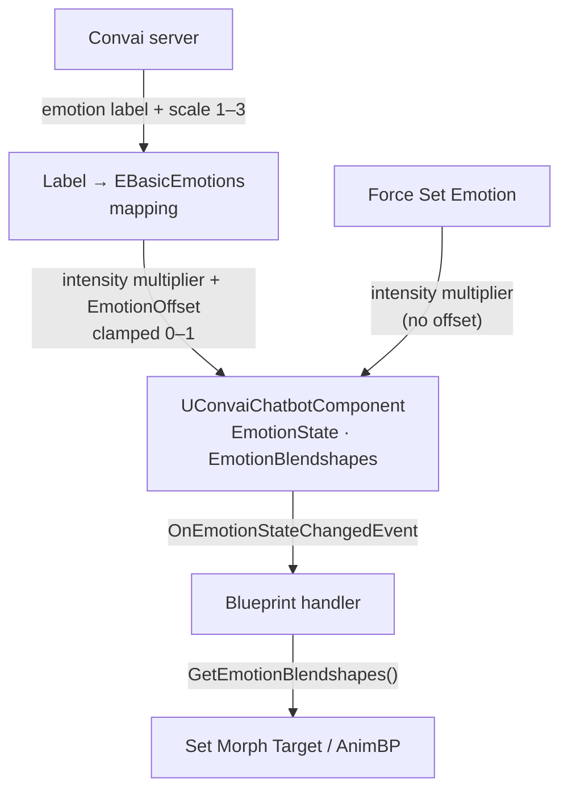

When a Convai character responds, the server analyzes the generated speech and sends back an emotion state alongside the audio. The Convai Unreal Engine plugin stores that state on `UConvaiChatbotComponent`, exposes per-emotion float scores and ready-to-apply blendshape weights through Blueprint, and fires an event each time the state updates.

## Key concepts

| Concept | What it is |
|---|---|
| `UConvaiChatbotComponent` | The Blueprint component that owns the emotion state for one character. All emotion API lives here. |
| `EBasicEmotions` | Enum of seven visible emotion categories (Happy, Calm, Afraid, Surprise, Sad, Bored, Angry). |
| `EEmotionIntensity` | Enum of three intensity levels (Less Intense, Basic, More Intense), each mapped to a score multiplier. |
| `EmotionOffset` | A `float` bias added to every server-driven emotion score before clamping. Shifts perceived intensity up or down. |
| `LockEmotionState` | A `bool` flag that freezes the current emotion state, discarding all incoming server updates until released. |
| `OnEmotionStateChangedEvent` | Delegate that fires on the game thread whenever emotion state changes — the main hook for Blueprint expression logic. |
| `GetEmotionBlendshapes()` | Returns a `TMap<FName, float>` of morph target names to weights, ready to apply with `Set Morph Target`. |
| Content assets | `Full_Emotion_spectrum` and `Full_Emotion_NoMouth_spectrum` — pre-built blendshape mappings for MetaHuman-compatible rigs included with the plugin. |

## Emotion categories and intensity

The plugin models emotion as a set of seven visible categories defined by `EBasicEmotions`, each at one of three intensity levels defined by `EEmotionIntensity`.

**Emotion categories (`EBasicEmotions`):**

| Enum value | Blueprint display name |
|---|---|
| `Joy` | `Happy` |
| `Trust` | `Calm` |
| `Fear` | `Afraid` |
| `Surprise` | `Surprise` |
| `Sadness` | `Sad` |
| `Disgust` | `Bored` |
| `Anger` | `Angry` |

**Intensity levels (`EEmotionIntensity`):**

| Enum value | Blueprint display name | Score multiplier |
|---|---|---|
| `LessIntense` | `Less Intense` | `0.25` |
| `Basic` | `Basic` | `0.60` |
| `MoreIntense` | `More Intense` | `1.00` |

The server produces a single dominant emotion per response. Each update overwrites the previous state unless `LockEmotionState` is `true` (see [Locking emotion state](#locking-emotion-state)).

## Server emotion labels

The server sends a short emotion label string alongside an intensity scale (`1`–`3`). The plugin maps those labels to `EBasicEmotions` enum values internally. The eight recognized labels are:

| Server label | Maps to (`EBasicEmotions`) |
|---|---|
| `"Joy"` | `Joy` |
| `"Calm"` | `Trust` |
| `"Fear"` | `Fear` |
| `"Surprise"` | `Surprise` |
| `"Sadness"` | `Sadness` |
| `"Bored"` | `Disgust` |
| `"Anger"` | `Anger` |
| `"Neutral"` | `None` (no active emotion) |

Any label the plugin does not recognize is silently ignored and leaves the current emotion state unchanged. If a specific emotion never appears on your character during conversation, verify that the server is sending one of the labels listed above — see [Troubleshooting and diagnostics](troubleshooting-and-diagnostics.md).

## Emotion scores

Each category carries a float score in the range `0.0`–`1.0`. The score is determined by the intensity multiplier for that response. Read the score for a specific emotion using `Get Emotion Score` (`EBasicEmotions Emotion`) on the `UConvaiChatbotComponent`.

### EmotionOffset

The `EmotionOffset` property on `UConvaiChatbotComponent` shifts all computed scores by a fixed amount when a server-driven emotion update arrives. The value is a `float` in the range `−1` to `1`:

- A positive offset amplifies the perceived intensity of every emotion.
- A negative offset diminishes it.
- Scores are always clamped to `0.0`–`1.0` after the offset is applied.

`EmotionOffset` applies only to server-driven updates. It does **not** apply to scores set via `Force Set Emotion` — that function uses the intensity multiplier directly.

## Blendshape weights

In addition to scores, the component provides a ready-to-use blendshape map from `Get Emotion Blendshapes`. This returns a `TMap<FName, float>` where each key is a morph target name on the character's Skeletal Mesh and each value is a weight in `0.0`–`1.0`. Apply these weights directly with `Set Morph Target` in Blueprint or inside your Animation Blueprint using `For Each Loop (Map)`.

The plugin ships two content assets for MetaHuman-compatible rigs:

| Asset | Use when |
|---|---|
| `Full_Emotion_spectrum` | The character's mouth should animate with emotion (emotion and speech blendshapes share the same mesh) |
| `Full_Emotion_NoMouth_spectrum` | The character uses a separate mouth mesh for lip sync — use this to avoid emotion blendshapes conflicting with lip-sync morph targets |

## Locking emotion state

Setting `LockEmotionState` to `true` on `UConvaiChatbotComponent` prevents incoming server updates from changing the current emotion. The state holds whatever values it had when the lock was applied — either from a previous server update or from a `Force Set Emotion` call — until `LockEmotionState` is set back to `false`.

This is useful when you want a character to hold a specific expression during a cutscene or cinematic regardless of what the server sends.


`LockEmotionState` is a replicated property. Its value is synchronized across the network in multiplayer sessions. Confirm it is reset to `false` after any locking sequence, or subsequent clients that receive the component's state will also see the locked expression.


## Forcing an emotion

`Force Set Emotion (EBasicEmotions BasicEmotion, EEmotionIntensity Intensity, bool ResetOtherEmotions)` overwrites the emotion state from Blueprint without waiting for a server update. When `ResetOtherEmotions` is `true`, all other emotion scores are zeroed first. When `false`, the forced score is added to (or replaces the same-category score in) the current state.

The score applied equals the intensity multiplier for the chosen `EEmotionIntensity`. `EmotionOffset` is not applied.

## The state-changed event

`On Emotion State Changed` fires on the game thread each time the emotion state is updated, whether by the server, `Force Set Emotion`, or `Reset Emotion State`. Its signature delivers the chatbot component and the player component that triggered the turn, letting you read scores or blendshapes in the handler and update your character immediately.

The following diagram shows the full flow from server delivery through score computation to Blueprint handler:

## Related pages


[Emotion Blueprint reference](emotion-blueprint-reference.md)



[Usage examples](usage-examples.md)

