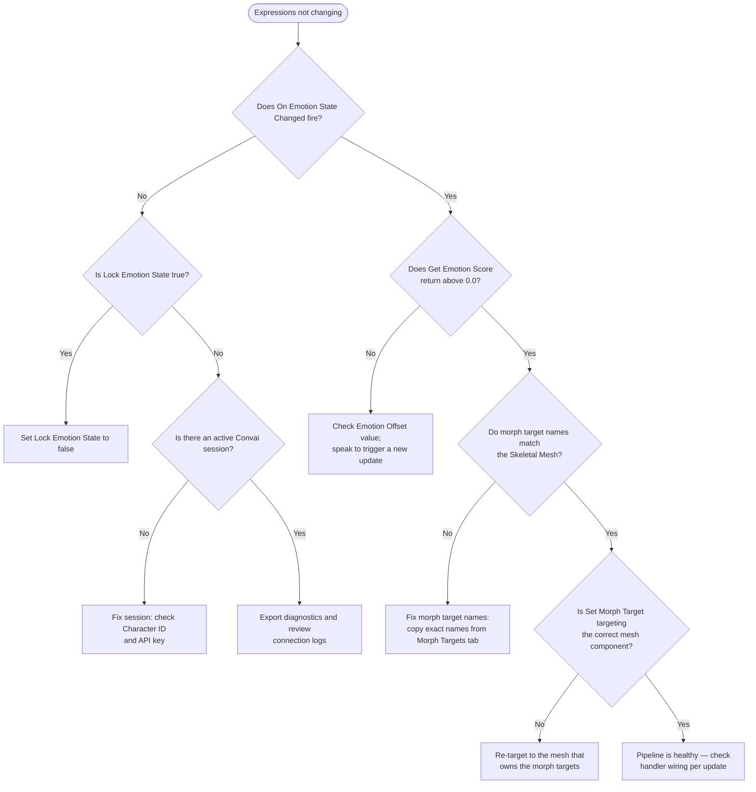

Most emotion problems fall into one of three categories: no `On Emotion State Changed` event firing at all, the event firing but no face movement, or state stuck due to a lock. Start by adding a `Print String` inside your `On Emotion State Changed` handler — this one signal identifies whether the issue is in the session/signal path or in the morph target application.

## Inspecting live state

The `UConvaiChatbotComponent` exposes emotion state you can query at any time from Blueprint during Play In Editor, without additional tooling.

| What to check | How to check it | What it tells you |
|---|---|---|
| Whether the event fires | Add `Print String` inside `On Emotion State Changed` | If it never fires, the session is not delivering emotion data or `Lock Emotion State` is blocking server updates |
| Current score for a specific emotion | Call `Get Emotion Score` and connect to `Print Float` | A value above `0.0` confirms that emotion is active |
| Whether state is locked | Print the `Lock Emotion State` bool property | `true` means server updates and server-driven events are suppressed |

To verify morph target mappings without relying on live conversation, call `Force Set Emotion` from `BeginPlay`, a temporary Blueprint input or test event, or a custom editor-callable wrapper function that calls `Force Set Emotion`. Then check whether `Get Emotion Score` returns the expected value and your `Set Morph Target` nodes respond.


`Lock Emotion State` is a replicated property. If you set it to `true` during testing, confirm it is reset to `false` before shipping — a locked state silently suppresses all live emotion response with no runtime error.


## First-line investigation

Work through this checklist in order when emotion is not behaving as expected. Most issues resolve at step 1 or 2.



### Confirm the session is active

The `Convai Chatbot` component must have a valid **Character ID** and be able to reach Convai. If there is no active session, emotion data is never sent.

- Speak to the character normally and confirm it responds with audio. If audio is absent, fix the session first.
- If audio works but the emotion event still never fires, export diagnostics and review the connection logs before escalating the character configuration to Convai support.



### Check whether On Emotion State Changed fires

Add a `Print String` node inside the `On Emotion State Changed` event handler. Enter Play In Editor and speak to the character.

- **Print String fires** → The signal path is healthy. Skip to step 4.
- **Print String never fires** → The event is not reaching your handler. Continue to step 3.



### Check Lock Emotion State

When `Lock Emotion State` is `true`, server-driven updates are discarded **and** `On Emotion State Changed` does not fire for those updates.

- **`Lock Emotion State` is `true`** → Set it to `false` to resume server updates and events.
- **`Lock Emotion State` is `false`** → The issue is upstream. Confirm the chatbot component has a valid Character ID and the plugin can reach Convai.



### Check emotion scores

In your event handler, call `Get Emotion Score` for the emotion you expect and print the return value. Confirm:

1. The score rises above `0.0` when the character speaks with emotional content. If the score stays at `0.0`, `Emotion Offset` may be suppressing values — see [Offset changes have no visible effect](#offset-changes-have-no-visible-effect).
2. The server label Convai sends matches one of the recognized labels — see [How the emotion system works](how-the-emotion-system-works.md#server-emotion-labels).



### Confirm Set Morph Target targets the correct mesh

If scores are above `0.0` but the face does not move:

1. Confirm the **Morph Target Name** on each `Set Morph Target` node matches a name on the character's Skeletal Mesh exactly. Open the Skeletal Mesh asset and check the **Morph Targets** tab. Name mismatches cause `Set Morph Target` to silently do nothing.
2. If the character uses multiple Skeletal Mesh components (body, head, hair), confirm each `Set Morph Target` call targets the mesh that owns the morph targets.




After completing the checklist, if `Print String` fires on `On Emotion State Changed`, `Get Emotion Score` returns values above `0.0`, and morph targets update on the correct mesh, the pipeline is healthy.


## Common issues quick reference

| Symptom | Most likely cause | Fix | Verify |
|---|---|---|---|
| `On Emotion State Changed` never fires | No active Convai session, no emotion packet for the response, or `Lock Emotion State` is `true` | Check Character ID, API key, connection diagnostics, and lock state | Speak to the character — the event fires and scores rise above `0.0` |
| Event fires; face does not change | Morph target name mismatch | Compare `Set Morph Target` names against **Morph Targets** tab on Skeletal Mesh | Morph target values change in the Details panel when scores rise |
| Event fires; `Get Emotion Score` stays at `0.0` | `Emotion Offset` suppressing scores, unrecognized server label, or `Reset Emotion State` with no new update | Check `Emotion Offset` value; speak to trigger a new update; verify server label | `Get Emotion Score` returns a value above `0.0` on the next server update |
| Character always shows the same expression | `Lock Emotion State` is `true` | Set `Lock Emotion State` to `false` | Expression changes with new speech after unlock |
| `Force Set Emotion` has no visible result | Morph target mismatch or handler not applying scores | Confirm handler runs with `Print String`; verify `Get Emotion Score` and morph target names | Forced score matches the intensity multiplier and the face updates |
| Offset change has no visible effect | Offset only applies when a new server update arrives | Speak to the character to trigger a new emotion update | `Get Emotion Score` reflects the new bias on the next update |

---

## Expressions never change during conversation

**Symptom:** The character speaks but its face shows no emotional expression changes. `On Emotion State Changed` never fires.

**Cause:** No active Convai session, Convai is not sending emotion data for this character, or `Lock Emotion State` is blocking server-driven updates and events.

**Fix:**

1. Confirm the `Convai Chatbot` component has a valid **Character ID** and the plugin can reach Convai.
2. Set `Lock Emotion State` to `false`.
3. Add a `Print String` node inside the `On Emotion State Changed` handler to confirm whether the event reaches your graph.
4. If audio works but the event still never fires, export diagnostics and review connection logs.

**Verify:** Speak to the character — `On Emotion State Changed` fires and `Get Emotion Score` returns values above `0.0` for active emotions.

---

## The On Emotion State Changed event fires but the face does not change

**Symptom:** The `Print String` inside the handler fires, but no morph targets update on the mesh.

**Cause:** Scores are zero, morph target names do not match the Skeletal Mesh, or `Set Morph Target` targets the wrong mesh component.

**Fix:**

1. Call `Get Emotion Score` in the handler and print the return value. If the score is `0.0`, check `Emotion Offset` and whether a `Reset Emotion State` call earlier in the session zeroed the scores without a subsequent server update.
2. Confirm the **Morph Target Name** on each `Set Morph Target` node matches the morph target names on the Skeletal Mesh. Open the Skeletal Mesh asset, switch to the **Morph Targets** tab, and compare the listed names.
3. Confirm `Set Morph Target` targets the Skeletal Mesh Component that owns the morph targets.

**Verify:** When `Get Emotion Score` rises above `0.0`, the corresponding morph target value changes on the Skeletal Mesh in the Details panel during Play In Editor.

---

## Emotion state is stuck and server updates have no effect

**Symptom:** The character always displays the same expression regardless of its speech content. Server-driven updates appear to have no effect.

**Cause:** `Lock Emotion State` is `true`, or a repeated `Force Set Emotion` call overwrites every server update.

**Fix:**

1. Set `Lock Emotion State` to `false` on the `Convai Chatbot` component. Print the boolean in Blueprint to confirm the value at runtime.
2. Search your Blueprint graphs for `Force Set Emotion` calls triggered on Tick or on every response. Remove or gate those calls so server updates can apply.

**Verify:** Set `Lock Emotion State` to `false`, speak to the character, and confirm `On Emotion State Changed` fires with changing scores.

---

## Force Set Emotion does not visibly update the face

**Symptom:** `Force Set Emotion` is called from Blueprint but the character's expression does not change.

**Cause:** The event handler is not applying scores to morph targets, `Reset Other Emotions` is set unexpectedly, or morph target names do not match the mesh.

**Fix:**

1. Add a `Print String` inside `On Emotion State Changed` to confirm the handler runs. Call `Get Emotion Score` for the forced emotion — the return value should match the intensity multiplier (`0.25`, `0.60`, or `1.00`).
2. Confirm **Reset Other Emotions** is set as intended. If `false`, the forced score merges with existing scores and may not produce a visible change.
3. Confirm your `Set Morph Target` nodes use morph target names that exist on the Skeletal Mesh.

**Verify:** After `Force Set Emotion`, `Get Emotion Score` returns the expected value and the mapped morph target updates in the viewport.

---

## Offset changes have no visible effect

**Symptom:** Changing `Emotion Offset` on the component does not noticeably change expression intensity.

**Cause:** `Emotion Offset` applies only when a new server-driven update arrives, not retroactively. It also does not apply to scores set via `Force Set Emotion`.

**Fix:**

1. Speak to the character to trigger a new server emotion update after changing the offset.
2. Confirm the offset value is reasonable. Scores clamp to `0.0`–`1.0` — extreme offsets may saturate or zero all scores.
3. To test a forced expression, use `Force Set Emotion` with a higher intensity level instead of relying on offset.

**Verify:** Speak to the character after changing the offset — `Get Emotion Score` reflects the new bias on the next server update.

---

## Diagnostic flowchart

Use this flowchart when the text checklist does not isolate the problem. Start at the symptom, then follow the branch that matches what you observe in Play In Editor.

---

## Related pages


[How the emotion system works](how-the-emotion-system-works.md)



[Emotion Blueprint reference](emotion-blueprint-reference.md)



[Emotion quick start](emotion-quick-start.md)



[Emotion examples](emotion-examples.md)

