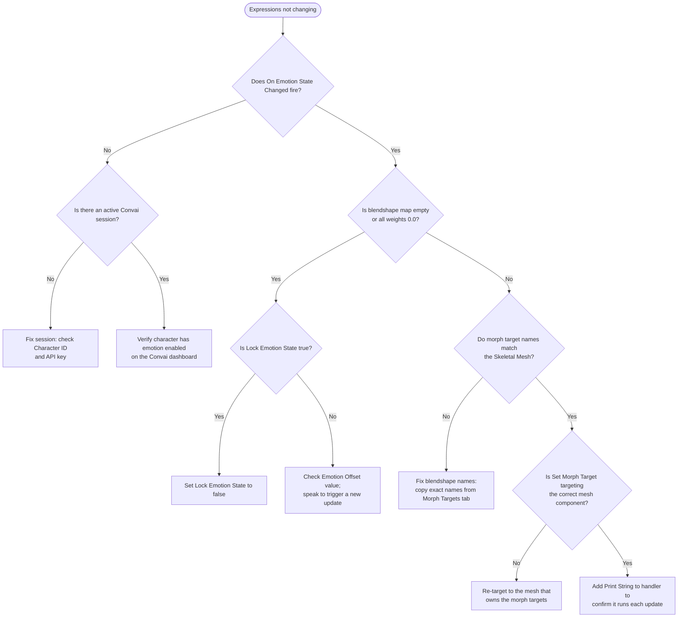

Most emotion problems fall into one of three categories: no `On Emotion State Changed` event firing at all, the event firing but no face movement, or state stuck due to a lock. Start by adding a `Print String` inside your `On Emotion State Changed` handler — this one signal identifies whether the issue is in the session/signal path or in the morph target application.

## Inspecting live state

The `UConvaiChatbotComponent` exposes emotion state you can query at any time from Blueprint during Play mode, without additional tooling.

| What to check | How to check it | What it tells you |
|---|---|---|
| Whether the event fires | Add `Print String` inside `On Emotion State Changed` | If it never fires, the session is not delivering emotion data |
| Current score for a specific emotion | Call `Get Emotion Score` and connect to `Print Float` | A value above `0.0` confirms that emotion is active |
| Full blendshape map | Call `Get Emotion Blendshapes` and connect to `Print String` | Shows all morph target names and their weights — reveals name mismatches |
| Whether state is locked | Print the `Lock Emotion State` bool property | `true` means server updates are discarded |

To verify your blendshape slot mappings without entering Play mode, manually call `Force Set Emotion` from a **Call Function in Editor** button and observe the Viewport.


`Lock Emotion State` is a replicated property. If you set it to `true` during testing, confirm it is reset to `false` before shipping — a locked state silently suppresses all live emotion response with no runtime error.


## First-line investigation

Work through this checklist in order when emotion is not behaving as expected. Most issues resolve at step 1 or 2.



### Confirm the session is active

The `Convai Chatbot` component must have a valid **Character ID** and be able to reach Convai. If there is no active session, emotion data is never sent.

- Speak to the character normally and confirm it responds with audio. If audio is absent, fix the session first.
- Verify the character's configuration on the [Convai dashboard](https://convai.com/pipeline/dashboard) has emotion support enabled. Some character configurations may not produce emotion responses.



### Check whether On Emotion State Changed fires

Add a `Print String` node inside the `On Emotion State Changed` event handler. Enter Play mode and speak to the character.

- **Print String fires** → The signal path is healthy. Skip to step 4.
- **Print String never fires** → The event is not reaching your handler. Continue to step 3.



### Check Lock Emotion State

`Lock Emotion State` prevents the event from updating the state but does not prevent the event from firing. If the event fires but state never changes, check `Lock Emotion State`.

- **`Lock Emotion State` is `true`** → Set it to `false` to resume server updates.
- **`Lock Emotion State` is `false`** → The issue is upstream. Confirm the chatbot component has a valid Character ID and the plugin can reach Convai.



### Check the blendshape map

In your event handler, call `Get Emotion Blendshapes` and print the result as a string. Confirm two things:

1. The map is not empty and not all weights are `0.0`. If all weights are zero, `Emotion Offset` may be suppressing scores — see [EmotionOffset has no visible effect](#emotionoffset-has-no-visible-effect).
2. The morph target names in the map match names that exist on the character's Skeletal Mesh. Open the Skeletal Mesh asset and check the **Morph Targets** tab. Name mismatches cause `Set Morph Target` to silently do nothing.



### Confirm Set Morph Target targets the correct mesh

If the character uses multiple Skeletal Mesh components (body, head, hair), confirm the `Set Morph Target` call in your handler targets the mesh that owns the morph targets. Getting the wrong component reference silently applies weights to the wrong mesh.




After completing the checklist, if `Print String` fires on `On Emotion State Changed` and morph targets update on the correct mesh, the pipeline is healthy.


## Common issues quick reference

| Symptom | Most likely cause | Fix |
|---|---|---|
| `On Emotion State Changed` never fires | No active Convai session or emotion not enabled for the character | Check Character ID, API key, and dashboard character configuration |
| Event fires; face does not change | Morph target name mismatch | Print `Get Emotion Blendshapes` map; compare keys against **Morph Targets** tab on Skeletal Mesh |
| Event fires; all blendshape weights are `0.0` | `EmotionOffset` suppressing scores, or `Reset Emotion State` zeroed state and no new update arrived | Check `EmotionOffset` value; speak to trigger a new server update |
| Character always shows the same expression | `Lock Emotion State` is `true` | Set `Lock Emotion State` to `false` |
| `Force Set Emotion` has no visible result | Morph target mismatch or handler not re-applying the blendshape map | Confirm handler runs with `Print String`; check morph target names |
| `EmotionOffset` change has no visible effect | Offset only applies when a new server update arrives | Speak to the character to trigger a new emotion update |

---

## Expressions never change during conversation

**Symptom:** The character speaks but its face shows no emotional expression changes. `On Emotion State Changed` never fires.

**Checks:**

1. Confirm the `Convai Chatbot` component has a valid **Character ID** and the plugin can reach Convai. If there is no session, emotion data is never sent.
2. Add a `Print String` node inside the `On Emotion State Changed` handler. If it never fires, the session is not connecting or the server is not sending emotion data for this character.
3. Verify the character's configuration on the [Convai dashboard](https://convai.com/pipeline/dashboard) has emotion support enabled.

---

## The On Emotion State Changed event fires but the face does not change

**Symptom:** The `Print String` inside the handler fires, but no morph targets update on the mesh.

**Checks:**

1. Call `Get Emotion Blendshapes` in the handler and print the resulting map. If the map is empty or all weights are `0.0`, check `Emotion Offset` and whether a `Reset Emotion State` call earlier in the session zeroed the scores without a subsequent server update.
2. Confirm the morph target names in the map match the morph target names on the Skeletal Mesh. Open the Skeletal Mesh asset, switch to the **Morph Targets** tab, and compare the listed names against the keys printed from the map. A naming mismatch causes `Set Morph Target` to silently do nothing.
3. Confirm `Set Morph Target` is targeting the correct Skeletal Mesh Component. If the character uses multiple meshes (body, face, hair), make sure the morph targets are on the mesh you are targeting.

---

## Emotion state is stuck and server updates have no effect

**Symptom:** The character always displays the same expression regardless of its speech content. `On Emotion State Changed` fires but blendshapes never change.

**Checks:**

1. Confirm `Lock Emotion State` is `false` on the `Convai Chatbot` component. Print the boolean in Blueprint to verify.
2. Search your Blueprint graphs for any `Force Set Emotion` calls that are triggered repeatedly — for example, on Tick or inside an event that fires every response. A repeated `Force Set Emotion` with no lock reset can overwrite every server update.

---

## Force Set Emotion does not visibly update the face

**Symptom:** `Force Set Emotion` is called from Blueprint but the character's expression does not change.

**Checks:**

1. `Force Set Emotion` fires `On Emotion State Changed` immediately. Add a `Print String` inside the handler to confirm it runs. If the handler runs but the mesh does not update, confirm the morph target names returned by `Get Emotion Blendshapes` match the names on the Skeletal Mesh.
2. Confirm **Reset Other Emotions** is set as intended. If `false`, the forced score is merged with existing scores, which may not produce a visible change if other scores are already high.

---

## EmotionOffset has no visible effect

**Symptom:** Changing `Emotion Offset` on the component does not noticeably change expression intensity.

**Checks:**

1. `Emotion Offset` only affects scores when a server-driven emotion update arrives. Changing it after the last update has no retroactive effect. Speak to the character to trigger a new response.
2. Confirm the offset value is in the range `−1.0` to `1.0`. The resulting score is clamped to `0.0`–`1.0` — extreme offsets may saturate all scores at `1.0` or zero them out entirely.
3. Note that `Emotion Offset` does **not** apply when `Force Set Emotion` is called. It applies only on the server-driven code path.

---

## Diagnostic flowchart

---

## Related pages


[How the emotion system works](how-the-emotion-system-works.md)



[Emotion Blueprint reference](emotion-blueprint-reference.md)



[Quick start](quick-start.md)



[Usage examples](usage-examples.md)

