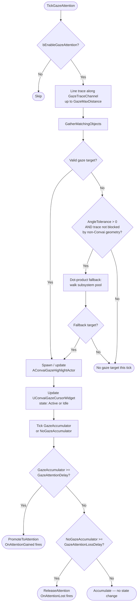
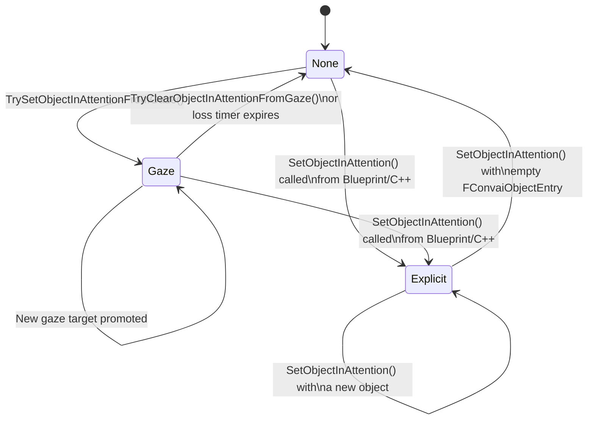

Gaze attention is a subsystem inside `UConvaiPlayerComponent` that translates where the player is looking into contextual focus for AI characters. When active, it runs every tick, manages visual feedback through a highlight actor and a cursor widget, and writes to the chatbot's "object in attention" slot after a configurable dwell period.

If you have not enabled gaze attention yet, start with [Gaze attention quick start](gaze-attention-quick-start.md). This page explains the mental model behind that setup.

## Three core ideas

Before the per-tick pipeline, keep these three stages in mind:

| Stage | What happens | What the player sees |
|---|---|---|
| **Gaze detection** | A line trace (and optional angle fallback) finds a gazeable `UConvaiObjectComponent` under the crosshair. | Highlight and cursor turn active immediately. |
| **Dwell promotion** | After `GazeAttentionDelay` seconds on the same target, the object is promoted to "in attention." | No new visual change; `OnAttentionGained` fires. |
| **Attention ownership** | Each chatbot tracks who set its attention slot via `AttentionSource`. Gaze can update the slot only when it is `None` or already owned by gaze. | The character may speak or stay silent depending on `GazeShouldRespond`. |

Tagged objects come from scene metadata — see [How scene metadata works](../scene-metadata/how-scene-metadata-works.md). Attention ownership and pronoun grounding overlap with [Attention and reference grounding](../character-actions/attention-and-reference-grounding.md).

## Tick pipeline

Each tick, `UConvaiPlayerComponent` calls `TickGazeAttention` when `bEnableGazeAttention` is `true`. The diagram below shows the full decision path; the numbered list that follows describes each stage in detail.



1. A line trace fires forward from the player camera or VR HMD along `GazeTraceChannel` (default `ECC_Visibility`) up to `GazeMaxDistance` (default 5000 cm).
2. The trace result is tested for a gazeable `UConvaiObjectComponent` on the hit actor. The gaze target is accepted only when the object is whole-actor scoped or the hit primitive matches the object's configured component scope.
3. If the strict trace does not engage a valid gaze target, a dot-product fallback runs when `GazeAngleTolerance` is greater than zero and the primary trace was not blocked by non-Convai geometry. The fallback walks every `UConvaiObjectComponent` registered in the subsystem, discards any that are out of range, behind the camera, or outside the cone half-angle, and picks the one with the highest dot product against the view direction. This avoids a sphere-trace physics query and behaves in a distance-independent way — a distant object needs the same on-screen tolerance as a nearby one.
4. Any transition between gaze targets (entering or leaving) fires `OnGazeBegin` or `OnGazeEnd` on the player component and updates the cursor widget state.
5. Two accumulators run in parallel: `GazeAccumulator` counts how long the current target has been held, and `NoGazeAccumulator` counts how long the player has been looking away from any Convai object.

## Attention promotion and release

When `GazeAccumulator` reaches `GazeAttentionDelay` seconds (default 1.0), the gaze target is promoted to "in attention":

- The player component calls an internal method on the chatbot component, passing the `FConvaiObjectEntry` for the target plus the values of `GazeAttentionText` and `GazeShouldRespond`. This is handled automatically — no Blueprint wiring is required.
- `OnAttentionGained` fires on the player component.
- The chatbot's `AttentionSource` property is stamped to `EConvaiAttentionSource::Gaze`.

When `NoGazeAccumulator` reaches `GazeAttentionLossDelay` seconds (default 5.0) and the player is no longer gazing at the current attention actor/primitive pair, the slot is released:

- The player component calls an internal method on the chatbot component to clear the attention slot. Again, this is automatic.
- `OnAttentionLost` fires on the player component.
- The chatbot's `AttentionSource` resets to `EConvaiAttentionSource::None`.

## Attention-source locking rule

The chatbot tracks who last set its attention slot via `AttentionSource` (`EConvaiAttentionSource`). The `AttentionSource` property on `UConvaiChatbotComponent` advances through three states:



| Value | Meaning |
|---|---|
| `None` | Attention slot is empty. |
| `Gaze` | Slot was last set by the gaze system. |
| `Explicit (Blueprint/C++)` | Slot was last set by a direct `SetObjectInAttention` call. |

Gaze-driven updates only succeed when `AttentionSource` is `None` or `Gaze`. A direct call to `SetObjectInAttention` from Blueprint or C++ sets `AttentionSource` to `Explicit`, locking the slot. Gaze calls are silently rejected while the slot is locked. To release an explicit lock, call `SetObjectInAttention` with an empty `FConvaiObjectEntry`.


If a character's attention slot stays on one object regardless of where the player looks, check whether a Blueprint graph is calling `SetObjectInAttention` and never clearing it. The `AttentionSource` read-only property on the chatbot shows which system currently owns the slot.


## Attention and the actions system

`SetObjectInAttention` has no effect when `Enable Actions` (`bEnableActions`) is `false` on the chatbot. Convai only resolves object attention when the `action_config` block was included at session connect — which requires actions to be enabled. Gaze attention therefore requires the actions system to be active on the chatbot.

## Component-scoped gaze

By default, every `UConvaiObjectComponent` on an actor represents the whole actor — the gaze system highlights all meshes and promotes the actor as a unit. To scope gaze to a sub-mesh, set `ObjectEntry.MoveTargetMode` to **Component as goal** (`Vector`) and set `ObjectEntry.ComponentName` to a case-insensitive substring of the target component's name. With the default **Actor as goal** mode, a non-empty `ComponentName` does not affect gaze.

`GatherMatchingObjects` divides `UConvaiObjectComponent` instances on a hit actor into two groups:

| Group | Condition | Fires when |
|---|---|---|
| Whole-actor | `MoveTargetMode` is `Actor as goal`, or `ComponentName` is empty | Any hit on the actor when the actor has no resolved component-scoped objects. If a component-scoped object on the same actor matches, whole-actor objects fire as piggyback. |
| Component-scoped | `MoveTargetMode` is `Component as goal` and `ComponentName` resolves to a mesh on the actor | Hit primitive matches (or is attached to) the resolved component |

When a component-scoped component matches, any whole-actor component on the same actor also fires ("piggyback" rule). If the actor has resolved component-scoped objects but the hit primitive does not match any of them, no gaze object fires for that hit.

**Example — a door actor with two Convai objects:**

```text
BP_Door
├── ConvaiObjectComponent "Door"        → MoveTargetMode: Actor as goal
└── ConvaiObjectComponent "DoorHandle"  → MoveTargetMode: Component as goal, ComponentName: "Handle"
    └── targets SM_Handle on the actor
```

- Player looks at door frame → no gaze object fires, because the actor has a resolved component-scoped object and the hit primitive does not match it.
- Player looks at handle → `ConvaiObjectComponent "DoorHandle"` fires; `ConvaiObjectComponent "Door"` also fires (piggyback). The highlight actor scopes to `SM_Handle` only.

`ComponentName` matching is case-insensitive substring lookup, resolved once and cached. Call `GetResolvedComponent(true)` to force a refresh if the component tree changes at runtime. An unresolved `ComponentName` logs a warning on first component resolve and that component is excluded from scoped gaze passes.


Use component-scoped `UConvaiObjectComponent` instances to let a single complex prop expose multiple independent interaction points — each with its own `Name`, `Description`, and gaze events — without duplicating the parent actor.


## Visual feedback

### Highlight actor

When a gaze target is identified, `UConvaiPlayerComponent` spawns (or reuses) an `AConvaiGazeHighlightActor` over the target. The highlight actor paints the target's meshes using `UMeshComponent::SetOverlayMaterial` on UE 5.3 and later. By default, the highlight actor loads `/ConvAI/Highlights/M_ConvaiGazeOverlay`, a Fresnel rim silhouette material referenced by the plugin source. The actor writes `GazeHighlightColor` to the material's `EmissiveColor` and `Color` vector parameters, then writes `GazeHighlightEmissiveIntensity` to the `EmissiveIntensity` scalar parameter.

On UE 5.0–5.2, `SetOverlayMaterial` is not available on `UMeshComponent`. The actor falls back to a `DrawDebugBox` wireframe around the target's bounds using `FallbackBoxThickness` and `FallbackBoxPadding`.

When a component-scoped `UConvaiObjectComponent` matches, the highlight scopes to that specific sub-mesh rather than every mesh on the actor. See [Component-scoped gaze](#component-scoped-gaze) above for the matching rules.

### Cursor widget

A `UConvaiGazeCursorWidget` is added to the viewport while gaze tracking is active when `bShowGazeCursor` is `true`. The widget has two visual states:

- **Idle** — gaze is not over any Convai object. Drawn with `GazeCursorIdleColor` (default alpha 0, fully transparent).
- **Active** — gaze is on a Convai object. Drawn with `GazeCursorActiveColor` (default white).

The transition between states is interpolated over `GazeCursorFadeInTime` and `GazeCursorFadeOutTime`. When `bAlwaysShowGazeCursor` is `true`, the cursor stays in the Active visual state even when gaze is not over a Convai object.

The cursor is a pure C++ widget that uses Unreal's `FCoreStyle::WhiteBrush`. No texture asset ships with the plugin. To display a custom reticle, subclass `UConvaiGazeCursorWidget` in Blueprint, override `OnGazeStateChanged`, and assign the subclass to `GazeCursorWidgetClass` on the player component.

## Next steps


[Gaze attention quick start](gaze-attention-quick-start.md)



[Gaze attention reference](gaze-attention-reference.md)



[Gaze attention usage examples](gaze-attention-usage-examples.md)



[Troubleshoot gaze attention](troubleshoot-gaze-attention.md)

