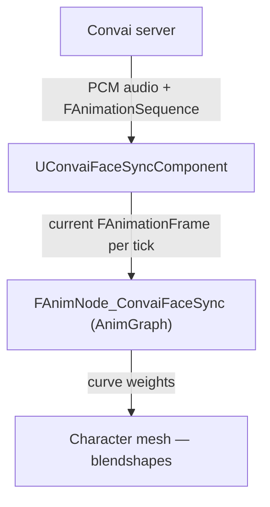

The Convai Unreal Engine plugin animates a character's face by replaying a sequence of blendshape frames that Convai precomputes on the server before the audio is streamed to the client. This page explains that pipeline, the four `EC_LipSyncMode` values, and how the AnimGraph node integrates with Unreal's animation system.

## Precomputed data pipeline

When a Convai character speaks, the server produces two things simultaneously: a PCM audio stream and a corresponding `FAnimationSequence` — a time-indexed list of `FAnimationFrame` values where each frame is a map of blendshape names to float weights.

The plugin receives those frames through `UConvaiFaceSyncComponent`, which buffers them and exposes the current frame each engine tick. The `FAnimNode_ConvaiFaceSync` AnimGraph node reads from that buffer, applies any remapping and alpha scaling, and writes the resulting curve values into the animation pose.

The reason data is precomputed rather than inferred at runtime is to avoid adding a machine learning inference step to the client. The server already has the text-to-speech synthesis context, so it can produce accurate blendshape timing without additional latency from a local viseme model.

The `UConvaiFaceSyncComponent` sets `RequiresPrecomputedFaceData()` to `true`. This tells the audio streamer to request facial data from the server rather than attempt runtime inference. Characters without this component, or with the mode set to `Off`, receive no facial data.

## Lip-sync modes

The `EC_LipSyncMode` enum controls which blendshape set the server produces and which curve names the AnimGraph node expects on the character's Skeletal Mesh.

| Mode | Display name | Target rig | Curve count |
|---|---|---|---|
| `Off` | `Off` | — | No facial data requested |
| `Auto` | `Auto` | Detected at runtime | Delegates to the attached `UConvaiFaceSyncComponent`'s own `GetLipSyncMode()` result to select the blendshape format |
| `VisemeBased` | `Viseme Based` | Custom rigs with OVR viseme targets | 15 OVR viseme curves |
| `BS_MHA` | `MetaHuman Blendshapes` | MetaHuman and CC5 characters | MetaHuman CTRL curves |
| `BS_ARKit` | `ARKit Blendshapes` | CC4 characters | 61 ARKit blendshape curves (52 standard Apple ARKit + 9 head/eye rotation curves) |
| `BS_CC4_Extended` | `CC4 Extended Blendshapes` | CC4 characters with extended blendshape sets | CC4 Extended curves |

### Choosing a mode

The mode must match the curve names baked into the character's Skeletal Mesh:

- Use `BS_MHA` for MetaHuman characters and for CC5 characters that have been configured to use MetaHuman-compatible curves.
- Use `BS_ARKit` for CC4 characters exported with the standard ARKit blendshape set.
- Use `BS_CC4_Extended` for CC4 characters that have the extended blendshape set enabled in Character Creator 4.
- Use `VisemeBased` for custom rigs where you have manually created curves named after the 15 OVR visemes: `sil`, `PP`, `FF`, `TH`, `DD`, `kk`, `CH`, `SS`, `nn`, `RR`, `aa`, `E`, `ih`, `oh`, `ou`.
- Use `Auto` when you want the plugin to delegate the blendshape format selection to the attached `UConvaiFaceSyncComponent`'s own mode at runtime rather than fixing it at the global level. `Off` disables lip sync entirely and stops facial data from being requested.

## AnimGraph integration

The `FAnimNode_ConvaiFaceSync` node is placed in an Animation Blueprint's AnimGraph between a pose source and the output. It reads the current blendshape frame from the resolved `UConvaiChatbotComponent` on the owning Actor, applies upper and lower face alphas, optional smoothing, and optional starvation blending, then outputs the modified pose.

The node auto-discovers the `UConvaiChatbotComponent` on the owning Actor if the `ConvaiChatbotComponent` pin is left unset. If the Actor has more than one chatbot component, connect the pin explicitly to avoid ambiguity.

The plugin ships two content assets — `Convai_MetaHuman_FaceAnim` and `Convai_MetaHuman_BodyAnim` — that are pre-configured Animation Blueprints for MetaHuman characters. For other rig types, you add the node to your own Animation Blueprint as described in the [Quick start](quick-start.md).

### Starvation blending

Between the end of one speech turn and the arrival of frames for the next, the buffer is empty. The node uses `StarvationBlendInDuration` and `StarvationBlendOutDuration` to fade the curves in and out smoothly rather than snapping the face to neutral and back. A blend-out of `0.8` seconds, for example, lets the mouth settle naturally after speech ends rather than snapping shut instantly.

### Upper and lower face split

The node separates blendshapes into upper-face (brow, eyes, lids) and lower-face (jaw, lips, cheeks) groups using the `UpperFaceBlendshapeNames` array. A separate alpha applies to each group. This lets you reduce eye/brow movement from speech — which is usually noise — while keeping full lip amplitude.

## Related concepts


[Face Sync component reference](face-sync-component-reference.md)



[Face Sync AnimGraph node reference](face-sync-anim-node-reference.md)

