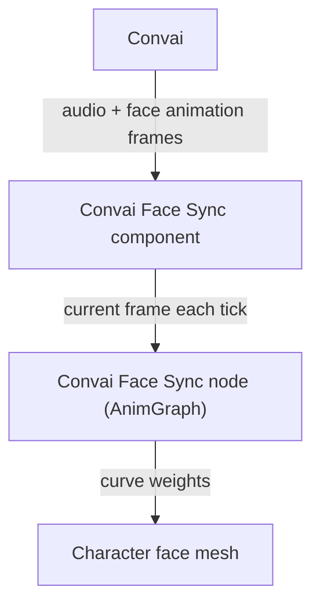

When your Convai character speaks, two things arrive together: the voice audio and a matching sequence of face animation data. The plugin plays them in lockstep so the character's mouth, jaw, and cheeks move in sync with every word. This page explains how that pipeline works, the six lip-sync modes, and how the Face Sync AnimGraph node applies the data.

## Precomputed data pipeline

Convai produces audio and a frame-indexed sequence of blendshape data at the same time. Each frame carries one float value per facial curve for a specific moment in time. The sequence arrives ahead of or alongside the audio so the face is ready to animate as soon as the character starts speaking.

The `Convai Face Sync` component buffers the incoming frames and exposes the current frame each engine tick. The `Convai Face Sync` AnimGraph node reads from that buffer through the `Convai Chatbot` component on the same Actor, then applies remapping and alpha scaling before writing the resulting curve values into the animation pose.

The reason data is precomputed rather than inferred at runtime is to avoid adding a machine learning inference step to the client. Convai already has the text-to-speech synthesis context, so it can produce accurate blendshape timing without additional latency from a local viseme model.

When the project-wide **Lip Sync Mode** is `Auto`, the plugin reads each character's `Convai Face Sync` component's `LipSyncMode` at runtime to select the matching format. Setting the project-wide mode to `Off` disables facial animation for the whole project.

## Lip-sync modes

The `EC_LipSyncMode` enum appears both in project settings and on `UConvaiFaceSyncComponent`. Concrete project-wide values such as `Off`, `VisemeBased`, `BS_MHA`, and `BS_ARKit` select the format during connection setup. When the project-wide value is `Auto`, the plugin reads the attached component's `LipSyncMode` value so each character can use the format that matches its rig.

| Mode | Display name | Target rig | Notes |
|---|---|---|---|
| `Off` | `Off` | — | Disables facial animation. No face data is requested from Convai. |
| `Auto` | `Auto` | Per-character rigs | Reads each character's **Convai Face Sync** component `LipSyncMode` at runtime to select the format. Use when different characters in the project use different rigs. |
| `VisemeBased` | `Viseme Based` | Custom rigs with OVR viseme curves | 15 phoneme curves: `sil`, `PP`, `FF`, `TH`, `DD`, `kk`, `CH`, `SS`, `nn`, `RR`, `aa`, `E`, `ih`, `oh`, `ou` |
| `BS_MHA` | `MetaHuman Blendshapes` | MetaHuman and CC5 characters | MetaHuman CTRL curve names. Default mode. |
| `BS_ARKit` | `ARKit Blendshapes` | CC4 characters | 61 ARKit blendshape curve names (52 standard Apple ARKit + 9 head/eye rotation). |
| `BS_CC4_Extended` | `CC4 Extended Blendshapes` | CC4 characters with extended blendshapes | CC4 Extended curve names. |

### Choosing a mode

The mode must match the blendshape format baked into the character's Skeletal Mesh:

- **MetaHuman Blendshapes** — use for MetaHuman characters and CC5 characters configured with MetaHuman-compatible curves.
- **ARKit Blendshapes** — use for CC4 characters exported with the standard ARKit blendshape set.
- **CC4 Extended Blendshapes** — use for CC4 characters exported with the extended blendshape option enabled in Character Creator 4.
- **Viseme Based** — use for custom rigs where you have manually created curves named after the 15 phoneme targets listed in the table above.
- **Auto** — use as the project-wide setting when different characters use different rigs. The plugin reads each character's `Convai Face Sync` component's mode at runtime.
- **Off** — use project-wide to disable facial animation entirely.


If the mode does not match the rig, the AnimGraph node receives data from Convai but finds no matching curve names to write. The face will not animate and no error is logged. Always verify that the selected mode matches the curve names present on the character's Skeletal Mesh.


## AnimGraph integration

The `FAnimNode_ConvaiFaceSync` node is placed in an Animation Blueprint's AnimGraph between a pose source and the output. It resolves the `UConvaiChatbotComponent` on the owning Actor, reads the blendshape frame supplied through that chatbot's lip-sync component, applies upper and lower face alphas, optional smoothing, and optional starvation blending, then outputs the modified pose.

The node auto-discovers the `UConvaiChatbotComponent` on the owning Actor if the `ConvaiChatbotComponent` pin is left unset. If the Actor has more than one chatbot component, connect the pin explicitly to avoid ambiguity.

For MetaHuman setup, assign the shipped Convai animation classes as described in [Set up a MetaHuman character](../../getting-started/set-up-a-metahuman-character.md). For custom Animation Blueprints, see [Face Sync AnimGraph node reference](face-sync-animgraph-node-reference.md).

### Starvation blending

When the animation buffer runs out of data — for example between speech turns or before the first frame arrives — the node fades the face back to neutral smoothly instead of freezing it at the last pose.

Between the end of one speech turn and the arrival of frames for the next, the buffer is empty. The node uses `StarvationBlendInDuration` and `StarvationBlendOutDuration` to fade the curves in and out smoothly rather than snapping the face to neutral and back. A blend-out of `0.8` seconds, for example, lets the mouth settle naturally after speech ends rather than snapping shut instantly.

### Upper and lower face split

Speech data sometimes moves brows and eyelids in ways that look unnatural on screen. The node lets you reduce upper-face movement independently while keeping full lip animation.

The node separates blendshapes into upper-face (brow, eyes, lids) and lower-face (jaw, lips, cheeks) groups using the `UpperFaceBlendshapeNames` array. A separate alpha applies to each group. This lets you reduce eye/brow movement from speech — which is usually noise — while keeping full lip amplitude.

## Related concepts


[Face Sync component reference](face-sync-component-reference.md)



[Face Sync AnimGraph node reference](face-sync-animgraph-node-reference.md)

