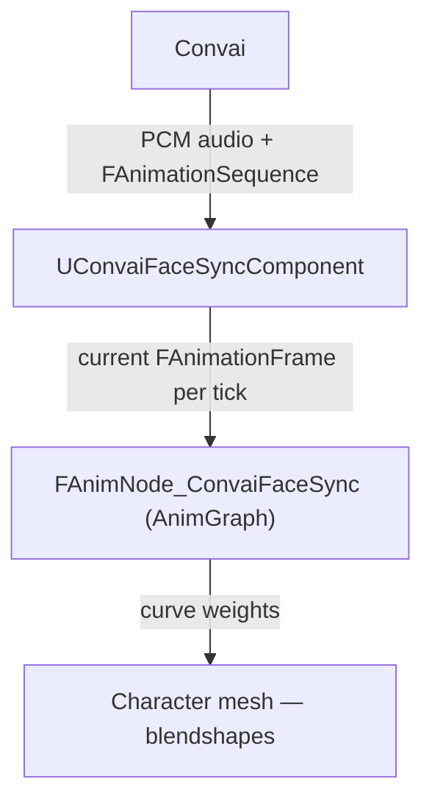

The Convai Unreal Engine plugin animates a character's face by replaying a sequence of blendshape frames that Convai precomputes before audio is streamed to the client. This page explains that pipeline, the six `EC_LipSyncMode` values, and how the AnimGraph node integrates with Unreal's animation system.

## Precomputed data pipeline

When a Convai character speaks, Convai produces two things simultaneously: a PCM audio stream and a corresponding `FAnimationSequence` — frame-indexed `FAnimationFrame` values with sequence-level duration and frame rate.

The plugin receives those frames through `UConvaiFaceSyncComponent`, which buffers them and exposes the current frame each engine tick. The `FAnimNode_ConvaiFaceSync` AnimGraph node resolves a `UConvaiChatbotComponent`; the chatbot supplies the current blendshape frame from its lip-sync component. The node then applies any remapping and alpha scaling, and writes the resulting curve values into the animation pose.

The reason data is precomputed rather than inferred at runtime is to avoid adding a machine learning inference step to the client. Convai already has the text-to-speech synthesis context, so it can produce accurate blendshape timing without additional latency from a local viseme model.

The `UConvaiFaceSyncComponent` sets `RequiresPrecomputedFaceData()` to `true`. This tells the audio streamer to request facial data from Convai rather than attempt runtime inference. If the project-wide lip-sync mode is `Auto`, the component's `LipSyncMode` selects the per-character format. A project-wide `Off` value disables facial data for the project.

## Lip-sync modes

The `EC_LipSyncMode` enum appears both in project settings and on `UConvaiFaceSyncComponent`. Concrete project-wide values such as `Off`, `VisemeBased`, `BS_MHA`, and `BS_ARKit` select the format during connection setup. When the project-wide value is `Auto`, the plugin reads the attached component's `LipSyncMode` value so each character can use the format that matches its rig. Use this `Auto` path for `BS_CC4_Extended`.

| Mode | Display name | Target rig | Curve count |
|---|---|---|---|
| `Off` | `Off` | — | No facial data requested when used as the project-wide value, or when project-wide mode is `Auto` and the component value is `Off` |
| `Auto` | `Auto` | Per-character rigs | Uses the attached `UConvaiFaceSyncComponent`'s `LipSyncMode` value at runtime to select the blendshape format |
| `VisemeBased` | `Viseme Based` | Custom rigs with OVR viseme targets | 15 OVR viseme curves |
| `BS_MHA` | `MetaHuman Blendshapes` | MetaHuman and CC5 characters | MetaHuman CTRL curves |
| `BS_ARKit` | `ARKit Blendshapes` | CC4 characters | 61 ARKit blendshape curves (52 standard Apple ARKit + 9 head/eye rotation curves) |
| `BS_CC4_Extended` | `CC4 Extended Blendshapes` | CC4 characters with extended blendshape sets | CC4 Extended curves |

### Choosing a mode

The mode must match the curve names baked into the character's Skeletal Mesh:

- Use `BS_MHA` for MetaHuman characters and for CC5 characters that have been configured to use MetaHuman-compatible curves.
- Use `BS_ARKit` for CC4 characters exported with the standard ARKit blendshape set.
- Use `BS_CC4_Extended` for CC4 characters that have the extended blendshape set enabled in Character Creator 4.
- Use `VisemeBased` for custom rigs where you have manually created curves named after the 15 OVR visemes: `sil`, `PP`, `FF`, `TH`, `DD`, `kk`, `CH`, `SS`, `nn`, `RR`, `aa`, `E`, `ih`, `oh`, `ou`.
- Use `Auto` as the project-wide setting when different characters in the same project use different rigs. In this mode, the plugin reads each attached `UConvaiFaceSyncComponent`'s `LipSyncMode` value at runtime.
- Use project-wide `Off` to disable lip sync entirely and stop facial data from being requested.


If the mode does not match the rig, the AnimGraph node receives data from Convai but finds no matching curve names to write. The face will not animate and no error is logged. Always verify that the selected mode matches the curve names present on the character's Skeletal Mesh.


## AnimGraph integration

The `FAnimNode_ConvaiFaceSync` node is placed in an Animation Blueprint's AnimGraph between a pose source and the output. It resolves the `UConvaiChatbotComponent` on the owning Actor, reads the blendshape frame supplied through that chatbot's lip-sync component, applies upper and lower face alphas, optional smoothing, and optional starvation blending, then outputs the modified pose.

The node auto-discovers the `UConvaiChatbotComponent` on the owning Actor if the `ConvaiChatbotComponent` pin is left unset. If the Actor has more than one chatbot component, connect the pin explicitly to avoid ambiguity.

For MetaHuman setup and other rig types, add the node to the character's Animation Blueprint as described in [Lip sync quick start](quick-start.md).

### Starvation blending

Between the end of one speech turn and the arrival of frames for the next, the buffer is empty. The node uses `StarvationBlendInDuration` and `StarvationBlendOutDuration` to fade the curves in and out smoothly rather than snapping the face to neutral and back. A blend-out of `0.8` seconds, for example, lets the mouth settle naturally after speech ends rather than snapping shut instantly.

### Upper and lower face split

The node separates blendshapes into upper-face (brow, eyes, lids) and lower-face (jaw, lips, cheeks) groups using the `UpperFaceBlendshapeNames` array. A separate alpha applies to each group. This lets you reduce eye/brow movement from speech — which is usually noise — while keeping full lip amplitude.

## Related concepts


[Face Sync component reference](face-sync-component-reference.md)



[Face Sync AnimGraph node reference](face-sync-anim-node-reference.md)

