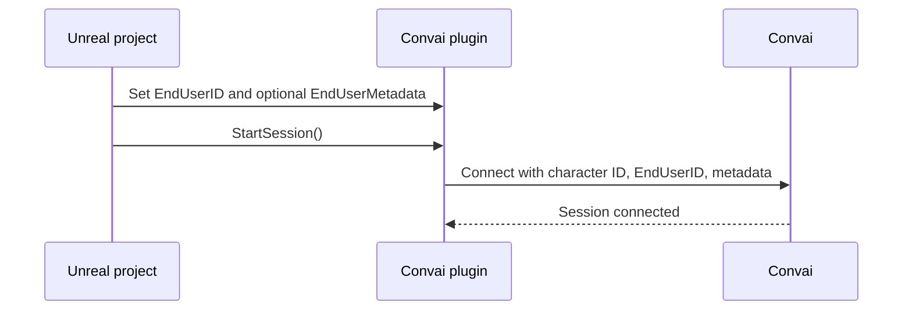

Long-term memory (LTM) gives a Convai character a persistent memory store scoped to one player and one character. In the Unreal plugin, a session can use memory only when the character has LTM enabled and the WebRTC connection sends a stable `EndUserID`.

## Character memory setting

LTM is disabled by default on new characters in the Convai dashboard. The Unreal plugin exposes two Blueprint nodes in the `Convai|LTM` category to read and update that character-level setting:

| Node | Purpose |
| --- | --- |
| **Convai Get LTM Status** | Queries whether LTM is currently enabled for a character ID. |
| **Convai Set LTM Status** | Enables or disables LTM by sending a `memorySettings.enabled` update for a character ID. |

When LTM is disabled, the character does not build persistent memory records. Enable LTM once for each character that should remember returning players. Use **Convai Get LTM Status** when you need to verify the current state from Blueprints.

## End-user identity

Every session sends an `EndUserID` string to Convai at connect time. Convai uses the `EndUserID` plus the character ID to scope which player memory should be loaded.

The plugin exposes this identity on both main conversation components:

- `UConvaiChatbotComponent.EndUserID`
- `UConvaiPlayerComponent.EndUserID`

The recommended Blueprint-first workflow is the Speaker ID system. A Speaker ID record stores a name and optional device identifier, then returns a stable `SpeakerID` value that you can save and reuse as `EndUserID`.

| Node | Purpose |
| --- | --- |
| **Convai Create Speaker ID** | Registers a new speaker and returns an `FConvaiSpeakerInfo` with the assigned `SpeakerID`. |
| **Convai List Speaker IDs** | Returns all speaker records associated with the configured API key as an array of `FConvaiSpeakerInfo`. |
| **Convai Delete Speaker ID** | Removes a speaker record by its `SpeakerID`. |

The `SpeakerID` field from `FConvaiSpeakerInfo` is the value to persist in your save data and assign before session start.

## Device fallback

If `EndUserID` is empty when connection parameters are built, the plugin calls `UConvaiUtils::GetDeviceUniqueIdentifier()`. That helper tries `FPlatformMisc::GetDeviceId()`, then `FPlatformMisc::GetOperatingSystemId()`, then `FPlatformMisc::GetLoginId()`.

This fallback is useful for a single-player project where one device maps to one user. It is not appropriate for shared devices or account-based applications where each user needs a separate memory scope.

## Session continuity

`EndUserID` controls whose long-term memory is loaded. For the WebRTC `StartSession` flow, the plugin sends `EndUserID` and optional `EndUserMetadata` at connect time. It does not send `UConvaiChatbotComponent.SessionID` in the connection parameters.

`SessionID` is still a replicated property on `UConvaiChatbotComponent`. It defaults to `"-1"` and is used by `ResetConversation()` to mark a fresh local conversation link. The HTTP Bot Query nodes also accept a `SessionID` input for REST-based conversations.

Calling `ResetConversation()` sets `SessionID` back to `"-1"`. This does not delete individual memory records from Convai. Long-term facts remain tied to the same `EndUserID`.

## Connect-time flow

The Unreal plugin reads identity and session values when a session is opened. Set them before calling `StartSession`.



The plugin does not manage your save data. Your project is responsible for storing the returned `SpeakerID` or account ID and assigning it before the next `StartSession` call.

## What persists where

| Data | Stored by | Notes |
| --- | --- | --- |
| Character LTM enabled state | Convai | Set from the dashboard or **Convai Set LTM Status**. |
| Speaker ID records | Convai | Created, listed, and deleted through `Convai|LTM` Blueprint nodes. |
| Memory records | Convai | Created from conversation content when LTM is enabled. The Unreal plugin does not expose memory-record CRUD nodes. |
| `EndUserID` | Your project | Save the returned `SpeakerID`, account ID, or other stable identifier. |
| `EndUserMetadata` | Your project | Optional JSON string sent at connect time. |
| `SessionID` | `UConvaiChatbotComponent` | Local conversation link marker. Defaults to `"-1"`. Cleared by `ResetConversation()`. Not sent by WebRTC `StartSession`. |

`EndUserMetadata` is a JSON string. Use it for supplementary context such as a display name or role:

```json
{"name": "Alex", "role": "field technician", "training_module": "fire-safety"}
```

## Common design choices

| Scenario | Recommended identity | Why |
| --- | --- | --- |
| Single-player project on one device | Device fallback or Speaker ID | Device fallback is minimal; Speaker ID gives explicit records. |
| Shared training kiosk | Speaker ID or account ID | Each trainee needs a separate memory scope. |
| Shared kiosk or training station | Account ID or Speaker ID per user | Avoids multiple users sharing the same `EndUserID`. |
| Authenticated enterprise app | Your account system's stable user ID | Keeps memory tied to the user's account across devices. |


Set identity values before `StartSession`. Changing `EndUserID` or `EndUserMetadata` after the session has opened affects the next session, not the already-open connection.


## Next steps


[Long-term memory quick start](quick-start.md)



[End-user identity](end-user-identity.md)



[Configure memory for a character](configure-memory-for-a-character.md)

