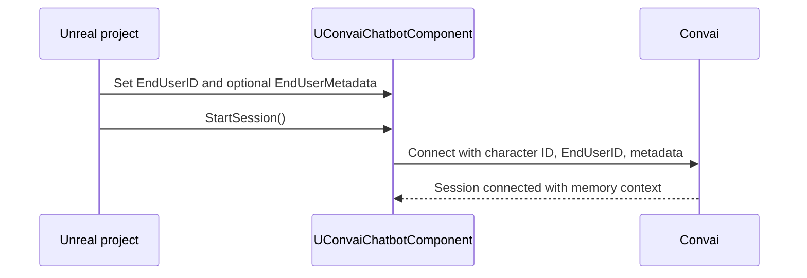

Long-term memory (LTM) gives a Convai character a persistent memory store scoped to one player and one character. A session can use memory only when the character has LTM enabled and the chatbot sends a stable `EndUserID` at connect time.

## Key terms

| Term | What it is | Who manages it |
| --- | --- | --- |
| `EndUserID` | The player identity string sent to Convai at connect time. | Your project assigns it on `UConvaiChatbotComponent` before `StartSession`. |
| `SpeakerID` | A Convai-assigned identifier returned when you create a Speaker ID record. | Convai returns it; your project saves it and reuses it as `EndUserID`. |
| `EndUserMetadata` | Optional JSON context sent alongside `EndUserID` at connect time. | Your project assigns it on the chatbot component. |
| `SessionID` | A local conversation link marker on `UConvaiChatbotComponent`. Defaults to `"-1"`. | The plugin manages it locally. It is not sent by WebRTC `StartSession`. |

For the WebRTC `StartSession` flow, the plugin reads `EndUserID` from `UConvaiChatbotComponent` through `IConvaiConnectionInterface`. Set the chatbot `EndUserID` before `StartSession`. Also set the same value on `UConvaiPlayerComponent` so both components stay in sync in your project.

## What must be true for memory to work

Two conditions must be met before a character can recall a returning player:

1. **Character LTM is enabled.** LTM is disabled by default on new characters in the Convai dashboard. Enable it on the dashboard or through **Convai Set LTM Status** in Blueprints. See [Configure memory for a character](configure-memory-for-a-character.md).
2. **A stable `EndUserID` is sent at connect time.** Convai uses `EndUserID` plus the character ID to load the correct memory scope. If the value changes between sessions, Convai treats the player as someone new. See [End-user identity](end-user-identity.md).

## Connect-time flow

Set identity on the chatbot component, then call `StartSession`. The plugin builds connection parameters and sends `EndUserID` and optional `EndUserMetadata` to Convai.



If `EndUserID` is empty when connection parameters are built, the plugin calls `UConvaiUtils::GetDeviceUniqueIdentifier()` as a fallback. That works for a single local user on one device. It is not appropriate for shared kiosks or account-based applications where each user needs a separate memory scope.

## What persists where

| Data | Stored by | Notes |
| --- | --- | --- |
| Character LTM enabled state | Convai | Set from the dashboard or **Convai Set LTM Status**. |
| Speaker ID records | Convai | Created, listed, and deleted through `Convai|LTM` Blueprint nodes. |
| Memory records | Convai | Built from conversation content when LTM is enabled. The plugin does not expose memory-record CRUD nodes. |
| `EndUserID` | Your project | Save the returned `SpeakerID`, account ID, or other stable identifier. |
| `EndUserMetadata` | Your project | Optional JSON string sent at connect time. |
| `SessionID` | `UConvaiChatbotComponent` | Local conversation link marker. Cleared by `ResetConversation()`. Not sent by WebRTC `StartSession`. |

`EndUserMetadata` is a JSON string. Use it for supplementary context such as a display name or role:

```json
{"name": "Alex", "role": "field technician", "training_module": "fire-safety"}
```

## Session continuity and reset

`EndUserID` controls whose long-term memory is loaded. `SessionID` controls the local conversation link on the chatbot component.

Calling `ResetConversation()` sets `SessionID` back to `"-1"`. This starts a fresh local conversation link. It does not delete the player's Speaker ID or individual memory records from Convai. Long-term facts remain tied to the same `EndUserID`.

## Common design choices

| Scenario | Recommended identity | Why |
| --- | --- | --- |
| Single-player project on one device | Device fallback or Speaker ID | Device fallback needs no save data; Speaker ID gives explicit records. |
| Shared kiosk or training station | Speaker ID or account ID per user | Avoids multiple users sharing the same `EndUserID`. |
| Authenticated enterprise app | Your account system's stable user ID | Keeps memory tied to the user's account across devices. |


Set `EndUserID` on the chatbot component before `StartSession`. Changing identity after the session has opened affects the next session, not the already-open connection.


## Next steps


[Long-term memory quick start](long-term-memory-quick-start.md)



[End-user identity](end-user-identity.md)



[Configure memory for a character](configure-memory-for-a-character.md)



[Speaker ID management](speaker-id-management.md)



[LTM Blueprint reference](ltm-blueprint-reference.md)

