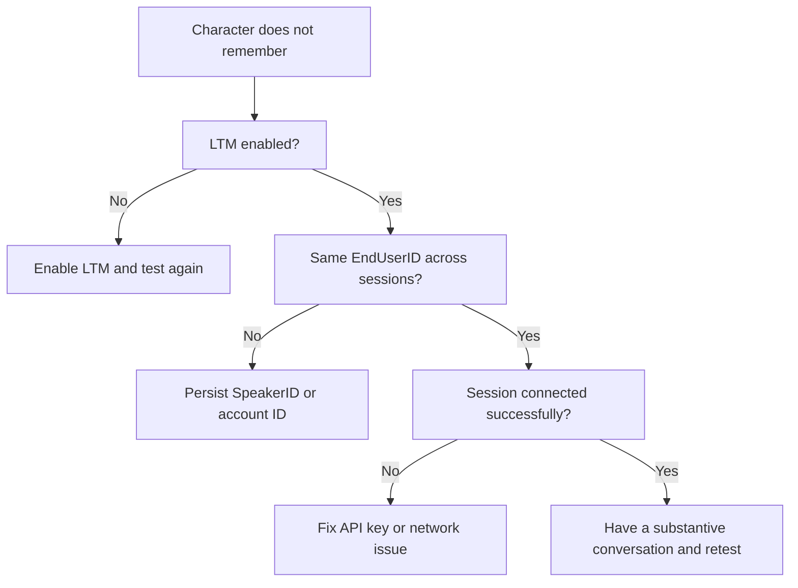

Use this page when a Convai character does not remember a returning player, remembers the wrong player, or an LTM Blueprint node fires **On Failure**. Start with the first-line checks, then use the symptom entries that match what you see.

## First-line checks

1. Confirm LTM is enabled for the character. In the Convai dashboard, memory is disabled by default for new characters. In Unreal, call **Convai Get LTM Status** and confirm **Status** is `true`.
2. Confirm `UConvaiChatbotComponent.EndUserID` is set to a non-empty, stable value before each `StartSession`.
3. Confirm the chatbot and player components use the same `EndUserID` before `StartSession`.
4. Confirm the API key is configured and other Convai session requests are succeeding.

## Decision flow



## Character never remembers previous sessions

**Symptom:** The character starts fresh every time, even after the player shared facts in an earlier session.

**Cause:** LTM is disabled for the character or `EndUserID` on the chatbot component changes between sessions.

**Fix:**

1. Call **Convai Get LTM Status** for the character ID.
2. If **Status** is `false`, call **Convai Set LTM Status** with **B Enable** set to `true`.
3. Print `UConvaiChatbotComponent.EndUserID` immediately before `StartSession`.

**Verify:** Run two Play In Editor sessions with the same `EndUserID` on the chatbot component before each `StartSession`.

## Character remembers the wrong player

**Symptom:** The character refers to facts from another player.

**Cause:** Multiple players are sharing the same `EndUserID`. This often happens when device fallback is used on a shared machine.

**Fix:** Create or assign a unique identity per player. For Blueprint-managed identity, call **Convai Create Speaker ID** once per player profile and save the returned `SpeakerID`. See [End-user identity](end-user-identity.md).

**Verify:** Print the active `EndUserID` for each profile before `StartSession`. Each player should have a distinct value.

## Convai Create Speaker ID fails

**Symptom:** **Convai Create Speaker ID** fires **On Failure**.

**Cause:** The **Speaker Name** input is empty, or the HTTP request fails.

**Fix:** Set **Speaker Name** to a non-empty string. If the value is empty, the plugin logs `Speaker name is empty` and fires **On Failure**.

If the name is valid, check the Output Log for the shared HTTP failure message from the base API proxy:

```text
HTTP request failed with code %d, and with response:%s
```

**Verify:** After fixing the input or connection issue, call **Convai List Speaker IDs** and confirm the new `SpeakerID` appears in the returned array.

## Speaker ID list is empty

**Symptom:** **Convai List Speaker IDs** succeeds but returns no records.

**Cause:** No Speaker ID records exist for the configured API key, or test records were deleted.

**Fix:** Create a new Speaker ID with **Convai Create Speaker ID**, then call **Convai List Speaker IDs** again.

**Verify:** The **On Success** array contains an `FConvaiSpeakerInfo` with a non-empty `SpeakerID`.

## Delete Speaker ID does not clear local state

**Symptom:** A deleted identity is still assigned on the next launch.

**Cause:** The project deleted the Speaker ID from Convai but did not clear the locally saved `SpeakerID`.

**Fix:** After **Convai Delete Speaker ID** succeeds, clear the locally saved `SpeakerID`.

**Verify:** Relaunch the project and confirm no deleted `SpeakerID` is loaded from save data.

## Source-verified log messages

The current source contains these LTM-specific log messages:

| Log message | Where it appears | Meaning |
| --- | --- | --- |
| `Speaker name is empty` | **Convai Create Speaker ID** | **Speaker Name** was empty. |
| `Parse Json failed` | **Convai Create Speaker ID** | The create response could not be parsed. |
| `Parse speaker id failed` | **Convai List Speaker IDs** | The list response could not be parsed. |
| `GetLTMStatus failed` | **Convai Get LTM Status** | The character details response did not contain the expected LTM status data. |
| `End User ID not provided, using Device ID: %s` | Connect parameter build | Chatbot `EndUserID` was empty; device fallback was used. |
| `Using End User ID: %s` | Connect parameter build | The chatbot `EndUserID` was sent at connect time. |
| `HTTP request failed with code %d, and with response:%s` | Shared API proxy | The HTTP request returned a non-2xx response. |

## What Unreal LTM does not expose

The Unreal plugin exposes Speaker ID management and the character LTM enabled state. It does not expose Blueprint nodes to list, add, retrieve, or delete individual memory records.

For a fresh local conversation link, use `ResetConversation()`. For identity deletion, use **Convai Delete Speaker ID** with a confirmation step.

## Next steps


[Configure memory for a character](configure-memory-for-a-character.md)



[End-user identity](end-user-identity.md)



[Long-term memory quick start](long-term-memory-quick-start.md)



[Speaker ID management](speaker-id-management.md)



[LTM Blueprint reference](ltm-blueprint-reference.md)

