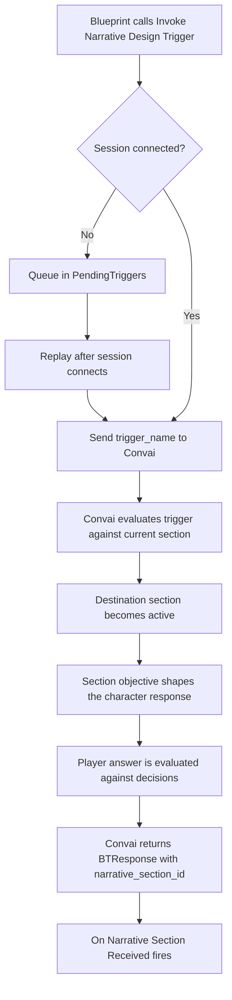

Narrative design gives a Convai character a structured story graph — named sections and the triggers that move between them — authored in the Convai dashboard and executed at runtime through `UConvaiChatbotComponent`. This page explains the mental model and the runtime pipeline. For hands-on setup, start with [Narrative design quick start](narrative-design-quick-start.md).

## The story graph model

A narrative design graph has three building blocks you work with from Unreal Engine.

| Concept | What it is | Where you configure it |
|---|---|---|
| Section | A named story beat with an `objective` that shapes character behavior. Each section has a `section_id`. | Convai dashboard |
| Trigger | A named edge that activates a destination section. The `trigger_name` in your Blueprint must match the dashboard exactly. | Convai dashboard |
| Template key | A runtime key-value pair in `NarrativeTemplateKeys` on the chatbot component. The plugin sends the map to Convai through `update-template-keys`. Dashboard objectives can reference `{key}` placeholders. | Blueprint or **Details** panel |

The character stays on the current section until **Invoke Narrative Design Trigger** activates another section. After that section becomes active, the player's answers and the section's decisions guide the next transition through the graph. See `FNarrativeDecision` in [Narrative design Blueprint reference](narrative-design-blueprint-reference.md) for the decision struct fields.

Author sections, triggers, and entry behavior in the Convai dashboard. See [Narrative Design | Playground](../../../../convai-playground/character-customization/narrative-design.md) for graph authoring guidance.

## Runtime pipeline for named triggers

The standard path from a named trigger call to a section change:

1. Blueprint calls **Invoke Narrative Design Trigger** with a `TriggerName` string.
2. If the session is connected, the component sends a `trigger-message` packet with `trigger_name` to Convai. If disconnected, the call queues in `PendingTriggers` and replays after connect.
3. Convai evaluates the trigger against the current section's outbound triggers. On a match, Convai activates the destination section.
4. The active section's `objective` shapes the character's next behavior.
5. The player's answers are evaluated against the section's `decisions` when the conversation continues.
6. Convai returns a `BTResponse` packet with `narrative_section_id` when a section update is delivered.
7. **On Narrative Section Received** fires on the chatbot component with `NarrativeSectionID`.

**On Narrative Section Received** fires only when Convai confirms a section change through `BTResponse`. It does not fire when the trigger function is called. For step-by-step trigger invocation, see [Narrative triggers](narrative-triggers.md).

## Two Blueprint functions

`UConvaiChatbotComponent` exposes two related functions that use different runtime paths.

| Function | Sends to Convai | Use when |
|---|---|---|
| **Invoke Narrative Design Trigger** | `trigger-message` with `trigger_name` | The transition target is known at design time and the trigger name is fixed in the dashboard. |
| **Invoke Speech** | Dynamic context event via `AddContextEvent` | The message is assembled at runtime and you want Convai to process it as conversational context, not match a dashboard trigger name. |

Named triggers queue in `PendingTriggers` while disconnected. **Invoke Speech** does not use that queue. Both paths can produce a section change if Convai returns a `BTResponse` with a `narrative_section_id`.

See [Narrative triggers](narrative-triggers.md) for input parameters, pending-queue behavior, and when to choose each function.

## Template keys

`NarrativeTemplateKeys` is a `TMap<FString, FString>` on `UConvaiChatbotComponent` under **Convai|NarrativeDesign**. Assign entries whose keys match `{key}` placeholders in dashboard objectives.

For example, if the dashboard objective reads `Guide {PlayerName} through the safety inspection`, add `PlayerName = "Rivera"` to `NarrativeTemplateKeys` before the trigger that advances to that section.

The plugin sends template keys when the session connects and whenever you assign `NarrativeTemplateKeys` while connected. Set keys before invoking a trigger that advances to a section whose objective references them. See [Template keys](template-keys.md) for setup and verification.

## Validate trigger names in the dashboard

Before hardcoding trigger names in Blueprint, open the character's narrative graph in the Convai dashboard and copy each `trigger_name` exactly as authored. Confirm the trigger is an outbound edge from the section the character starts on. See [Narrative Design | Playground](../../../../convai-playground/character-customization/narrative-design.md).

## Query narrative data at runtime

The full list of sections and triggers for a character is queryable through **Convai Fetch Narrative Sections** and **Convai Fetch Narrative Triggers** under **Convai|REST API**. Use these nodes to validate trigger names or populate in-game UI — not as the primary story progression path. See [Fetching narrative data](fetching-narrative-data.md).

## Next steps


[Narrative design quick start](narrative-design-quick-start.md)



[Narrative triggers](narrative-triggers.md)



[Narrative design Blueprint reference](narrative-design-blueprint-reference.md)

