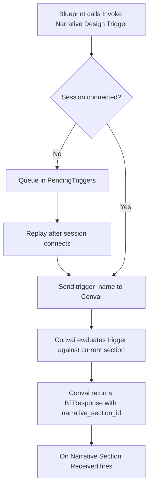

Narrative design gives a Convai character a structured story graph — a set of named sections and the triggers that move between them — authored in the Convai dashboard and executed at runtime through `UConvaiChatbotComponent`. Understanding the pipeline helps you design story graphs that respond predictably to gameplay events.

## The story graph model

A narrative design graph consists of three building blocks.

| Concept | What it is | Where it lives |
|---|---|---|
| Section | A named story beat. Each section carries an `objective` that shapes the character's behavior, a `section_id`, and optional `behavior_tree_code` and `bt_constants` for advanced automation. | Convai dashboard |
| Trigger | A named edge between sections. When a trigger fires, Convai advances the active section. Each trigger has a `trigger_name` that your Blueprint must match exactly. | Convai dashboard |
| Template key | A runtime key-value pair stored in `NarrativeTemplateKeys` on the chatbot component. Convai substitutes `{key}` placeholders in section objectives with the current value. | Set in Blueprint or Details panel |

The character remains on the current section until a named trigger advances the graph. You author sections, triggers, and entry behavior in the Convai dashboard.

The full list of sections and triggers for a character is also queryable at runtime via **Convai Fetch Narrative Sections** and **Convai Fetch Narrative Triggers** under **Convai|REST API** — useful for validating trigger names or populating in-game UI. See [Fetching narrative data](fetching-narrative-data.md).

## Runtime pipeline for named triggers

The standard path from a named trigger call to a section change is:

1. Blueprint calls **Invoke Narrative Design Trigger** with a `TriggerName` string.
2. If the chatbot session is connected, the component sends a `trigger-message` packet with `trigger_name` to Convai. If the session is not connected, the call is queued in `PendingTriggers` and replayed after the session connects.
3. Convai evaluates the trigger against the current section's outbound triggers. If a match is found, Convai advances the story graph to the destination section.
4. Convai returns a `BTResponse` packet containing `narrative_section_id`, plus optional `bt_code` and `bt_constants`.
5. **On Narrative Section Received** fires on the chatbot component, delivering `NarrativeSectionID` and the `ChatbotComponent` reference to bound Blueprint nodes.

**On Narrative Section Received** fires only when Convai confirms a section change through `BTResponse`. It does not fire when the trigger function is called.

## Two Blueprint functions

The plugin exposes two related functions on `UConvaiChatbotComponent`. They use different runtime paths.

### Invoke Narrative Design Trigger

`InvokeNarrativeDesignTrigger` sends a named trigger through `SendTriggerMessage`. The `TriggerName` must match a trigger configured in the Convai dashboard for the current section. This is the standard approach for designed story beats where the transition target is known at authoring time.

While disconnected, named triggers queue in `PendingTriggers` and replay in order after the session connects. They are not discarded on a closed session.

### Invoke Speech

`ExecuteNarrativeTrigger` (Blueprint display name **Invoke Speech**) stages a dynamic context event through `AddContextEvent` with `EC_RunLLMOption::Always`. It does not send a `trigger-message` packet and does not use the `PendingTriggers` queue. Use it when you want Convai to process a freeform runtime message — for example assembled player speech or game-state text — rather than match a dashboard trigger name.

A section change from **Invoke Speech** still arrives through the same `BTResponse` path if Convai determines one is appropriate. **On Narrative Section Received** fires when Convai returns a `BTResponse` packet with a `narrative_section_id`.

## Blueprint parameters

Both functions expose `InGenerateActions` and `InReplicateOnNetwork` in their Blueprint signatures. In the current plugin source, these parameters are accepted but not applied to runtime behavior. See [Narrative design Blueprint reference](narrative-design-blueprint-reference.md) for the verified parameter list.

## Template keys

`NarrativeTemplateKeys` is a `TMap<FString, FString>` on `UConvaiChatbotComponent` under **Convai|NarrativeDesign**. When Convai evaluates the active section's objective, it substitutes `{key}` tokens in the objective text with the corresponding values from this map.

For example, if the dashboard objective reads `Guide {PlayerName} through the safety inspection`, and `NarrativeTemplateKeys` contains `PlayerName = "Rivera"`, Convai receives `Guide Rivera through the safety inspection`.

The plugin sends template keys to Convai when the session connects (`OnAttendeeConnected`) and whenever you assign the `NarrativeTemplateKeys` property while connected (through `UpdateNarrativeTemplateKeys`). Set keys before invoking a trigger that advances to a section whose objective references them.

## Next steps


[Quick start](quick-start.md)



[Narrative triggers](narrative-triggers.md)



[Narrative design Blueprint reference](narrative-design-blueprint-reference.md)

