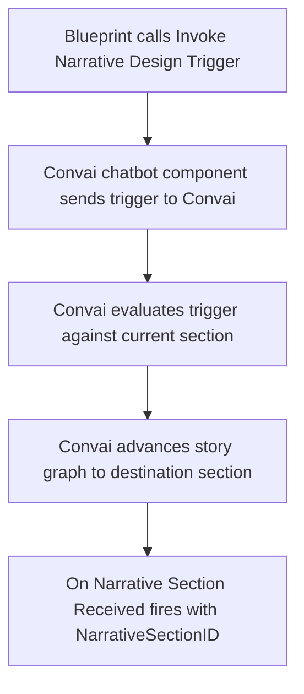

Narrative design gives a Convai character a structured story graph — a set of named sections and the triggers that move between them — authored in the Convai dashboard and executed at runtime through `UConvaiChatbotComponent`. Understanding the pipeline helps you design story graphs that respond predictably to gameplay events.

## The story graph model

A narrative design graph consists of three building blocks.

| Concept | What it is | Where it lives |
|---|---|---|
| Section | A named story beat. Each section carries an `objective` that shapes the character's behavior, a `section_id`, and an optional `behavior_tree_code` for advanced automation. | Convai dashboard |
| Trigger | A named edge between sections. When a trigger fires, Convai advances the active section. Each trigger has a `trigger_name` that your Blueprint must match exactly. | Convai dashboard |
| Template key | A runtime key-value pair stored in `NarrativeTemplateKeys` on the chatbot component. Convai substitutes `{key}` placeholders in section objectives with the current value. | Set in Blueprint or Details panel |

The graph starts at the section designated as the entry point in the Convai dashboard. The character remains on the current section until a trigger advances the graph.

The full list of sections and triggers for a character is also queryable at runtime via the `Convai Fetch Narrative Sections` and `Convai Fetch Narrative Triggers` Blueprint nodes — useful for validating trigger names or populating in-game UI. See [Fetching narrative data](fetching-narrative-data.md).

## Runtime pipeline

The sequence from Blueprint call to section change is:

1. Blueprint calls `Invoke Narrative Design Trigger` with a `TriggerName` string, or calls `Invoke Speech` with a raw message string.
2. The chatbot component sends the trigger or message to Convai over the active session.
3. Convai evaluates the trigger against the current section's outbound triggers. If a matching trigger is found, Convai advances the story graph to the destination section.
4. Convai returns the new section ID, along with the section's behavior data.
5. The `On Narrative Section Received` event fires on the chatbot component, delivering the `NarrativeSectionID` string and the `ChatbotComponent` reference to bound Blueprint nodes.

The `On Narrative Section Received` event fires only when Convai confirms a section change. It does not fire when the trigger is sent — it fires when Convai responds with the new section ID.

If a trigger is called before the session is open, the plugin holds it in a per-component pending queue and replays it automatically when the session connects. Triggers are not discarded on a closed session — they are deferred.

## Two ways to invoke a transition

The plugin exposes two functions for advancing the graph.

### `Invoke Narrative Design Trigger`

`InvokeNarrativeDesignTrigger` sends a named trigger. The name must match a trigger configured in the Convai dashboard for the current section. This is the standard approach for designed story beats where the transition target is known at authoring time.

### `Invoke Speech`

`ExecuteNarrativeTrigger` sends a raw message string directly. Convai processes the message without attempting to match it to a named trigger. Use this for dynamic or programmatic transitions where the message content is assembled at runtime and does not correspond to a dashboard-configured trigger name.

## Shared parameters

Both functions share two parameters that control downstream behavior.

| Parameter | Type | Effect |
|---|---|---|
| `InGenerateActions` | `bool` | When `true`, Convai returns character actions along with the response. Set to `false` for purely conversational transitions. |
| `InReplicateOnNetwork` | `bool` | When `true`, the trigger call is replicated to clients in a multiplayer session. Set to `false` for single-player or server-authoritative scenarios. |

## Template keys

The `NarrativeTemplateKeys` property is a `TMap<FString, FString>` on `UConvaiChatbotComponent`. Before Convai processes the active section's objective, it substitutes `{key}` tokens in the objective text with the corresponding values from this map.

For example, if the dashboard's objective reads `"Guide {PlayerName} through the safety inspection"`, and `NarrativeTemplateKeys` contains `PlayerName = "Rivera"`, Convai receives `"Guide Rivera through the safety inspection"`.

Keys are applied at the time Convai reads the active section's objective. You can update the map at any point — before the session starts or during an active session — and the next objective evaluation uses the current values.

## Next steps


[Quick start](quick-start.md)



[Narrative triggers](narrative-triggers.md)



[Narrative design Blueprint reference](narrative-design-blueprint-reference.md)

