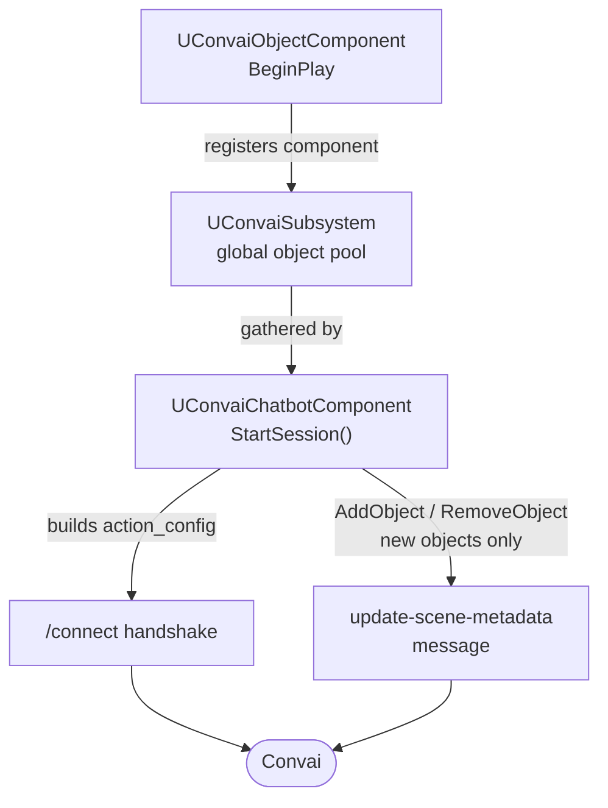

Scene metadata is the information that Convai receives about the physical world around a character. The Convai Unreal Engine plugin assembles this information from components you place on individual `Actor`s, then sends object entries through the connect-time `action_config` snapshot and runtime environment updates. Tracked property values use dynamic context state updates so live object state can change during gameplay.

## Registration and delivery flow

Every `UConvaiObjectComponent` registers itself with the `UConvaiSubsystem` global pool at `BeginPlay` and binds its `ObjectEntry.Ref` to the owning `Actor`. When a chatbot calls `StartSession()`, `UConvaiChatbotComponent` gathers registered object components from the subsystem, builds the `action_config` payload, and sends it to Convai as part of the `/connect` handshake. Objects added after the session is live can travel through a separate `update-scene-metadata` message instead.

Objects that were present at `/connect` live in the frozen `action_config` snapshot and cannot be updated mid-session without restarting the session. New object entries added after session start are sent through `update-scene-metadata` on the next debounce flush, unless the mutation call uses `bFlushImmediately = true`.


Scene metadata tells Convai what objects exist in the scene. Tracked properties tell Convai what is happening to those objects in real time. Both reach Convai through different channels but complement each other.


## Context mechanisms at a glance

The plugin gives Convai characters three channels of world context, each with a different purpose:

|  | Scene metadata | Tracked properties | `SetObjectInAttention` |
|---|---|---|---|
| **What it describes** | Static `Actor`s and props in the scene | Live state of an `Actor` `UPROPERTY` or function | The specific object the character is focused on right now |
| **When it's sent** | Once, at `/connect` (frozen snapshot) or through runtime environment updates for new entries | At session start, then on detected value changes | On an explicit call or gaze pipeline trigger |
| **Typical use** | `"A locked door at the main entrance"` | `"The door is now unlocked"` | `"The character notices the fire extinguisher"` |

Use all three together for the most context-rich experience.

## The Convai object component

`UConvaiObjectComponent` is an `ActorComponent` you attach to any `Actor` you want Convai characters to know about. One component on the `Actor` is enough; every chatbot in the level sees it automatically without per-chatbot configuration.

At `BeginPlay` the component joins the `UConvaiSubsystem` pool. Every chatbot that starts a session after that point can include the `Actor` in its environment.

## Object identity

Each `UConvaiObjectComponent` carries an `ObjectEntry` (`FConvaiObjectEntry`) that describes the `Actor` to Convai:

- `Name` — the label chatbots use when referring to this object. It must be unique per level. If two components share a name, `UConvaiSubsystem` renames the duplicate automatically and writes a warning to the Output Log.
- `Description` — a plain-language sentence or paragraph Convai receives at session start.

Convai receives the object's name in the `name` field of its `action_config.objects` entry. Keeping names short and descriptive (for example `"FrontDoor"` rather than `"BP_Door_01"`) makes references easier to resolve.

## Tracked properties

Beyond static identity, you can attach live-state watchers to supported `UPROPERTY` values or supported pure, parameterless functions using `TrackedProperties` (`TArray<FConvaiTrackedProperty>`).

Each `FConvaiTrackedProperty` holds:

- `PropertyPath` — a dotted path to the `UPROPERTY` or function, resolved at runtime against the owning `Actor` (for example `"bIsLocked"`, `"Stats.HP"`, `"GetCurrentRoomName"`).
- `Description` — what the value means in plain language.
- `StateValueDescriptions` — optional per-value annotations, most useful for enums and bools.
- `ShouldRespond` (`EC_RunLLMOption`) — what happens when the value changes at runtime.

At session start the current value of every tracked property is seeded into the chatbot's context with `EC_RunLLMOption::Never`, so the character is informed without speaking. On each detected change, the plugin sends a dynamic context state update with the configured `ShouldRespond`: `Auto` lets Convai decide whether to react, `Always` requests a response, and `Never` updates silently.

The key the chatbot sees for a tracked property is `"<ObjectName>.<PropertyPath>"` — for example `"FrontDoor.bIsLocked"`.

## Proximity state

When `bAutoGenerateProximityState` is `true` (the default), the plugin computes a synthetic state key `"<ObjectName>.ProximityToYou"` for each chatbot by querying the Unreal Engine navigation system. Partial paths are accepted, so the proximity description is meaningful even when the chatbot cannot reach the object along a complete nav route.

The value combines reachability and relative direction in phrases such as `"close by, in front"`, `"some distance away, to the left"`, or `"no walking path, behind"`. The evaluation is deferred while either the object or the chatbot is actively moving (a stability gate) and is forced through after several consecutive deferred ticks. Because proximity is spatial context rather than conversational content, `ShouldRespond` for proximity is always `EC_RunLLMOption::Never`; Convai is informed silently.

`bDebugDrawProximityPaths` draws the navigation paths from each chatbot to this object in the editor viewport while `bAutoGenerateProximityState` is on. Disable this flag before shipping.

## Connect-time vs live updates

The `/connect` handshake delivers a frozen snapshot of `action_config.objects`. The `bEnableActions` bool on `EnvironmentData` controls the connect-time action configuration: when it is `false`, the `action_config` block is not sent at `/connect`, and attention resolution through `SetObjectInAttention` has no effect.

Once a session is live, object and character mutation methods on `UConvaiChatbotComponent` update the local environment mirror and schedule a sync. New scene entries and removals are sent through `update-scene-metadata`; existing entries that were already present in the connect-time snapshot keep their original `action_config` data until reconnect.

One important constraint applies: if an object was already included in `action_config` at `/connect`, its description in the frozen snapshot cannot be changed mid-session. Only objects that are new to the session travel through the live `update-scene-metadata` lane. To propagate a description change to an existing object, call `StopSession` then `StartSession` to reconnect with the updated description.

## Debounce and flush

Mutation methods batch their updates into a debounce window by default, so rapid calls are coalesced into a single network message. Passing `bFlushImmediately = true` skips the debounce window and sends immediately. Use `bFlushImmediately` sparingly — high-frequency calls produce many small WebRTC messages and increase network overhead.

## Next steps


[Scene metadata quick start](quick-start.md)



[Scene metadata component reference](component-reference.md)



[Managing the environment at runtime](managing-the-environment-at-runtime.md)

