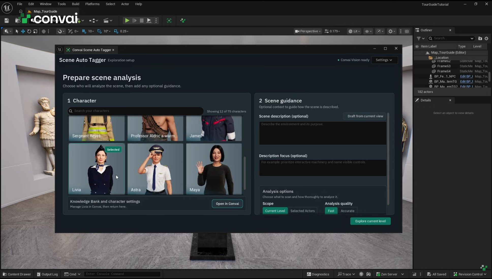
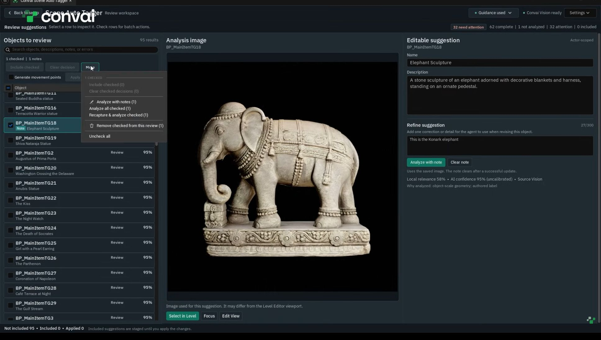
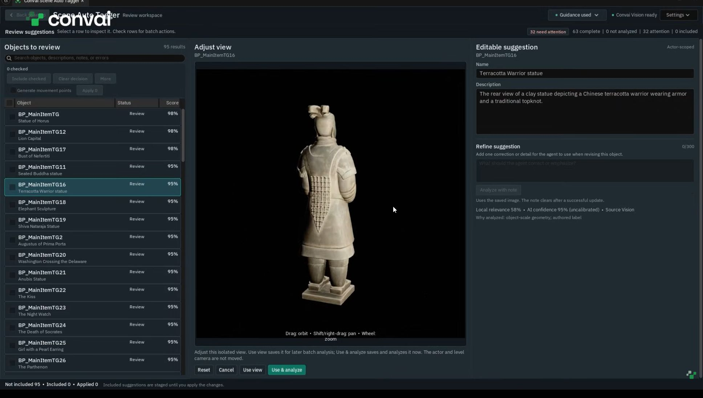
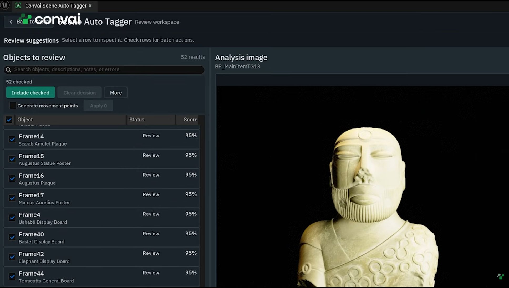
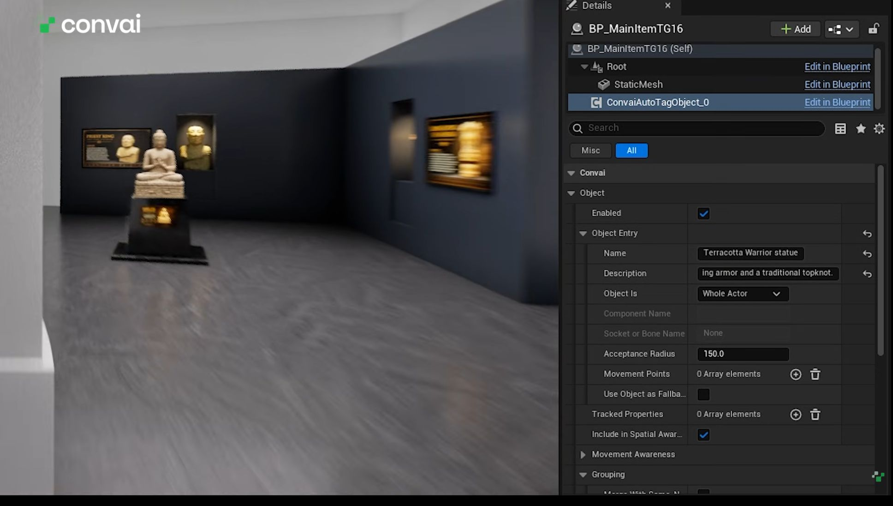

# Scene Auto Tagger

Scene Auto Tagger creates names and descriptions for objects in your Unreal Engine level. You review the suggestions before applying them as scene metadata—the information Convai characters use to recognize objects around them. Start with a few exhibits in a museum, props in a shop, or objects in your own scene.

Watch the museum walkthrough to see the setup, review, and apply workflow:


Scene Auto Tagger walkthrough


## Prerequisites

* [ ] An Unreal Engine project open in the Unreal Editor on Windows, with the [Convai Unreal Engine plugin installed](../../getting-started/install-the-convai-plugin.md).
* [ ] Signed in through the **Convai** window in Unreal Engine, with a character in your Convai account.
* [ ] An open level containing the objects you want to tag.

## Explore your objects



### Open Scene Auto Tagger

Select **Scene Auto Tagger** in the Unreal Editor toolbar, or open **Tools** and select **Scene Auto Tagger** in the **Convai** section.

On first use, read **Allow AI scene analysis?** and select **Accept** to continue. The tool sends captured images and your optional guidance to Convai for analysis.



### Choose a character and add guidance

Use **Search your characters** to find and select a character. Scene Auto Tagger uses that character's AI configuration and Knowledge Bank to help identify objects and write their descriptions. Choose a character with knowledge relevant to your scene—for example, your museum guide for a gallery of exhibits. The resulting tags are saved on scene objects and can be used by Convai characters in your level.

To add reference material, select **Open in Convai**, update the character's **Knowledge Bank**, then return to Unreal Engine. Exhibit notes or reference documents can give the analysis more context.

<figure><figcaption>
Select the character whose AI configuration and knowledge will guide the analysis.
</figcaption></figure>

Under **Scene description (optional)**, describe the setting, such as `A museum gallery with statues and paintings.` Or frame the environment in the level viewport and select **Draft from current view**. Review the generated text before continuing.

Use **Description focus (optional)** to guide the descriptions. For example, enter `Focus on each exhibit's material, shape, and visible details.`



### Choose what to scan

Expand **Analysis options** and choose a **Scope**:

* **Selected Actors** scans eligible objects you select in the Level Editor. This is a useful starting point for a small group of objects.
* **Current Level** discovers significant objects across the current level.

Choose **Accurate** for higher-detail analysis of artwork, text, or specific subjects. This takes longer.

Clear **Re-analyze existing tagged objects** if you want to skip objects that already have a Convai Object Component.

<figure><figcaption>
Choose the objects to scan and the analysis quality before exploring.
</figcaption></figure>



### Start the analysis

Select **Explore selected actors** or **Explore current level**, depending on your scope. Wait for analysis to finish. The review list fills with object suggestions.

Your level remains unchanged until you apply the suggestions.



## Review and refine suggestions

Select a row to inspect the object's captured image, **Name**, and **Description**. Edit the text directly to match your scene. Use a short, natural name, such as `Bronze horse`, and a description that helps your character talk about the object.

<figure><figcaption>
Select an object to inspect the image used for its suggestion.
</figcaption></figure>

### Correct a detail

Select the object, then enter a correction under **Refine suggestion**. For example, if the tool identifies an exhibit as an elephant but misses its name, enter `This is the Konark Elephant.` Select **Analyze with note** to generate a revised name and description using that correction and the saved image. Review the result before including it.

<figure><figcaption>
Add the missing detail, then select Analyze with note.
</figcaption></figure>

### Change the capture angle

If the image misses the front or an important detail, select **Edit View** below the image. Drag to orbit, use Shift-drag or right-drag to pan, and use the mouse wheel to zoom. These controls move the capture camera without moving the object in your level.

Select **Use & analyze** to generate a new suggestion from the adjusted view, then review the updated name and description.

<figure><figcaption>
Frame the details you want the tool to see, then use the new view for analysis.
</figcaption></figure>

### Leave an object out

Leave unwanted suggestions out of your included set. To tidy the list, check their rows and select **More > Remove checked from this review**. This removes the review entries without deleting the objects in your level.

## Apply and verify your tags



### Include the objects you want

Check the boxes beside the suggestions you want to keep, then select **Include checked**. Selecting a row to inspect it does not include it for application.

<figure><figcaption>
Include the suggestions you want, then apply them to your level.
</figcaption></figure>



### Apply the included suggestions

Select **Apply**, followed by the number of included suggestions ready to apply. The tool adds or updates a **Convai Object Component** on those level objects.



### Verify an object and save

Select a tagged object in the Level Editor. In **Details**, select the Convai Object Component added by Scene Auto Tagger. It may appear as ConvaiAutoTagObject\_0 in the component list. Under Object Entry, confirm that Name and Description match the suggestion you applied.

<figure><figcaption>
Confirm the generated name and description on the object in your level.
</figcaption></figure>

Save your level to keep the changes. Applying tags and saving are separate actions.



## Troubleshoot a tagging run

### An object needs attention

**Symptom:** An object appears under **Needs attention** without a reliable suggestion.

**Cause:** Analysis did not produce a reliable result from the captured image.

**Fix:** Select the object and inspect its image. Use **Edit View** and **Use & analyze** to try another view. Leave the object unincluded if you do not want to tag it.

**Verify:** Inspect the new name and description before including the object.

### Apply is unavailable

**Symptom:** The **Apply** button is disabled.

**Cause:** Analysis or view editing is still active, or no completed suggestions are included.

**Fix:** Wait for analysis to finish, and finish or cancel **Edit View** if it is open. Check at least one completed suggestion and select **Include checked**.

**Verify:** The **Apply** button shows a count of suggestions ready to apply.

If tags are applied but your character does not recognize the objects, see [Troubleshoot scene metadata](troubleshoot-scene-metadata.md).

## Next steps

Test your tagged objects in a conversation, or add more scene information:


[scene-metadata-quick-start.md](scene-metadata-quick-start.md)



[scene-metadata-component-reference.md](scene-metadata-component-reference.md)

