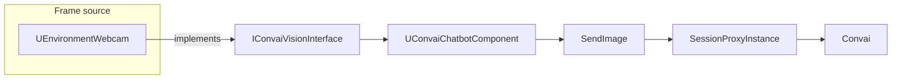

Vision works by placing a frame source component on the same Actor as the Convai Chatbot component. During the session, the chatbot reads raw frames from that source at the configured capture rate and sends them to Convai with the conversation stream.

## Runtime architecture

The Unreal vision path has three user-facing parts: a frame source, the `IConvaiVisionInterface` contract, and the Chatbot component that sends frames.

**Frame source** — `UEnvironmentWebcam` is the built-in frame source in the `ConvaiVisionBase` module. It owns a `USceneCaptureComponent2D`, renders into a `UTextureRenderTarget2D`, and exposes the render target through `IConvaiVisionInterface`.

**Interface contract** — `IConvaiVisionInterface` is declared in `VisionInterface.h`. It defines the capture state, raw-frame access, texture access, FPS settings, and diagnostic methods used by the chatbot.

**Chatbot sender** — `UConvaiChatbotComponent` inherits the vision functions from `UConvaiAudioStreamer`. At runtime it discovers the first component on the owning Actor that implements `IConvaiVisionInterface`, or uses the component passed to **Set Vision Component**. Its `SendImage` tick path calls `CaptureRaw`, then forwards the raw width, height, and byte array through the active session.

## Key concepts

| Concept | Definition |
|---|---|
| **Frame Source** | A component implementing `IConvaiVisionInterface` that captures image data from the scene and exposes it to the chatbot. |
| **Vision Interface** | `IConvaiVisionInterface`, the contract any frame source must satisfy before the chatbot can register it. |
| **Vision State** | The current lifecycle phase of a frame source, tracked as `EVisionState` (`Stopped`, `Starting`, `Capturing`, `Stopping`, `Paused`). |
| **Frame throttling** | Accumulator-based rate limiting in `UConvaiChatbotComponent` that uses the vision component's `GetMaxFPS()` value. |
| **Render target** | The `UTextureRenderTarget2D` assigned to `ConvaiRenderTarget`. The built-in creation path uses `RTF_RGBA8` and `512 x 512`. |
| **Video connection** | The connection type used when vision is supported. The session setup selects `video` when the chatbot reports vision support or `AlwaysAllowVision` is enabled. |

## Component discovery

`UConvaiAudioStreamer::FindFirstVisionComponent()` searches the owning Actor for components that implement `UConvaiVisionInterface`. If it finds at least one, it passes the first component to `SetVisionComponent`.

`SetVisionComponent(UActorComponent* VisionComponent)` returns `true` only when the supplied component implements `UConvaiVisionInterface`. Passing a plain `USceneCaptureComponent2D` returns `false` because it is a capture component, not a Convai vision source.

`SupportsVision()` returns `true` when a valid vision interface component is registered. If no component is registered yet, it tries discovery once before returning.

## Vision states

Every frame source component tracks its lifecycle through `EVisionState`, declared in `VisionInterface.h`.

| State | Meaning |
|---|---|
| `Stopped` | The vision system is inactive. No frames are captured or sent. |
| `Starting` | The vision system is initializing. Transitional; normally brief. |
| `Capturing` | The vision system is active and capturing frames each tick. |
| `Stopping` | The vision system is shutting down. Transitional; normally brief. |
| `Paused` | The vision system is suspended. It was previously running but is not capturing now. |

`UEnvironmentWebcam` uses `Capturing` and `Stopped` directly in the verified source path. Calling `Start()` validates `CaptureComponent` and `ConvaiRenderTarget`, then sets the state to `Capturing`. Calling `Stop()` sets the state to `Stopped` and disables `CaptureComponent->bCaptureEveryFrame`.

Three C++ delegates on `IConvaiVisionInterface` are available for native integrations. These are plain C++ `DECLARE_DELEGATE` delegates, not Blueprint-assignable events:

- `FOnVisionStateChanged` — fires whenever the state changes, carrying the new `EVisionState`.
- `FOnFirstFrameCaptured` — fires during `UEnvironmentWebcam::Start()` after capture is enabled.
- `FOnFramesStopped` — fires when frame capturing stops.

Blueprint users can bind to the **On Frame Ready** event on `UConvaiWebcamBase`. `UEnvironmentWebcam::TickComponent()` broadcasts it while the component is in the `Capturing` state and the event has at least one binding.

## Texture source types

`ETextureSourceType` (declared in `VisionInterface.h`) describes which kind of texture backs the current frame.

| Value | Texture type |
|---|---|
| `Texture2D` | A standard `UTexture2D` asset. |
| `RenderTarget2D` | A `UTextureRenderTarget2D` rendered at runtime. |

`UEnvironmentWebcam` always returns `RenderTarget2D` because its `CaptureComponent` renders into a `UTextureRenderTarget2D`. The texture source type is surfaced through `GetImageTexture(ETextureSourceType& TextureSourceType)` on the interface.

## Frame delivery and FPS throttling

The chatbot accumulates `DeltaTime` each tick. When the accumulated time reaches `TargetFrameInterval`, it calls `CaptureRaw` on the active vision component and sends the frame through `SessionProxyInstance->SendImage`.

The default target interval is `1.0f / 15.f`. When `GetMaxFPS()` changes, the chatbot clamps the cached FPS to the `1` to `60` range before recalculating the interval. `UConvaiWebcamBase::SetMaxFPS(int MaxFPS)` rejects values `<= 0`; it does not clamp upper values itself.

## Render target requirements

`UEnvironmentWebcam` requires a `UTextureRenderTarget2D` assigned to `ConvaiRenderTarget`. If the property is not assigned, `CanStart()` records `ConvaiRenderTarget is null. Cannot start capture.` and `Start()` returns without entering `Capturing`.

The Convai editor code creates render targets with `DefaultSizeX = 512`, `DefaultSizeY = 512`, `RTF_RGBA8`, and `FLinearColor::Black`. The source path verifies these as creation defaults, not as a runtime minimum-size validation rule.

## Error reporting

Each `UConvaiWebcamBase` stores the last error code and message set through `SetErrorCodeAndMessage`. Blueprint users can call **Get Last Error Message** and **Get Last Error Code** to read those values.

## Next steps


[Vision quick start](quick-start.md)



[Vision frame sources](frame-sources.md)



[Vision usage examples](usage-examples.md)

