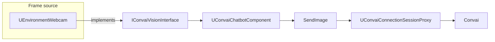

Vision adds scene images to a Convai conversation. A frame source component on the character captures the level, and the **Convai Chatbot** component sends those frames to Convai while the session is active.

## What happens at runtime

The built-in path has three parts:

1. **Frame source** — **Environment Webcam** (`UEnvironmentWebcam`) captures the scene through a `USceneCaptureComponent2D` and writes into a `UTextureRenderTarget2D`.
2. **Vision contract** — `IConvaiVisionInterface` defines the methods the chatbot expects from any frame source.
3. **Chatbot sender** — `UConvaiChatbotComponent` discovers the frame source on the same `Actor`, reads frames at the configured rate, and sends them through the active session.

Vision attaches to the **chatbot character**, not the player pawn. The player component starts conversation; the chatbot component owns frame discovery and upload.

## Key concepts

| Concept | What it means |
|---|---|
| **Frame source** | A component on the chatbot `Actor` that implements `IConvaiVisionInterface` and supplies image data. |
| **Environment Webcam** | The shipped frame source. It scene-captures into a render target. It is not a physical device webcam. |
| **Render target** | The `UTextureRenderTarget2D` assigned to **Convai Render Target**. The capture component writes scene pixels into this asset. |
| **Vision state** | `EVisionState` tracks whether capture is active. The shipped implementation sets `Stopped` and `Capturing` only. |
| **Frame throttling** | The chatbot sends frames based on the source component's **Maximum FPS** (`m_MaxFPS`), clamped to `1`–`60` during upload. |
| **Video connection** | Session setup uses connection type `video` when vision is supported or when `AlwaysAllowVision` is enabled in project settings. |

## Component discovery

At `BeginPlay`, `UConvaiChatbotComponent` searches the owning `Actor` for components that implement `UConvaiVisionInterface` and registers the first match.

- **Set Vision Component** replaces the auto-discovered source when multiple frame sources exist on the same `Actor`.
- **Supports Vision** returns `true` when a valid source is registered. If none is registered yet, the chatbot searches the `Actor` once before returning.
- Passing a plain `USceneCaptureComponent2D` to **Set Vision Component** returns `false`. The capture component is not a Convai frame source.

`Set Vision Component` and **Supports Vision** are inherited by `UConvaiPlayerComponent`, but they return `false` there because only `UConvaiChatbotComponent` enables vision registration. Use these nodes on the chatbot component.

## Capture and upload

When **Environment Webcam** is in the `Capturing` state:

1. Its internal `USceneCaptureComponent2D` renders the scene into **Convai Render Target**.
2. Each chatbot tick accumulates time until the interval from `GetMaxFPS()` is reached.
3. The chatbot calls `CaptureRaw()` on the active source and sends the RGBA bytes through `SendImage`.
4. Convai receives the frames over the active video connection.

The default send interval is `1.0f / 15.f`. If `GetMaxFPS()` returns `0` or an invalid value, the chatbot falls back to `15` FPS for upload timing.

## Vision states and events

`EVisionState` includes `Stopped`, `Starting`, `Capturing`, `Stopping`, and `Paused`. In the current shipped implementation, **Environment Webcam** transitions only between `Stopped` and `Capturing`.

Blueprint users can bind **On Frame Ready** on the frame source. It broadcasts during tick while the component is in `Capturing` and the event has at least one binding.

C++ integrations can also use `FOnVisionStateChanged`, `FOnFirstFrameCaptured`, and `FOnFramesStopped` on `IConvaiVisionInterface`. These delegates are not Blueprint-assignable.

## Late vision setup

Normal Blueprint setup places **Environment Webcam** on the chatbot `Actor` before `BeginPlay`. In that case, **Supports Vision** is enough for session setup to choose the `video` connection.

Enable `AlwaysAllowVision` in **Edit > Project Settings > Plugins > Convai** (advanced category) only when your project registers or swaps the vision component after initial connection setup.

## Next steps


[Vision quick start](quick-start.md)



[Vision frame sources](frame-sources.md)



[Vision Blueprint reference](vision-blueprint-reference.md)

