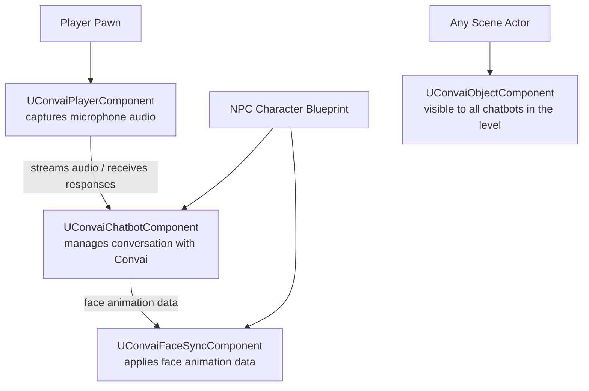

The Convai Unreal Engine plugin adds four components to Unreal Engine. Each has a distinct role. Understanding their responsibilities before building a scene prevents the most common wiring mistakes.

## Component roles

| Component | Class | Search name in Add menu | Attach to |
|---|---|---|---|
| Convai Chatbot | `UConvaiChatbotComponent` | `BP Convai ChatBot Component` | NPC character Blueprint |
| Convai Player | `UConvaiPlayerComponent` | `BP Convai Player Component` | Player pawn Blueprint |
| Convai Object | `UConvaiObjectComponent` | `Convai Object` | Any in-scene Actor the AI should know about |
| Convai Face Sync | `UConvaiFaceSyncComponent` | `Convai Face Sync` | NPC character Blueprint |


**BP vs bare component:** Searching `BP Convai ChatBot Component` or `BP Convai Player Component` adds the Blueprint-wrapped version, which comes pre-wired with push-to-talk input and the chat UI widget. Searching `Convai Chatbot` or `Convai Player` adds the bare C++ component — this works but requires you to wire push-to-talk, chat widget, and audio capture yourself.


## How the components connect

The `UConvaiPlayerComponent` and `UConvaiChatbotComponent` connect through the session managed by `UConvaiSubsystem` — a game instance subsystem the plugin registers automatically. You do not need to reference the subsystem directly in most Blueprint setups.

## Component details



`UConvaiChatbotComponent` is the AI brain for a non-player character. It holds the `CharacterID` that links the component to a character you created on the Convai dashboard. At runtime it connects to Convai, receives player speech or text from a `UConvaiPlayerComponent`, and streams the response back.

**Details panel fields:**

| Field | Default | Description |
|---|---|---|
| `CharacterID` | _(empty)_ | **Required.** The unique ID from the Convai dashboard that identifies which character this component represents. |
| `CharacterName` | _(empty)_ | Display name shown in transcripts and UI. Optional — can be left empty. |
| `VoiceType` | _(dashboard value)_ | Voice used for speech synthesis. Set on the dashboard; the component reads this from the character data. |
| `Backstory` | _(dashboard value)_ | Character personality and context. Set on the dashboard; override here to use a local value instead. |
| `LanguageCode` | _(empty)_ | Language for speech recognition (e.g., `en-US`). Leave empty to use the dashboard setting. |
| `bAutoInitializeSession` | `true` | When `true`, the component connects to Convai automatically on BeginPlay. Set to `false` to call `StartSession()` manually. |
| `InterruptVoiceFadeOutDuration` | `0.5` | Seconds over which the character's speech audio fades out when `InterruptSpeech` is called. `0` cuts audio immediately. See [Configure character audio](configure-character-audio.md). |

**Useful runtime functions (Blueprint-callable):**

| Function | Returns | Description |
|---|---|---|
| `IsListening()` | `bool` | `true` while receiving player speech. |
| `IsProcessing()` | `bool` | `true` while Convai is generating a response ("Is Thinking"). |
| `GetIsTalking()` | `bool` | `true` while the character is speaking ("Is Talking"). |
| `IsInConversation()` | `bool` | `true` while an active conversation session exists. |

**Blueprint events fired by this component:**

- **On Actions Received** — the character has determined actions to perform.
- **On Emotion State Changed** — the character's emotional state has updated.
- **On Character Data Loaded** — character metadata from the dashboard is ready.
- **On Narrative Section Received** — a narrative design section was triggered.
- **On Interaction ID Received** — a new interaction was assigned an ID.
- **On Interrupted** — the character's speech was interrupted by new player input.
- **On Failure** — a network or authentication error occurred.

The `CharacterID` field is the only required field. All other fields have usable defaults.



`UConvaiPlayerComponent` represents the human participant in the conversation. It captures microphone audio and streams it to the active `UConvaiChatbotComponent` during a conversation.

**Details panel fields:**

| Field | Default | Description |
|---|---|---|
| `PlayerName` | _(empty)_ | Name of the player shown to the AI character in conversation context. |
| `EndUserID` | _(empty)_ | Persistent identifier for this player, used by the long-term memory feature to recall past interactions across sessions. |
| `bMute` | `false` | When `true`, silences microphone input without stopping the session. Toggle at runtime to mute/unmute the player. |

**Useful runtime functions (Blueprint-callable):**

| Function | Returns | Description |
|---|---|---|
| `UnmuteStreamingAudio()` | `bool` | Begin streaming microphone audio to the active chatbot. |
| `MuteStreamingAudio()` | `void` | Stop streaming audio. |
| `UpdateVadBP(bEnableVad)` | `void` | Enable (`true`) or disable (`false`) hands-free voice activity detection. |
| `SendText(ChatbotComponent, Text)` | `void` | Send a text message to the specified chatbot without microphone input. |
| `GetIsStreaming()` | `bool` | `true` while audio is actively streaming to a chatbot. |
| `GetAvailableCaptureDeviceNames()` | `TArray<FString>` | List of available microphone device names. |
| `SetCaptureDeviceByIndex(Index)` | `bool` | Switch to the device at the specified index. |
| `SetCaptureDeviceByName(Name)` | `bool` | Switch to the device with the specified name. |

One `UConvaiPlayerComponent` on the player pawn can talk to any `UConvaiChatbotComponent` in the level.



`UConvaiObjectComponent` marks an in-scene Actor so every Convai chatbot in the level can reference it by name. Attach it to doors, switches, items, rooms, or any object that your AI characters should be able to name, describe, or interact with.

**Details panel fields:**

| Field | Default | Description |
|---|---|---|
| `ObjectName` | _(empty)_ | **Required.** The name the AI uses to refer to this object in conversation and actions. |
| `ObjectDescription` | _(empty)_ | A short description of the object that is included in the character's context. |
| `TrackedProperties` | _(empty array)_ | UPROPERTY values on the parent Actor to monitor. When a tracked value changes, the update is pushed to all chatbots automatically. |

The component provides each object with:
- **Identity** — a name and description that appear in the character's context.
- **Live state** — `TrackedProperties` entries that monitor UPROPERTY values on the Actor and push updates to chatbots when they change.



`UConvaiFaceSyncComponent` drives blendshape-based lip sync and facial animation on an NPC. It receives pre-computed face animation data from the `UConvaiChatbotComponent` and applies it frame by frame in sync with the character's speech audio.

**Details panel fields:**

| Field | Default | Description |
|---|---|---|
| `LipSyncMode` | `BS_MHA` (MetaHuman Blendshapes) | Selects the blendshape target. Must match the character's rig. See the table below for available values. |

**LipSyncMode values:**

| Display name | Enum value | Use with |
|---|---|---|
| Off | `EC_LipSyncMode::Off` | Disables face sync entirely. |
| Auto | `EC_LipSyncMode::Auto` | Lets the plugin choose the mode based on available data. |
| Viseme Based | `EC_LipSyncMode::VisemeBased` | Custom rigs using OVR visemes (15 shapes). |
| MetaHuman Blendshapes | `EC_LipSyncMode::BS_MHA` | MetaHuman characters and Reallusion CC5 characters. **(Default)** |
| ARKit Blendshapes | `EC_LipSyncMode::BS_ARKit` | Generic ARKit-compatible rigs. |
| CC4 Extended Blendshapes | `EC_LipSyncMode::BS_CC4_Extended` | Reallusion CC4 characters. |



## Blueprint wrappers

The plugin ships Blueprint-wrapped versions of each component in its `Content/` folder. Use these instead of the bare C++ components — they include push-to-talk input binding, chat widget integration, and audio capture out of the box.

| Asset | What it includes |
|---|---|
| `BP_ConvaiChatbotComponent` (`BP Convai ChatBot Component`) | `UConvaiChatbotComponent` pre-wired with push-to-talk and chat UI. |
| `BP_ConvaiPlayerComponent` (`BP Convai Player Component`) | `UConvaiPlayerComponent` pre-wired with push-to-talk and chat UI. |
| `BP_ConvaiSamplePlayer` | A full player pawn with `BP_ConvaiPlayerComponent` attached. |
| `BP_SampleGameMode` | A game mode that pairs with `BP_ConvaiSamplePlayer`. |
| `BP_Convai3DWidgetComponent` / `WBP_3DChatWidget` | In-world chat UI widget. |

## Next steps


[Add your first Convai character](add-your-first-character.md)



[Set up a MetaHuman character](set-up-a-metahuman-character.md)



[Set up a Reallusion (CC) character](set-up-a-reallusion-character.md)

