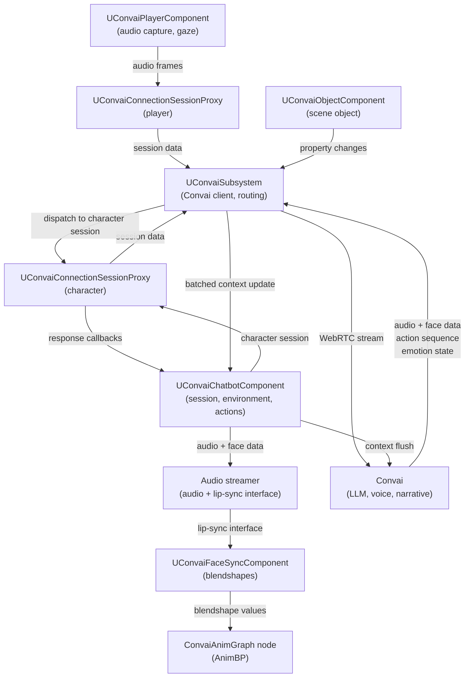

The Convai Unreal Engine plugin is structured as four modules, runtime components, connection session proxies, and `UConvaiSubsystem`. Each module has a defined scope and loading phase; each component has a single responsibility and communicates through Unreal's component and subsystem model.

## Modules

The plugin declares four modules in `ConvAI.uplugin`.

| Module | Type | Platforms | Purpose |
|---|---|---|---|
| `Convai` | Runtime | Win64, Android | Core conversation pipeline: WebRTC session management, audio streaming, chatbot and player components, subsystem, dynamic context, environment, actions, vision. |
| `ConvaiEditor` | Editor | All (editor build only) | Editor-only tooling. The in-editor configuration window, API key setup UI, and character dashboard browser require UE 5.2 or later; Blueprint graph utilities such as the `Create Convai Action Handler` right-click entry are editor features. |
| `ConvaiAnimGraph` | UncookedOnly | All | Animation graph nodes that read live blendshape values from Convai components and apply them in Animation Blueprints. |
| `ConvaiVisionBase` | Runtime | Win64, Android | Base layer for the vision feature: frame capture and image encoding. The `Convai` runtime sends captured frames through the active session path. |

The `Convai` module loads at `PreDefault` phase so it is available before gameplay systems initialize. `ConvaiEditor` loads at `PostEngineInit` so it can access the fully initialized editor environment.

## System diagram

The diagram below shows the runtime flow for a single player–character conversation turn.

`UConvaiSubsystem` owns the underlying Convai client and routes data for the active player and character session proxies. Runtime components register with the subsystem so it can route audio, response data, object updates, and context flushes to the correct component.

## Runtime components

Four primary conversation components form the architecture described on this page and attach to Actors like native Unreal components. Additional Blueprint-spawnable helpers support audio capture, vision, and diagnostic workflows. A separate runtime piece, `UConvaiSubsystem`, is a `UGameInstanceSubsystem` that Unreal creates automatically rather than a component you add.


Each component's **display name** is the label shown in the **Add Component** panel inside the Unreal Editor. Use the display name to find each component when adding it to a Blueprint Actor. The Convai Subsystem is not added this way — the engine creates one per game instance automatically.


### `UConvaiChatbotComponent` (display name: Convai Chatbot)

The central component for an AI character. It holds the character ID, session state, environment contract (actions, objects, scene characters), dynamic context, emotion state, and the action queue. One instance per AI character Actor.

`UConvaiChatbotComponent` holds a connection session proxy for its character. When a session starts, the component registers the proxy with `UConvaiSubsystem`, which routes audio and response data through the underlying Convai client. The chatbot receives audio, facial animation data, and action sequences, then coordinates audio playback, lip-sync processing, and Blueprint action handlers.

### `UConvaiPlayerComponent` (display name: Convai Player)

Represents the human player in the conversation. It captures microphone audio through `UConvaiAudioCaptureComponent`, streams it to the active chatbot session, and drives the gaze-attention system that tracks which `UConvaiObjectComponent` actors are under the player's crosshair.

### `UConvaiObjectComponent` (display name: Convai Object Component)

Tags an Actor as a scene object that a chatbot can reference in its environment contract. When the component registers with `UConvaiSubsystem`, the subsystem polls its tracked properties on a shared clock and coalesces changes into batched dynamic-context updates. Multiple chatbots can share the same object component.

### `UConvaiFaceSyncComponent` (display name: Convai Face Sync)

A scene component that applies precomputed facial animation sequences to a skeletal mesh. The chatbot/audio-streamer path forwards face data to the active lip-sync interface, commonly `UConvaiFaceSyncComponent`. The component interpolates blendshape frames and exposes the resulting `TMap<FName, float>` to an Animation Blueprint through an AnimGraph node in the `ConvaiAnimGraph` module. It supports `Off`, `Auto`, `Viseme Based`, `MetaHuman Blendshapes`, `ARKit Blendshapes`, and `CC4 Extended Blendshapes` modes.

### `UConvaiSubsystem` (display name: Convai Subsystem)

A `UGameInstanceSubsystem` that acts as the shared connection manager and component registry. It maintains the underlying Convai client, routes audio and data packets to the correct session proxies, and tracks registered runtime components needed for routing.

## Plugin dependencies

The plugin declares the following engine plugin dependencies in `ConvAI.uplugin`:

| Plugin | Enabled | Role |
|---|---|---|
| `AudioCapture` | Yes | Microphone input pipeline |
| `AndroidPermission` | Yes | Runtime microphone permission request on Android |
| `EditorScriptingUtilities` | Yes | Editor automation helpers used by `ConvaiEditor` (editor only) |
| `PropertyAccessEditor` | Yes | Property-binding editor feature used by `ConvaiEditor` (editor only) |

## Next steps

With the module and component model in mind, install the plugin or explore the full feature set.


[Getting started](../getting-started/)



[Feature map](feature-map.md)



[What is the Convai Unreal Engine plugin](what-is-the-convai-unreal-engine-plugin.md)

