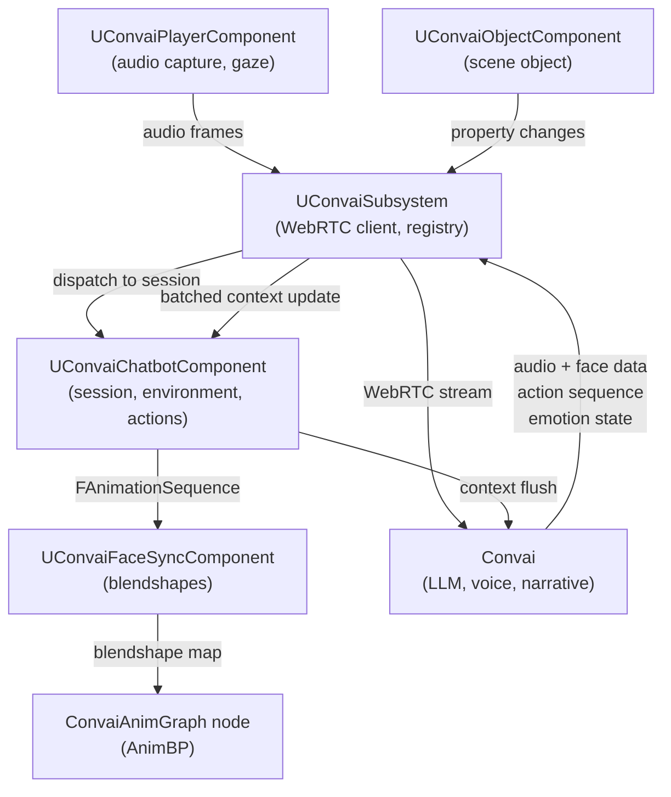

The Convai Unreal Engine plugin is structured as four modules, four runtime components, and one game-instance subsystem. Each module has a defined scope and loading phase; each component has a single responsibility and communicates with the others through Unreal's component and subsystem model.

## Modules

The plugin declares four modules in `ConvAI.uplugin`.

| Module | Type | Platforms | Purpose |
|---|---|---|---|
| `Convai` | Runtime | Win64, Android | Core conversation pipeline: WebRTC session management, audio streaming, chatbot and player components, subsystem, dynamic context, environment, actions, vision. |
| `ConvaiEditor` | Editor | All (editor build only) | In-editor configuration window, API key setup, character dashboard browser, Blueprint graph utilities (e.g. the `Create Convai Action Handler` right-click entry). Disabled on `UE 5.1` and earlier. |
| `ConvaiAnimGraph` | UncookedOnly | All | Animation graph nodes that drive blendshapes from the live facial animation stream. Available in the Animation Blueprint editor for MetaHuman and other rigs. |
| `ConvaiVisionBase` | Runtime | Win64, Android | Base layer for the vision feature: frame capture, encoding, and delivery to the WebRTC session. |

The `Convai` module loads at `PreDefault` phase so it is available before gameplay systems initialize. `ConvaiEditor` loads at `PostEngineInit` so it can access the fully initialized editor environment.

## System diagram

The diagram below shows the runtime flow for a single player–character conversation turn.

`UConvaiSubsystem` is the single shared connection point. Components register themselves with it at `BeginPlay` and unregister at `EndPlay`. The subsystem's shared object-poll clock fires on every registered `UConvaiObjectComponent` in the same tick so property changes from multiple objects coalesce into one batched update per debounce window.

## Runtime components

Four Blueprint-spawnable components form the plugin's runtime surface and attach to Actors like any native Unreal component. A fifth runtime piece, the Convai Subsystem, is a game-instance subsystem the engine creates automatically rather than a component you add.


Each component's **display name** is the label shown in the **Add Component** panel inside the Unreal Editor. Use the display name to find each component when adding it to a Blueprint Actor. The Convai Subsystem is not added this way — the engine creates one per game instance automatically.


### `UConvaiChatbotComponent` (display name: Convai Chatbot)

The central component for an AI character. It holds the character ID, session state, environment contract (actions, objects, scene characters), dynamic context, emotion state, and the action queue. One instance per AI character Actor.

`UConvaiChatbotComponent` holds a connection session proxy for its character. When a session starts, the component registers the proxy with `UConvaiSubsystem`, which routes audio and response data through the shared WebRTC client. The chatbot then receives audio, facial animation data, and action sequences, and routes each to the appropriate output: the audio streamer, `UConvaiFaceSyncComponent`, and Blueprint action handlers.

### `UConvaiPlayerComponent` (display name: Convai Player)

Represents the human player in the conversation. It captures microphone audio through `UConvaiAudioCaptureComponent`, streams it to the active chatbot session, and drives the gaze-attention system that tracks which `UConvaiObjectComponent` actors are under the player's crosshair.

### `UConvaiObjectComponent`

Tags an Actor as a scene object that a chatbot can reference in its environment contract. When the component registers with `UConvaiSubsystem`, the subsystem polls its tracked properties on a shared clock and coalesces changes into batched dynamic-context updates. Multiple chatbots can share the same object component.

### `UConvaiFaceSyncComponent` (display name: Convai Face Sync)

A scene component that applies precomputed facial animation sequences to a skeletal mesh. It consumes `FAnimationSequence` data delivered by `UConvaiChatbotComponent`, interpolates blendshape frames, and exposes the resulting `TMap<FName, float>` to an Animation Blueprint through an AnimGraph node in the `ConvaiAnimGraph` module. It supports multiple lip-sync modes — `Viseme Based`, `MetaHuman Blendshapes`, `ARKit Blendshapes`, and `CC4 Extended Blendshapes` — selectable to match the character's rig.

### `UConvaiSubsystem` (display name: Convai Subsystem)

A `UGameInstanceSubsystem` that acts as the shared connection manager and component registry. It maintains the WebRTC client, routes audio and data packets to the correct session proxies, and provides registry access to all active `UConvaiChatbotComponent`, `UConvaiPlayerComponent`, and `UConvaiObjectComponent` instances via `GetAllChatbotComponents`, `GetAllPlayerComponents`, and `GetAllObjectComponents`.

## Plugin dependencies

The plugin declares the following engine plugin dependencies in `ConvAI.uplugin`:

| Plugin | Enabled | Role |
|---|---|---|
| `AudioCapture` | Yes | Microphone input pipeline |
| `AndroidPermission` | Yes | Runtime microphone permission request on Android |
| `EditorScriptingUtilities` | Yes | Editor automation helpers used by `ConvaiEditor` (editor only) |
| `PropertyAccessEditor` | Yes | Property-binding editor feature used by `ConvaiEditor` (editor only) |

## Next steps

With the module and component model in mind, install the plugin or explore the full feature set.


[Getting started](../getting-started/)



[Feature map](feature-map.md)



[What is the Convai Unreal Engine plugin](what-is-the-convai-unreal-plugin.md)

