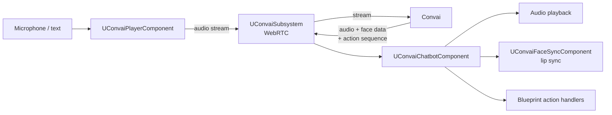

The Convai Unreal Engine plugin connects Unreal Engine 5 projects to Convai, enabling actors in a scene to hold real-time voice and text conversations, express emotions, animate their faces in sync with speech, and respond to player actions. It does this through a set of Blueprint-spawnable components and a Game Instance Subsystem that manage the WebRTC session between the project and Convai.

## What it includes

The plugin ships with a complete conversation pipeline and a set of opt-in feature add-ons.

### Conversation pipeline

Always active once connected:

* **Real-time voice input** — microphone capture through `UConvaiAudioCaptureComponent`, streamed to Convai over WebRTC
* **Language understanding and generation** — Convai processes speech and responds in character
* **Text-to-speech playback** — voice generated by Convai, played back through `UConvaiChatbotComponent`

### Feature add-ons

Opt-in, each configured through Blueprint or the component Inspector:

* **Lip sync** — real-time blendshape mouth animation driven by audio, with selectable `Viseme Based`, `MetaHuman Blendshapes`, `ARKit Blendshapes`, and `CC4 Extended Blendshapes` modes for different rigs
* **Emotion** — Convai infers emotion from conversation and drives blendshape expressions on the character
* **Character actions** — characters execute structured in-scene commands (Move To, Follow, custom) dispatched from Convai
* **Dynamic context** — push live world state and events into character knowledge at runtime
* **Narrative design** — trigger scripted conversation branches and sections by name from Blueprint
* **Long-term memory** — characters remember each player across sessions using an end-user ID
* **Scene metadata** — tag level actors so characters are aware of and can act on them
* **Vision** — stream camera frames to Convai so characters can describe what they see
* **Gaze attention** — route the object under the player's crosshair as context to the active character

### Editor tooling

The `ConvaiEditor` module adds an in-editor configuration window for API key setup, the character dashboard browser, and Blueprint graph utilities such as the "Create Convai Action Handler" right-click entry.

## Relationship to Convai

Convai hosts the language model, voice synthesis, narrative design engine, long-term memory store, and character configuration. The plugin is a client-side integration layer: it captures audio or text from the player, streams it to Convai over WebRTC, and delivers the response back to the character's audio and animation pipeline.

No Convai logic runs inside the game process. The plugin does not bundle a local language model. All character knowledge, voice, and decision-making remain in Convai, which means character changes made in the Convai dashboard (backstory, voice, narrative sections, memory) take effect in the project without a recompile or re-deploy.

## Voice → Convai → character flow

`UConvaiPlayerComponent` captures microphone audio and forwards it to `UConvaiSubsystem`, which manages the shared WebRTC connection to Convai. `UConvaiChatbotComponent` receives the response — audio, facial animation data, and action sequences — and routes each to the appropriate output: audio playback, `UConvaiFaceSyncComponent` for lip sync, and Blueprint handlers for in-scene actions.

## Blueprint-first design

Every feature in the plugin is accessible from Blueprint graphs. C++ access is available but is secondary — all public components, events, and functions carry `BlueprintCallable`, `BlueprintPure`, or `BlueprintAssignable` specifiers. The design assumes that most projects will build their character logic in Blueprint and only reach into C++ for performance-critical extensions.

## Requirements

| Requirement | Minimum |
|---|---|
| Unreal Engine | <code class="expression">space.vars.unreal_min_version</code> |
| Build targets | `Win64`, `Android` |
| Network | Internet connection to Convai |
| API key | Free account at [convai.com](https://convai.com) |


Android requires microphone permission handling. The plugin bundles the `AndroidPermission` engine plugin as a dependency and requests `RECORD_AUDIO` permission automatically when it connects to Convai.


The Convai Unreal Engine plugin is available on [Fab](https://www.fab.com/listings/ba3145af-d2ef-434a-8bc3-f3fa1dfe7d5c). Plugin releases are also published on [GitHub](https://github.com/Conv-AI/Convai-UnrealEngine-SDK-V4/releases).

For the full platform and engine version support matrix, see Compatibility and requirements.


[Compatibility and requirements](../compatibility-and-requirements/)


## Next steps

Install the plugin and add your first AI character.


[Getting started](../getting-started/)


To understand the module and component structure before building, see the architecture page.


[Plugin architecture](plugin-architecture.md)


For a one-screen overview of every feature and links to the corresponding guides, see the feature map.


[Feature map](feature-map.md)

