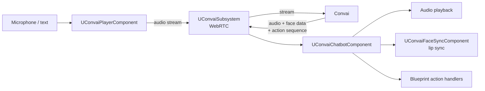

The Convai Unreal Engine plugin connects Unreal Engine 5 projects to Convai, enabling actors in a scene to hold real-time voice and text conversations, express emotions, animate their faces in sync with speech, and respond to player actions. It does this through a set of Blueprint-spawnable components and a Game Instance Subsystem that manage the WebRTC session between the project and Convai.

## What the plugin adds to a UE project

An Unreal Engine project has no built-in concept of a conversational AI character. The plugin fills that gap by providing:

- **Blueprint-spawnable components** that attach to any Actor and handle conversation, audio capture, lip sync, and scene-object awareness without custom C++.
- **An in-editor configuration window** for setting the API key and browsing the character dashboard without leaving the Unreal Editor.
- **Animation graph nodes** (via the `ConvaiAnimGraph` module) that drive MetaHuman and other rig blendshapes from the live audio stream.
- **A runtime subsystem** (`UConvaiSubsystem`) that manages the shared WebRTC connection and provides a registry of all active chatbot and player components in the level.

The plugin is described in `ConvAI.uplugin` as: "Adds new blueprint functions and components to integrate Convai API." (direct quote from the manifest — lowercase "blueprint" is as written in the source). The plugin's `FriendlyName` is `Convai`.

## Relationship to Convai

Convai hosts the language model, voice synthesis, narrative design engine, long-term memory store, and character configuration. The plugin is a client-side integration layer: it captures audio or text from the player, streams it to Convai over WebRTC, and delivers the response back to the character's audio and animation pipeline.

No Convai logic runs inside the game process. The plugin does not bundle a local language model. All character knowledge, voice, and decision-making remain in Convai, which means character changes made in the Convai dashboard (backstory, voice, narrative sections, memory) take effect in the project without a recompile or re-deploy.

## Voice → Convai → character flow

`UConvaiPlayerComponent` captures microphone audio and forwards it to `UConvaiSubsystem`, which manages the shared WebRTC connection to Convai. `UConvaiChatbotComponent` receives the response — audio, facial animation data, and action sequences — and routes each to the appropriate output: audio playback, `UConvaiFaceSyncComponent` for lip sync, and Blueprint handlers for in-scene actions.

## Blueprint-first design

Every feature in the plugin is accessible from Blueprint graphs. C++ access is available but is secondary — all public components, events, and functions carry `BlueprintCallable`, `BlueprintPure`, or `BlueprintAssignable` specifiers. The design assumes that most projects will build their character logic in Blueprint and only reach into C++ for performance-critical extensions.

## Requirements

| Requirement | Minimum |
|---|---|
| Unreal Engine | <code class="expression">space.vars.unreal_min_version</code> |
| Build targets | Win64, Android |
| Network | Internet connection to Convai |
| API key | Free account at [convai.com](https://www.convai.com/) |


Android requires microphone permission handling. The plugin bundles the `AndroidPermission` engine plugin as a dependency and calls the permission request automatically on startup.


The Convai Unreal Engine plugin is available on [Fab](https://www.fab.com/listings/ba3145af-d2ef-434a-8bc3-f3fa1dfe7d5c). Plugin releases are also published on [GitHub](https://github.com/Conv-AI/Convai-UnrealEngine-SDK-V4/releases).

For the full platform and engine version support matrix, see Compatibility and requirements.


[Compatibility and requirements](../compatibility-and-requirements/)


## Next steps

Install the plugin and add your first AI character.


[Getting started](../getting-started/)


To understand the module and component structure before building, see the architecture page.


[Plugin architecture](plugin-architecture.md)


For a one-screen overview of every feature and links to the corresponding guides, see the [Feature map](feature-map.md).
