# Create a Discord Bot

Follow the next set of steps to create your own Discord bot:

1.  Navigate to [Discord Developer Portal](https://discord.com/developers/applications)

    <figure>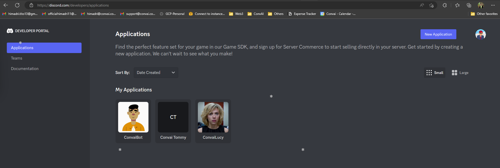<figcaption></figcaption></figure>
2.  Click on **New Application**

    <figure>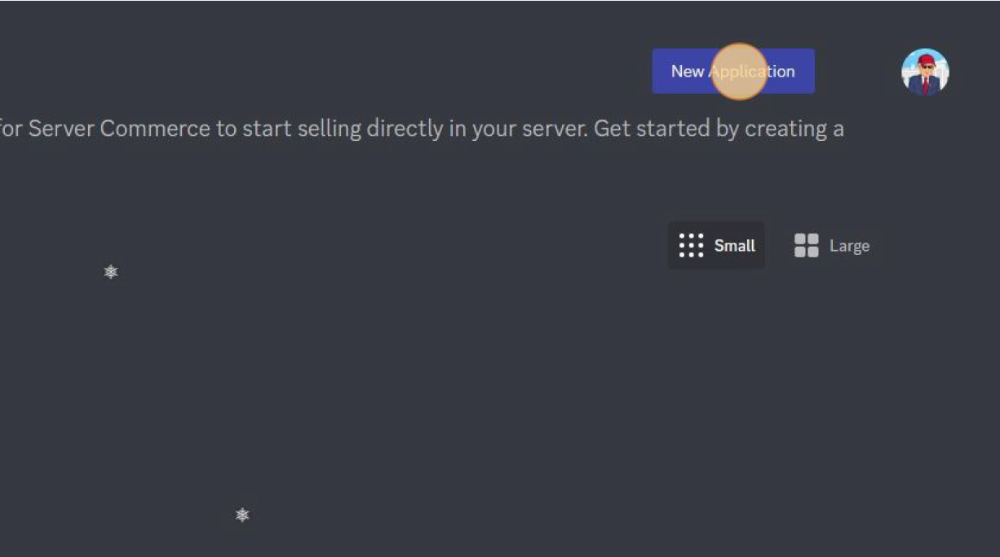<figcaption></figcaption></figure>
3. Enter the name of the bot that you want to create. Let's go with **ConvaiTracy**
4.  Accept the Developer Terms of Service and Developer Policy and click on **Create**.

    <figure>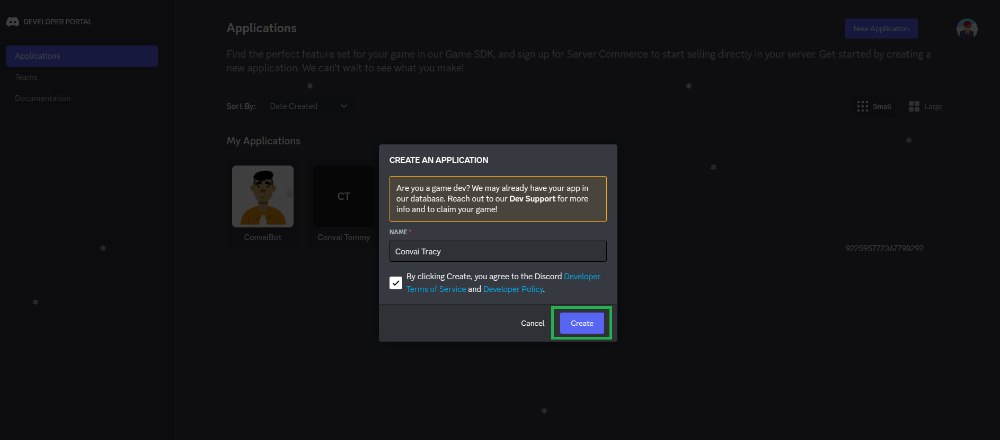<figcaption></figcaption></figure>
5.  Now, you land on the application details page. Upload an app icon and provide a description as you see fit. and click on Save Changes.

    <figure>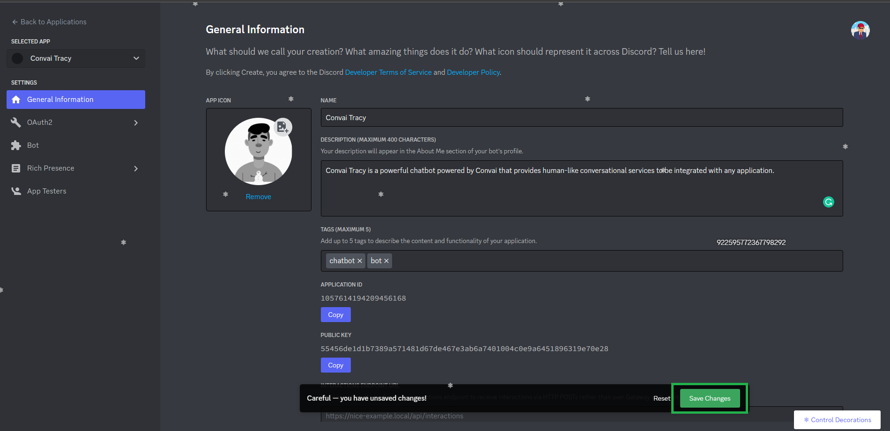<figcaption></figcaption></figure>
6.  Then click on **OAuth2** --> **URL Generato**r&#x20;

    <figure>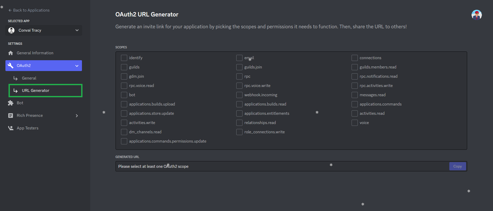<figcaption></figcaption></figure>
7.  Click on the **bot** checkbox under the **Scopes** section

    <figure>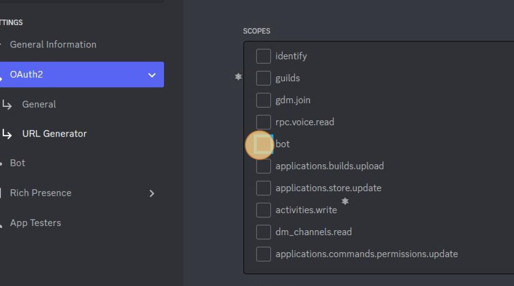<figcaption></figcaption></figure>
8.  Click on the following checkboxes under the various Permissions

    1. General Permissions:
       1. Manage Webhooks
    2. Text Permissions:
       1. All the checkboxes
    3. Voice Permissions:
       1. Connect
       2. Speak
       3. Use Voice Activity
       4. Priority Speaker
       5. Request To Speak

    <figure>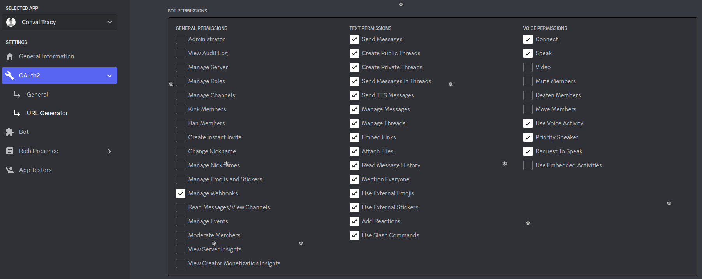<figcaption></figcaption></figure>
9.  Copy the URL generated below. This will be the shareable invite link for the bot on all servers.

    <figure>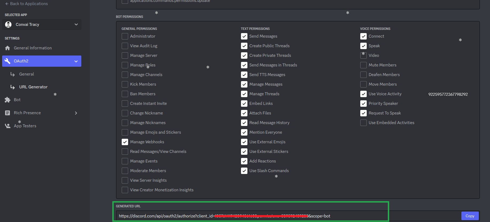<figcaption></figcaption></figure>
10. Next click on **Bot**
11. Click on **Add Bot**  --> **Yes, do it!**

    <figure>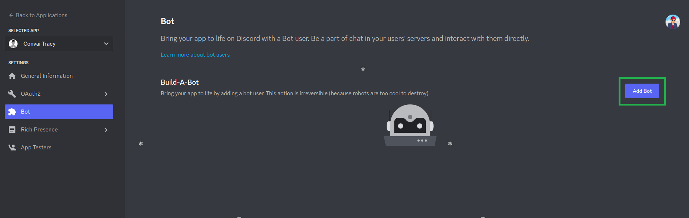<figcaption></figcaption></figure>
12. Allow the following intents under the **Privileged Intents** section and click on **Save Changes.**

    <figure>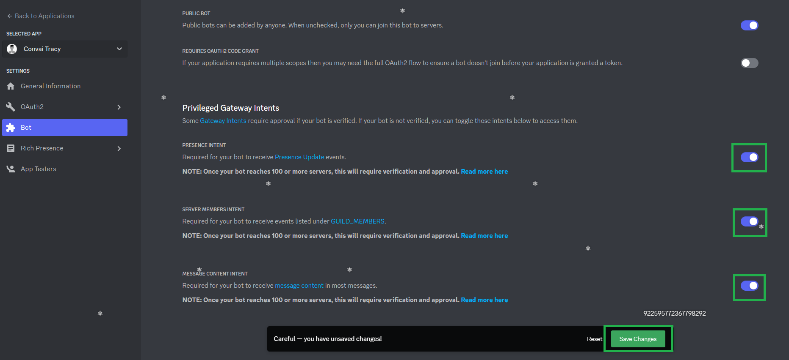<figcaption></figcaption></figure>
13. Click on **Reset Tokens** to generate a new token for the bot. Then click on **Yes, do it**

    <figure>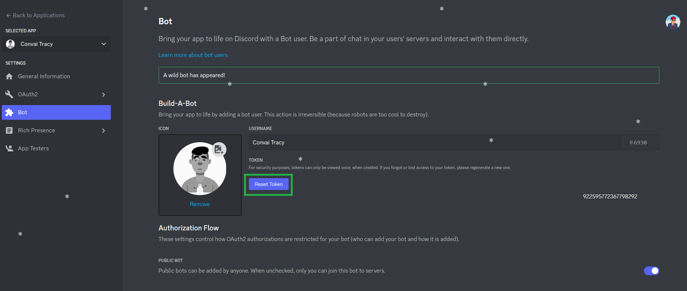<figcaption></figcaption></figure>
14. **Copy** the generated token to be used later for hosting the bot server.

Now we move on to connecting the Discord bot with a Convai Character and hosting the server.


[hosting-discord-bot-from-personal-server.md](hosting-discord-bot-from-personal-server.md)

