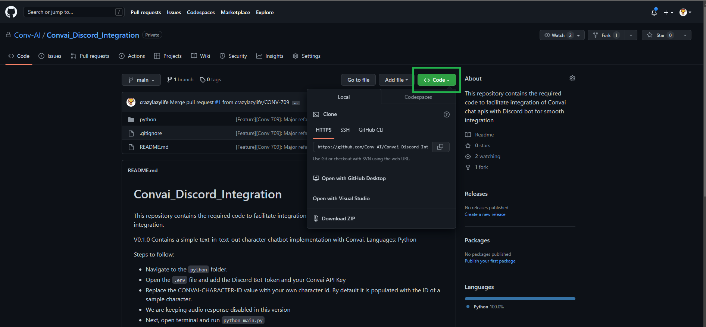
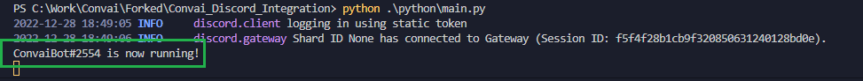

# Hosting Discord Bot from Personal Server

Here we list out the steps to successfully host a discord bot server and update the required details to allow users to effectively communicate with the character created.


The current version has support for only Python language. We are striving to include support for servers in other languages also. Please, reach out to us at support@convai.com if you have any queries on this.


Code Link: [Github](https://github.com/Conv-AI/Convai_Discord_Integration)

Steps:

1.  Visit the link given above and clone the repository in your system, where you want to host the server.


    <figure><figcaption></figcaption></figure>
2. Go to your system and open **Terminal**
3.  Insert the following commands:

    ```bash
    $ git clone https://github.com/Conv-AI/Convai_Discord_Integration.git

    $ cd Convai_Discord_Integration

    $ cd python/
    ```
4. We are now inside the **python** folder that has the necessary code.
5.  We need to edit the **.env** file to update it with the required credentials. Open the .**env** file to edit and enter the necessary details.

    ```
    # The unique token generated by Discord for your bot
    DISCORD_BOT_TOKEN=<the token that we received from Step 13 while creating Discord Bot>

    # Unique API Key received after creating an account with Convai.
    CONVAI_API_KEY=<the unique key you get once you sign-up with Convai>

    # The character-id of the new character created with Convai
    CONVAI_CHARACTER_ID=<a unique id to identify the character that we got while creating the character in Convai website>

    # The URL to get back a response from the Convai server for every query
    CHARACTER_GET_RESPONSE_URL=https://api.convai.com/character/getResponse

    # Enable voice response to generate audio files to be played in the voice channel. Current WIP
    ENABLE_VOICE_RESPONSE=False

    # List out all the channels you want the bot to respond to, separated by commas ','
    # ALLOWED_CHANNELS=welcome,general,...
    ALLOWED_CHANNELS= <leave it empty if you want the bot to respond to all channels>
    ```
6.  With this, we are set to start our server, just run the following command:

    ```bash
    $ python main.py
    ```
7.  Now the bot should be running perfectly. You should see some log like this, that indicates that the bot is up.


    <figure><figcaption></figcaption></figure>

    Note: Here ConvaiBot is the name that we gave. The name of your bot will appear there in place of ConvaiBot.

And we are done. Your bot is up. Keep it running for it to be able to interact with the users.


If you have some problem with hosting it, do reach out to us at support@convai.com and we will get back to you soon.

Convai is looking into solutions for hosting the server bot for you so that you do not have to go through the whole hassle in the above steps. We will keep on updating the docs as soon as we have some updates.

