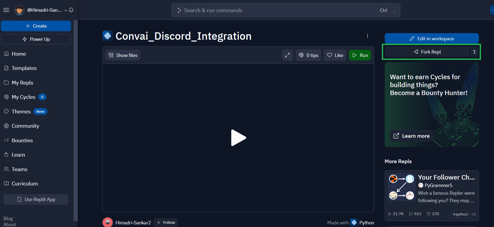
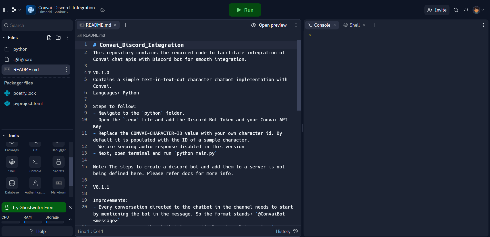
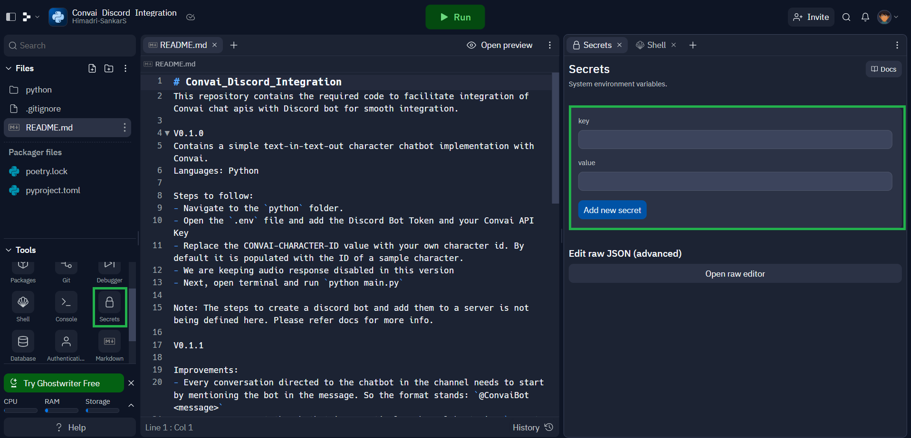
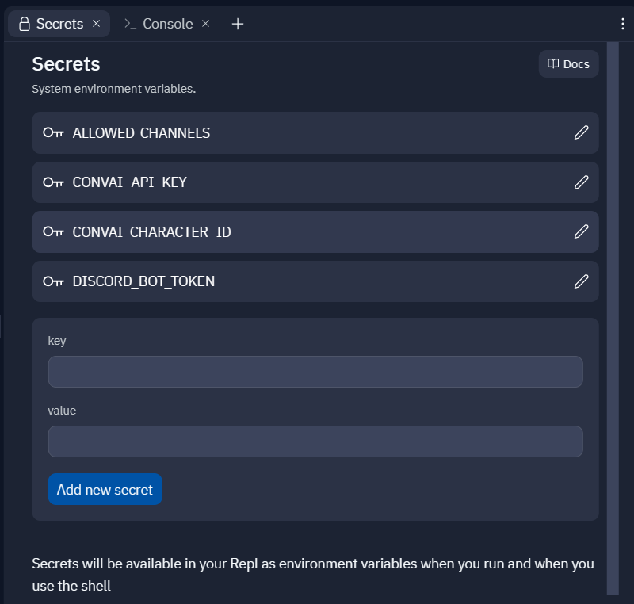

# Hosting Discord Bot from Replit

### [Link to the Repl](https://replit.com/@Himadri-Sankar2/ConvaiDiscordIntegration?v=1)

Here are the steps listed to run the discord bot server from Replit successfully

### Steps:

1. Sign up to [Replit](https://replit.com/), then visit the link mentioned above to get to the published Repl.
2.  Once you are on the page, click on **Fork Repl**.

    Click on **Fork Repl** again from the pop-up notification.

    <figure><figcaption></figcaption></figure>
3.  This will create a fork of the code in your account. Once it has been forked successfully, it will open the code in the editor for you.


    <figure><figcaption></figcaption></figure>
4.  Go over to **Secrets** in the bottom left corner of the screen.


    <figure><figcaption></figcaption></figure>
5.  Now Add the following credentials. Copy the Keys directly from here to avoid any typos.

    1.  Convai API Key Details:&#x20;

        ```properties
        Key: CONVAI_API_KEY
        Value: <your unique API key from Convai>
        ```
    2.  Convai Character ID:&#x20;

        ```properties
        Key: CONVAI_CHARACTER_ID
        Value: <the unique ID of the character that you designed on Convai website>
        ```
    3.  Allowed Channels:&#x20;

        ```properties
        Key: ALLOWED_CHANNELS
        Value: <mention the name of the channels separated by ','. Example: 'chat-with-convaibot,interactive-avatars'>
        ```
    4.  Discord Bot Details:

        ```properties
        Key: DISCORD_BOT_TOKEN
        Value: <the token generated while creating the discord bot>
        ```


    Note: ALLOWED\_CHANNELS restricts the bot to respond to only the channels mentioned in the list. This affects all the servers the bot has been invited to. For new server additions, you need to add the new list of allowed channels to the list.  This might also require you to re-run the Repl.
6.  After you have entered the details, it should look something like this


    <figure><figcaption></figcaption></figure>
7. Then click on the **Run** button at the top to start the bot. Once you have the log, saying the bot has started, you are all done.
