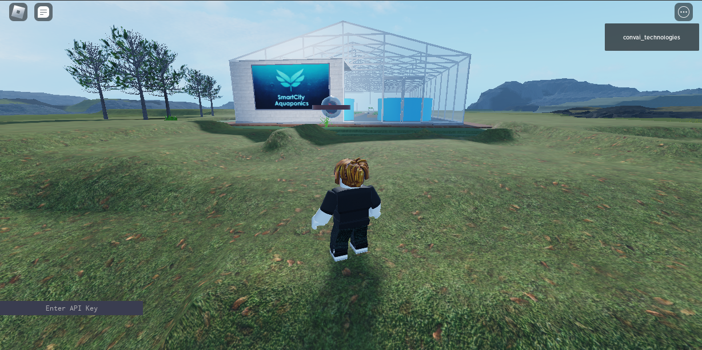
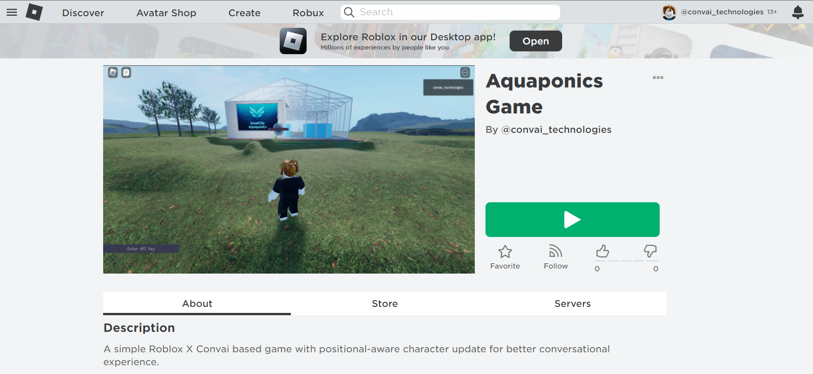
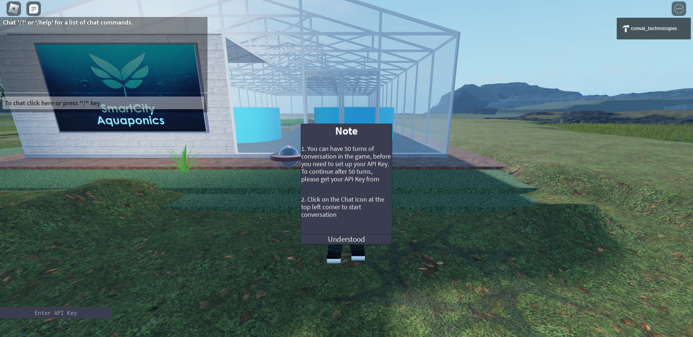
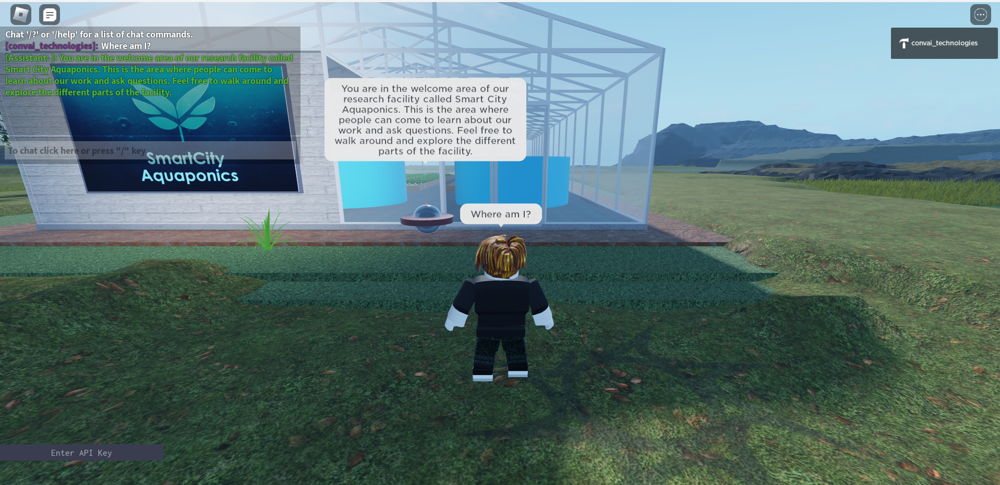

# Sample Game 2

### [Click here to play the game in Roblox](https://www.roblox.com/games/11390008146/Aquaponics-Game)

<figure><figcaption>
InGame Scene
</figcaption></figure>

This is another simple game that you can access, ask questions and get them answered by the assistant bot.


For beginners, we provide 50 sample conversations that they can carry out with the characters they want, without setting up their API Key. To continue with more conversation, please get your API Key from our site and enter the value in the respective input box at the bottom left corner, and press ENTER.


### Play the Game:

To play the game follow the given steps:

1. Get your API Key from our website. It is necessary to carry on any conversation in the game after the free quota has expired.
2.  Visit the link given above for the game. 

    <figure><figcaption></figcaption></figure>
3. Click on the green Play button. That will open Roblox locally for you to play.
4.  You are ready to converse with the character

    <figure><figcaption></figcaption></figure>

    Click on the **Understood** button, to close the notifications. Read it once though.\
    Enter the API Key in the bottom left section of the screen.\
    Remember to press **ENTER** after entering the value to register it in the backend.
5.  Now click on the Chatbox Icon or press the "/" icon on the keyboard to start a conversation. Type out the text and press **ENTER**. 

    <figure><figcaption></figcaption></figure>
6. That's it. You can continue your conversation and keep exploring the environment.
